Late arrivals model report
==========================


* [Original sample](#original-sample)
	* [Logit regression - statsmodel report](#logit-regression---statsmodel-report)
	* [RandomForestClassifier outputs](#randomforestclassifier-outputs)
	* [LGBMClassifier outputs](#lgbmclassifier-outputs)
	* [LogisticRegression outputs](#logisticregression-outputs)
* [Balanced sample (50% of each predictor class)](#balanced-sample-50-of-each-predictor-class)
	* [Logit regression - statsmodel report](#logit-regression---statsmodel-report)
	* [RandomForestClassifier outputs](#randomforestclassifier-outputs)
	* [LGBMClassifier outputs](#lgbmclassifier-outputs)
	* [LogisticRegression outputs](#logisticregression-outputs)
* [Self-builder sample](#self-builder-sample)
	* [Logit regression - statsmodel report](#logit-regression---statsmodel-report)
	* [RandomForestClassifier outputs](#randomforestclassifier-outputs)
	* [LGBMClassifier outputs](#lgbmclassifier-outputs)
	* [LogisticRegression outputs](#logisticregression-outputs)
* [Relay sample](#relay-sample)
	* [Logit regression - statsmodel report](#logit-regression---statsmodel-report)
	* [RandomForestClassifier outputs](#randomforestclassifier-outputs)
	* [LGBMClassifier outputs](#lgbmclassifier-outputs)
	* [LogisticRegression outputs](#logisticregression-outputs)
* [No entity feature sample](#no-entity-feature-sample)
	* [Logit regression - statsmodel report](#logit-regression---statsmodel-report)
	* [RandomForestClassifier outputs](#randomforestclassifier-outputs)
	* [LGBMClassifier outputs](#lgbmclassifier-outputs)
	* [LogisticRegression outputs](#logisticregression-outputs)
* [Timings since slot start predictor](#timings-since-slot-start-predictor)
	* [Logit regression - statsmodel report](#logit-regression---statsmodel-report)
	* [RandomForestClassifier outputs](#randomforestclassifier-outputs)
	* [LGBMClassifier outputs](#lgbmclassifier-outputs)
	* [LogisticRegression outputs](#logisticregression-outputs)


***
## Introduction


This report summarises the main outputs from the model trained in the script 
[`late_atts_model_runner.py`](https://github.com/misilva73/eth-slot-analysis/blob/main/src/late_atts_model_runner.py).

We collected data on the attestation arrival times for two types of slots - slots from 
relays (titan and ultrasound) and slots from self-builders. For the relays, we compute the 
attestation arrival since the block was published by the relay (to account for timing games), 
while for self-builders, we compute the attestation arrival since the start of the slot 
(i.e., assuming no timing games or other delays). 

We gathered additional data on the slot and the attester and trained different models 
that predict whether an attestation was late, which is defined as taking more than 4.5s. We 
use these models to compute feature importance and SHAP values to surface which properties of the 
slot or the attester explain late arrivals.

This report was generated from the data in sample_12187616_12202016 at 12-08-2025 13:07:57.

# Original sample

## Logit regression - statsmodel report


```python
                           Logit Regression Results                           
==============================================================================
Dep. Variable:                      y   No. Observations:              2857659
Model:                          Logit   Df Residuals:                  2857632
Method:                           MLE   Df Model:                           26
Date:                Tue, 12 Aug 2025   Pseudo R-squ.:                  0.3323
Time:                        22:35:25   Log-Likelihood:            -5.3628e+05
converged:                       True   LL-Null:                   -8.0320e+05
Covariance Type:            nonrobust   LLR p-value:                     0.000
================================================================================================
                                   coef    std err          z      P>|z|      [0.025      0.975]
------------------------------------------------------------------------------------------------
const                           -2.9915   3.85e+04  -7.78e-05      1.000   -7.54e+04    7.54e+04
p66_block_arrival_ms             0.3410      0.002    164.724      0.000       0.337       0.345
block_total_bytes_compressed    -0.0623      0.006    -10.080      0.000      -0.074      -0.050
block_proposer_index             0.0305      0.002     12.243      0.000       0.026       0.035
block_gas_used                   0.0803      0.006     14.479      0.000       0.069       0.091
block_tx_count                  -0.0312      0.006     -5.170      0.000      -0.043      -0.019
header_from_self_build           1.5839    6.2e+04   2.56e-05      1.000   -1.21e+05    1.21e+05
header_from_titan               -2.4488    6.2e+04  -3.95e-05      1.000   -1.21e+05    1.21e+05
header_from_ultrasound          -2.1266    6.2e+04  -3.43e-05      1.000   -1.21e+05    1.21e+05
entity_abyss_finance            -0.2700        nan        nan        nan         nan         nan
entity_binance                   1.3843        nan        nan        nan         nan         nan
entity_bitcoinsuisse            -1.9004        nan        nan        nan         nan         nan
entity_blockdaemon              -2.3985        nan        nan        nan         nan         nan
entity_coinbase                  0.2739        nan        nan        nan         nan         nan
entity_ether.fi                  0.2974        nan        nan        nan         nan         nan
entity_everstake                 0.5053        nan        nan        nan         nan         nan
entity_figment                   2.3940        nan        nan        nan         nan         nan
entity_kiln                     -0.4787        nan        nan        nan         nan         nan
entity_kraken                   -1.8423        nan        nan        nan         nan         nan
entity_lido                     -1.1322        nan        nan        nan         nan         nan
entity_mantle                   -0.3425        nan        nan        nan         nan         nan
entity_okex                     -0.0368        nan        nan        nan         nan         nan
entity_other                    -0.1972        nan        nan        nan         nan         nan
entity_p2porg                   -0.8248        nan        nan        nan         nan         nan
entity_rocketpool                0.1798        nan        nan        nan         nan         nan
entity_solo_stakers             -0.3917        nan        nan        nan         nan         nan
entity_staked.us                 1.0714        nan        nan        nan         nan         nan
entity_stakefish                 1.5440        nan        nan        nan         nan         nan
entity_upbit                    -0.8265        nan        nan        nan         nan         nan
================================================================================================
```
## RandomForestClassifier outputs

### Model performance


```python

              precision    recall  f1-score   support

     on-time      0.919     1.000     0.958   2626348
        late      0.000     0.000     0.000    231311

    accuracy                          0.919   2857659
   macro avg      0.460     0.500     0.479   2857659
weighted avg      0.845     0.919     0.880   2857659

```

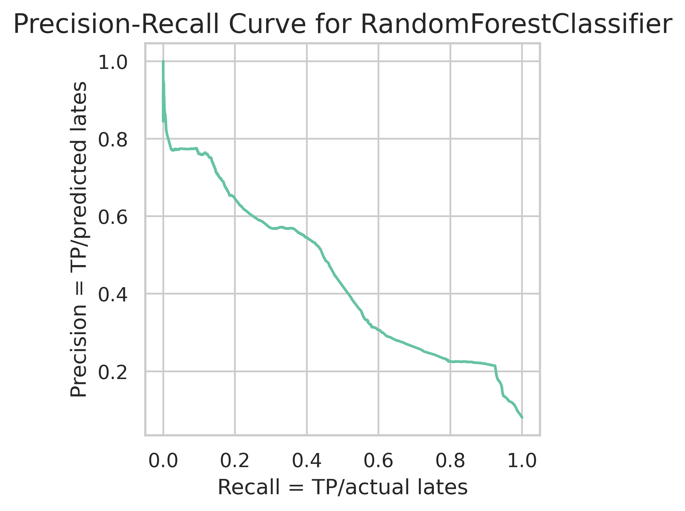

### Feature importance

|feature|importance|
| :---: | :---: |
|header_from_self_build|0.2977740877026892|
|block_gas_used|0.13248191622929562|
|header_from_ultrasound|0.11816867299327324|
|block_total_bytes_compressed|0.10577921036378755|
|entity_figment|0.08541364510895853|
|p66_block_arrival_ms|0.0814468081774253|
|block_tx_count|0.0732619631459057|
|entity_binance|0.04446490491925013|
|header_from_titan|0.030515074099486048|
|entity_other|0.011817669860784776|
|entity_stakefish|0.004919565841382717|
|entity_kraken|0.004777228680443377|
|block_proposer_index|0.004299700007120301|
|entity_solo_stakers|0.0016535439214256987|
|entity_blockdaemon|0.0012135525762193354|
|entity_kiln|0.0007140201814918133|
|entity_bitcoinsuisse|0.0004541449669304463|
|entity_staked.us|0.00044940387486012284|
|entity_ether.fi|0.00020055153028788664|
|entity_lido|0.00010255539160719391|
|entity_everstake|5.42818336322056e-05|
|entity_coinbase|2.5581662562850533e-05|
|entity_okex|5.0008508694410986e-06|
|entity_upbit|3.793159764350144e-06|
|entity_mantle|2.3811596299651146e-06|
|entity_abyss_finance|5.551582118452555e-07|
|entity_rocketpool|1.8660270442163977e-07|


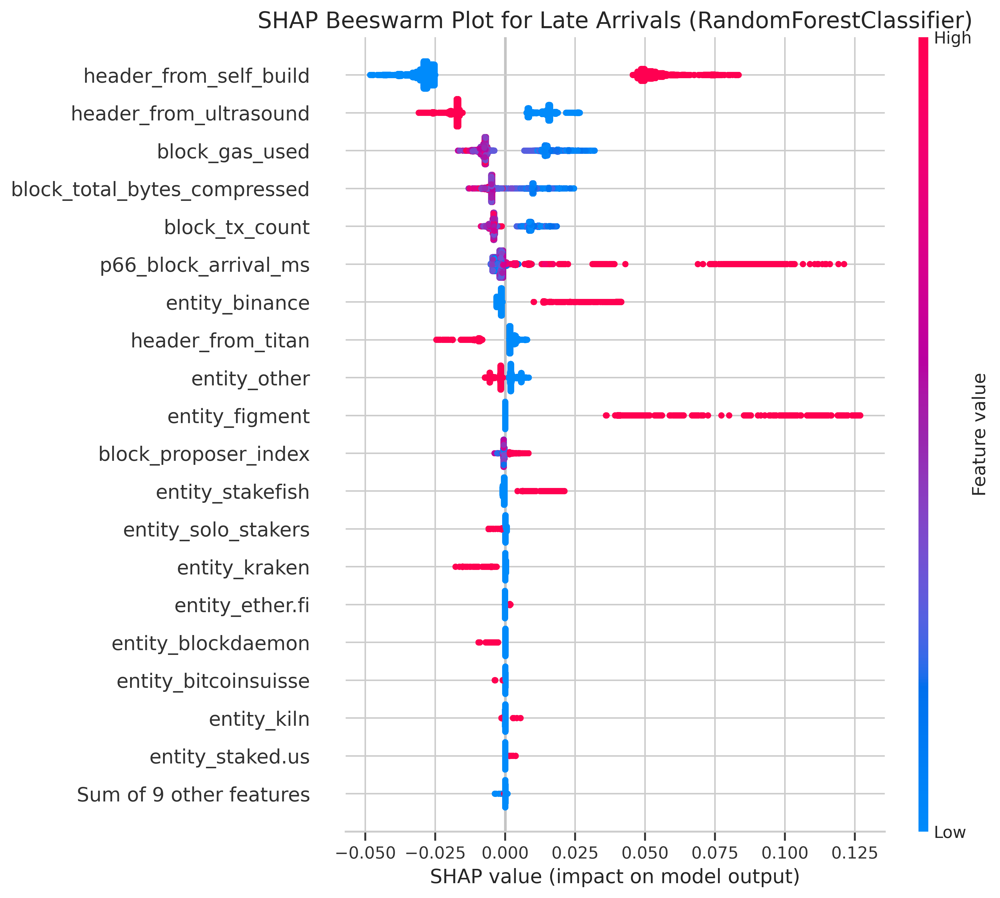


## LGBMClassifier outputs

### Model performance


```python

              precision    recall  f1-score   support

     on-time      0.935     0.993     0.963   2626348
        late      0.720     0.212     0.327    231311

    accuracy                          0.930   2857659
   macro avg      0.827     0.602     0.645   2857659
weighted avg      0.917     0.930     0.911   2857659

```

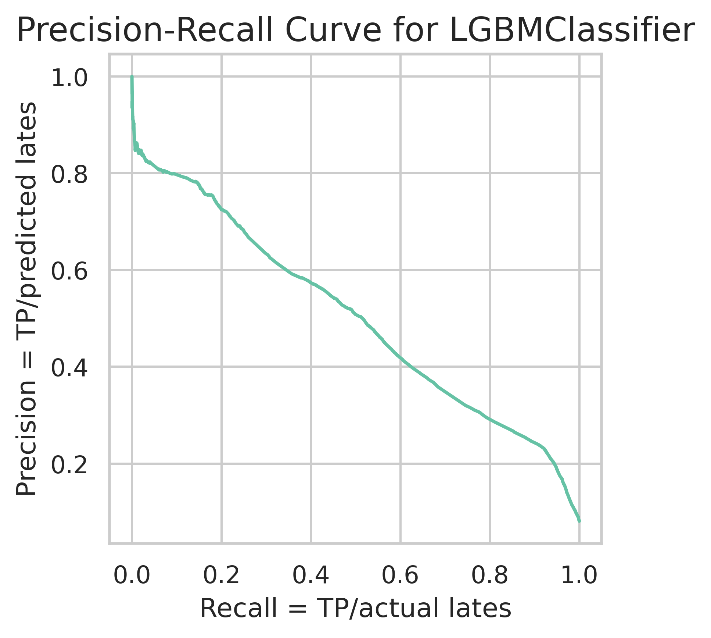

### Feature importance

|feature|importance|
| :---: | :---: |
|p66_block_arrival_ms|239|
|header_from_self_build|70|
|entity_figment|38|
|entity_binance|32|
|entity_ether.fi|29|
|entity_kraken|26|
|block_proposer_index|24|
|block_gas_used|23|
|entity_blockdaemon|22|
|entity_bitcoinsuisse|21|
|entity_kiln|20|
|entity_stakefish|20|
|block_total_bytes_compressed|19|
|entity_other|14|
|entity_staked.us|13|
|block_tx_count|12|
|entity_solo_stakers|12|
|entity_lido|12|
|entity_upbit|10|
|header_from_titan|8|
|entity_everstake|8|
|entity_abyss_finance|8|
|entity_p2porg|8|
|entity_coinbase|6|
|entity_okex|3|
|header_from_ultrasound|2|
|entity_rocketpool|1|


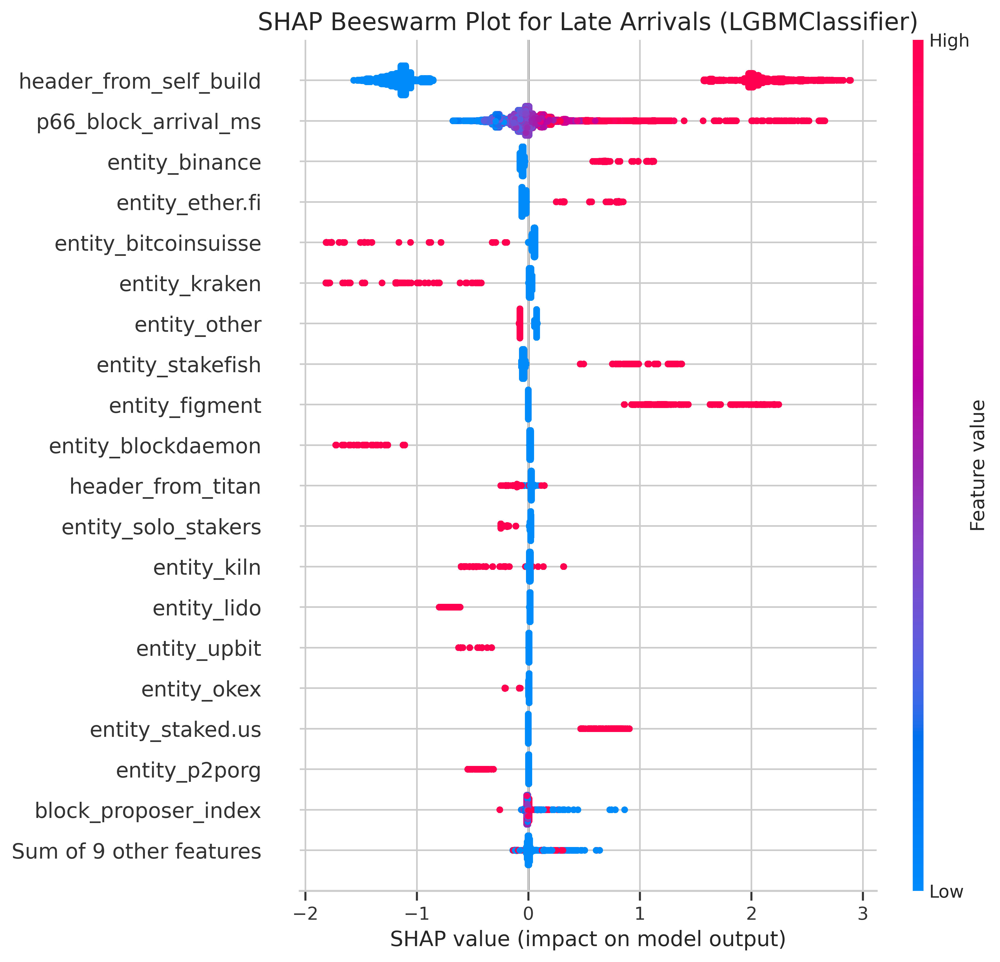


## LogisticRegression outputs

### Model performance


```python

              precision    recall  f1-score   support

     on-time      0.935     0.991     0.962   2626348
        late      0.667     0.213     0.323    231311

    accuracy                          0.928   2857659
   macro avg      0.801     0.602     0.642   2857659
weighted avg      0.913     0.928     0.910   2857659

```

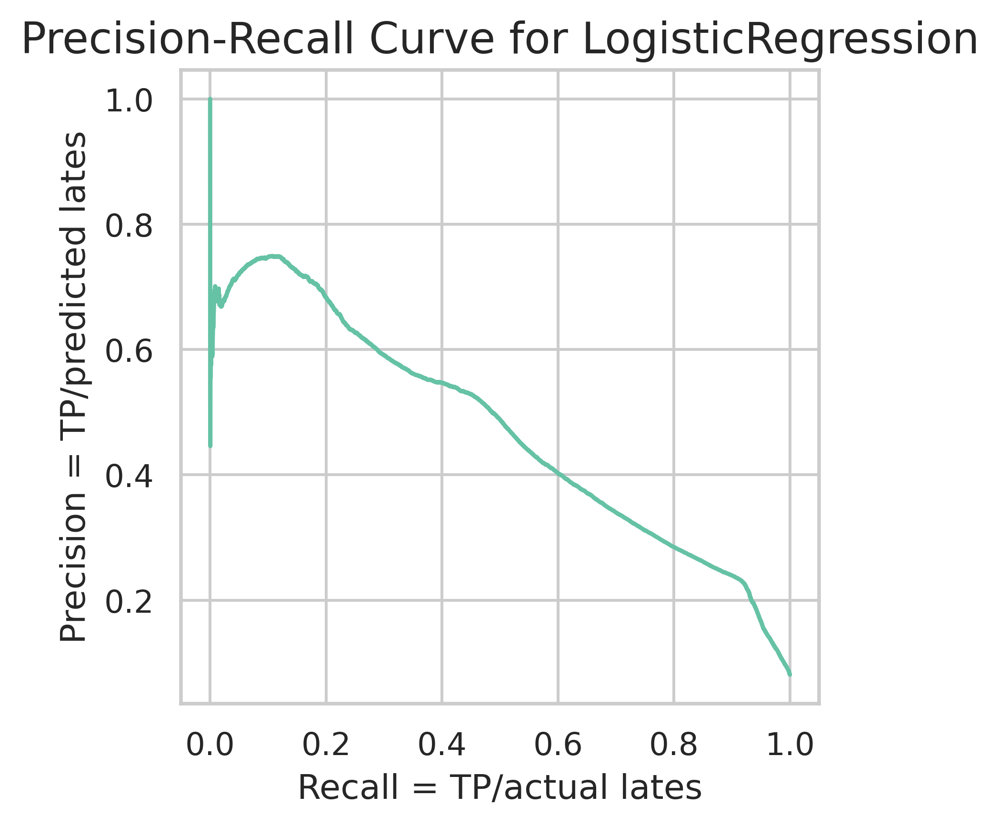

### Feature importance

|feature|importance|
| :---: | :---: |
|entity_figment|2.38305207119904|
|header_from_self_build|1.5915502119010514|
|entity_stakefish|1.5430213748560095|
|entity_binance|1.3710028387780409|
|entity_staked.us|1.0346664362933242|
|entity_everstake|0.48627960754479593|
|p66_block_arrival_ms|0.3412496935784203|
|entity_ether.fi|0.2747746638933127|
|entity_coinbase|0.25153558779975804|
|entity_rocketpool|0.17374119144400707|
|block_gas_used|0.08215661293281178|
|block_proposer_index|0.0286711560291776|


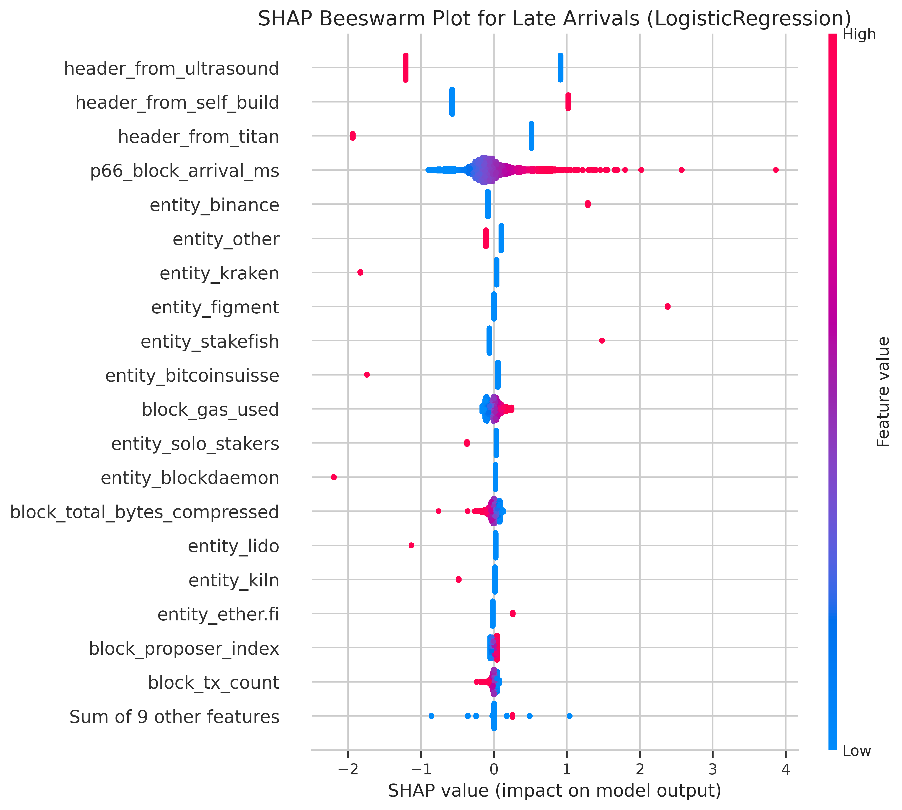


# Balanced sample (50% of each predictor class)

## Logit regression - statsmodel report


```python
                           Logit Regression Results                           
==============================================================================
Dep. Variable:                      y   No. Observations:               462611
Model:                          Logit   Df Residuals:                   462584
Method:                           MLE   Df Model:                           26
Date:                Tue, 12 Aug 2025   Pseudo R-squ.:                  0.4321
Time:                        23:15:49   Log-Likelihood:            -1.8209e+05
converged:                       True   LL-Null:                   -3.2066e+05
Covariance Type:            nonrobust   LLR p-value:                     0.000
================================================================================================
                                   coef    std err          z      P>|z|      [0.025      0.975]
------------------------------------------------------------------------------------------------
const                           -0.7349   1.35e+05  -5.45e-06      1.000   -2.64e+05    2.64e+05
p66_block_arrival_ms             0.4730      0.005     95.497      0.000       0.463       0.483
block_total_bytes_compressed    -0.0810      0.010     -8.221      0.000      -0.100      -0.062
block_proposer_index             0.0411      0.004      9.599      0.000       0.033       0.049
block_gas_used                   0.1053      0.009     11.133      0.000       0.087       0.124
block_tx_count                  -0.0252      0.009     -2.728      0.006      -0.043      -0.007
header_from_self_build           2.2750        nan        nan        nan         nan         nan
header_from_titan               -1.6545        nan        nan        nan         nan         nan
header_from_ultrasound          -1.3554        nan        nan        nan         nan         nan
entity_abyss_finance            -0.6272        nan        nan        nan         nan         nan
entity_binance                   0.7795        nan        nan        nan         nan         nan
entity_blockdaemon              -2.8994        nan        nan        nan         nan         nan
entity_coinbase                 -0.2803        nan        nan        nan         nan         nan
entity_coinspot                  2.6953        nan        nan        nan         nan         nan
entity_ether.fi                  0.1765        nan        nan        nan         nan         nan
entity_everstake                -0.1898        nan        nan        nan         nan         nan
entity_figment                   1.4498        nan        nan        nan         nan         nan
entity_figment_lido              1.7364        nan        nan        nan         nan         nan
entity_kiln                     -1.1681        nan        nan        nan         nan         nan
entity_kraken                   -2.5594        nan        nan        nan         nan         nan
entity_liquid_collective         0.2328        nan        nan        nan         nan         nan
entity_okex                     -0.6379        nan        nan        nan         nan         nan
entity_other                    -1.0793        nan        nan        nan         nan         nan
entity_rocketpool               -0.2072        nan        nan        nan         nan         nan
entity_senseinode_lido           1.0952        nan        nan        nan         nan         nan
entity_solo_stakers             -0.8446        nan        nan        nan         nan         nan
entity_staked.us                 0.6491        nan        nan        nan         nan         nan
entity_stakefish                 0.9437        nan        nan        nan         nan         nan
================================================================================================
```
## RandomForestClassifier outputs

### Model performance


```python

              precision    recall  f1-score   support

     on-time      0.903     0.701     0.789    231300
        late      0.756     0.925     0.832    231311

    accuracy                          0.813    462611
   macro avg      0.829     0.813     0.811    462611
weighted avg      0.829     0.813     0.811    462611

```

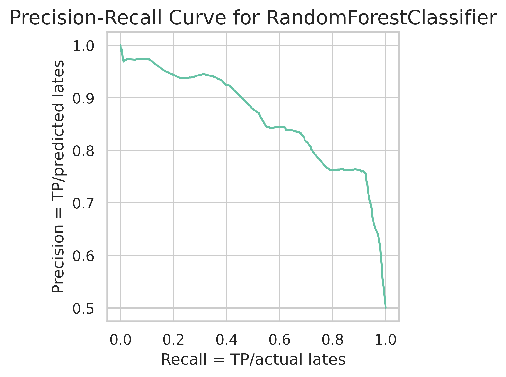

### Feature importance

|feature|importance|
| :---: | :---: |
|header_from_self_build|0.2824976120797475|
|header_from_ultrasound|0.22499555436275856|
|block_gas_used|0.11876485145697192|
|block_total_bytes_compressed|0.11018975576629211|
|block_tx_count|0.09766185014942477|
|header_from_titan|0.0640156006521645|
|entity_other|0.03473808452195128|
|entity_figment|0.015362465732302101|
|p66_block_arrival_ms|0.015189651019004711|
|entity_binance|0.012087470623409629|
|entity_kraken|0.007789414217458069|
|entity_coinspot|0.004582739263359328|
|block_proposer_index|0.004487920075052744|
|entity_figment_lido|0.0031091332408073606|
|entity_blockdaemon|0.0015524944803408072|
|entity_solo_stakers|0.0011385903992653385|
|entity_stakefish|0.0008531557747831559|
|entity_ether.fi|0.0006360760609344572|
|entity_kiln|0.00013994871181236278|
|entity_senseinode_lido|0.0001339791588671771|
|entity_abyss_finance|2.1750581178856132e-05|
|entity_coinbase|1.9411990748672756e-05|
|entity_okex|1.6819192054003437e-05|
|entity_staked.us|8.429589856649132e-06|
|entity_everstake|4.023373800338098e-06|
|entity_rocketpool|3.2175256536458396e-06|


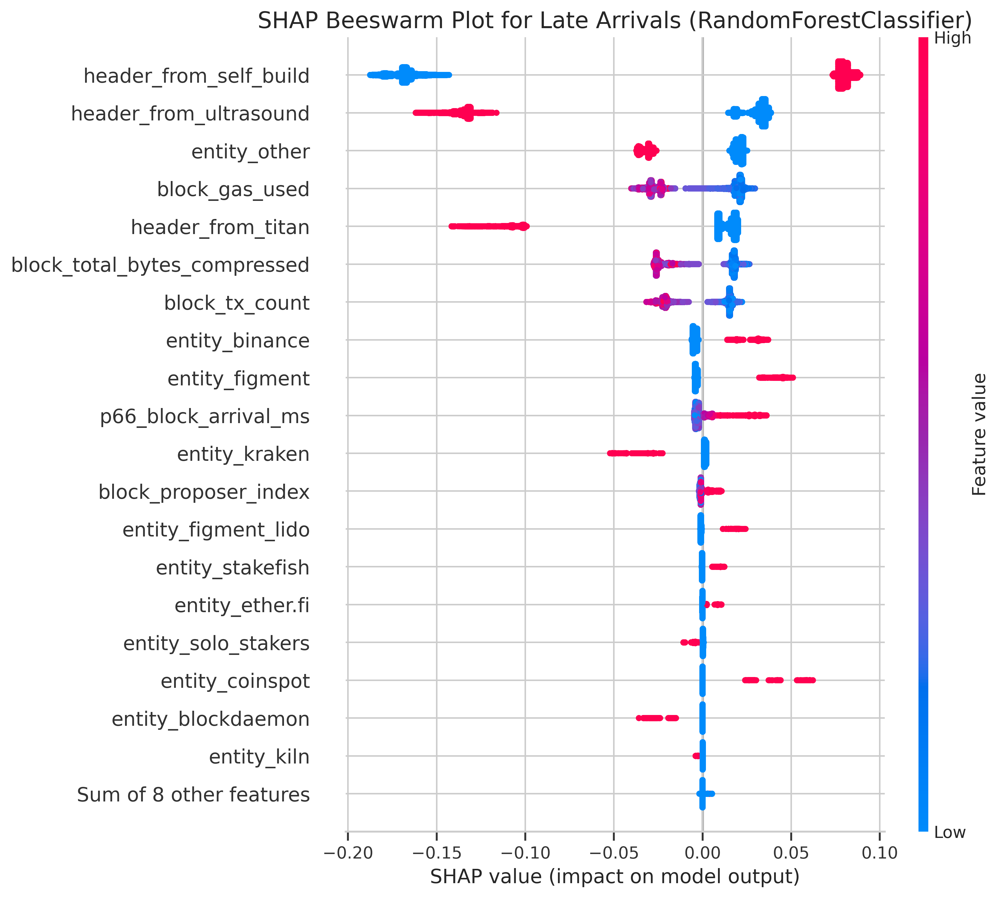


## LGBMClassifier outputs

### Model performance


```python

              precision    recall  f1-score   support

     on-time      0.847     0.803     0.825    231300
        late      0.813     0.855     0.834    231311

    accuracy                          0.829    462611
   macro avg      0.830     0.829     0.829    462611
weighted avg      0.830     0.829     0.829    462611

```

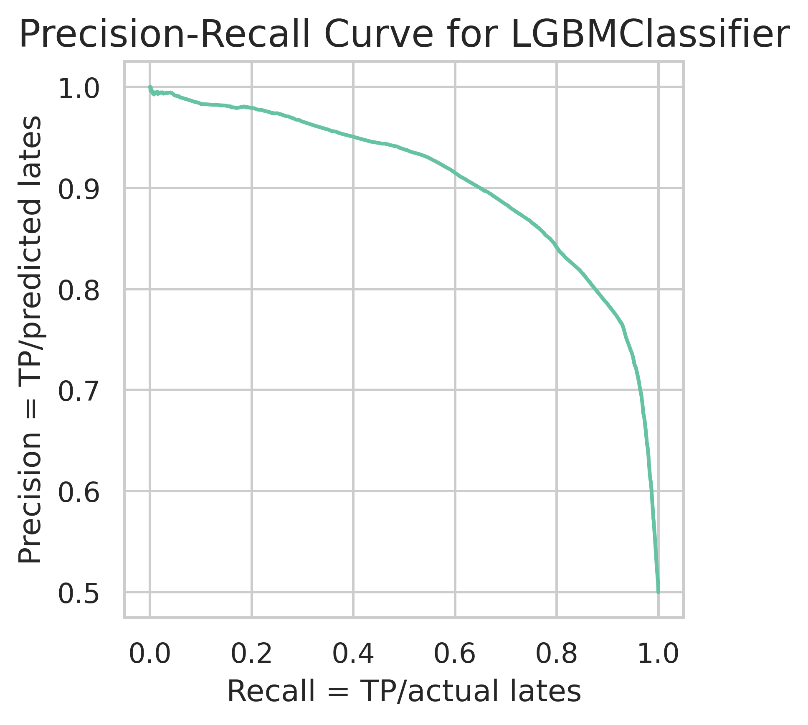

### Feature importance

|feature|importance|
| :---: | :---: |
|p66_block_arrival_ms|210|
|header_from_self_build|122|
|entity_other|34|
|entity_figment|33|
|entity_coinspot|29|
|entity_binance|27|
|entity_kraken|23|
|entity_figment_lido|22|
|entity_blockdaemon|21|
|entity_ether.fi|20|
|entity_kiln|19|
|block_total_bytes_compressed|18|
|block_gas_used|15|
|entity_stakefish|15|
|entity_senseinode_lido|15|
|block_proposer_index|13|
|entity_solo_stakers|12|
|entity_staked.us|11|
|header_from_titan|11|
|block_tx_count|9|
|entity_abyss_finance|9|
|entity_okex|5|
|entity_everstake|4|
|entity_liquid_collective|2|
|header_from_ultrasound|1|


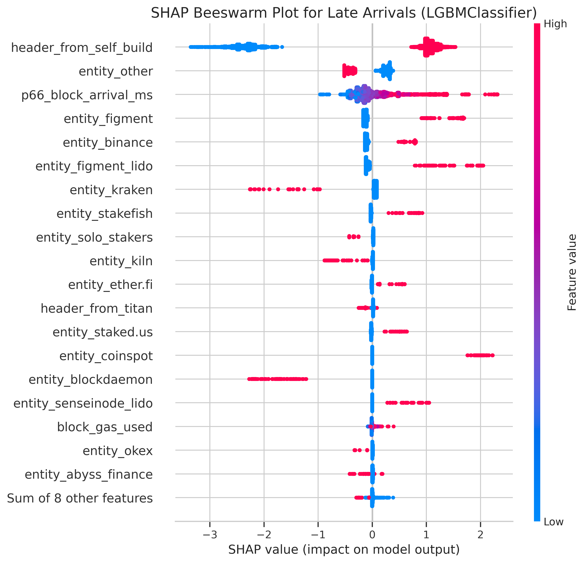


## LogisticRegression outputs

### Model performance


```python

              precision    recall  f1-score   support

     on-time      0.881     0.751     0.811    231300
        late      0.783     0.898     0.837    231311

    accuracy                          0.825    462611
   macro avg      0.832     0.825     0.824    462611
weighted avg      0.832     0.825     0.824    462611

```

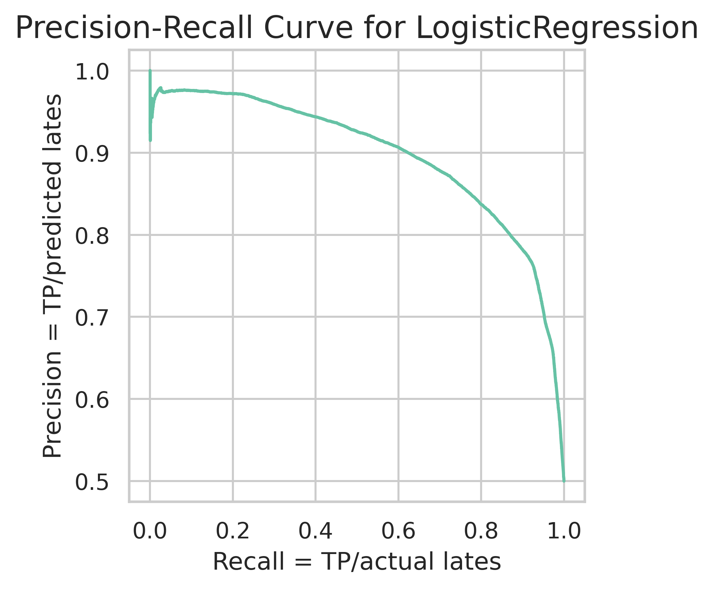

### Feature importance

|feature|importance|
| :---: | :---: |
|entity_coinspot|2.6834394520101377|
|header_from_self_build|2.274856287922898|
|entity_figment_lido|1.7521805403500095|
|entity_figment|1.447493340970015|
|entity_senseinode_lido|1.103863242630929|
|entity_stakefish|0.9394724119848599|
|entity_binance|0.7722901702149074|
|entity_staked.us|0.6349214855577994|
|p66_block_arrival_ms|0.4736565461323781|
|entity_liquid_collective|0.23017130204129904|
|entity_ether.fi|0.1773867521039|
|block_gas_used|0.10779838448940376|
|block_proposer_index|0.04142411502244558|


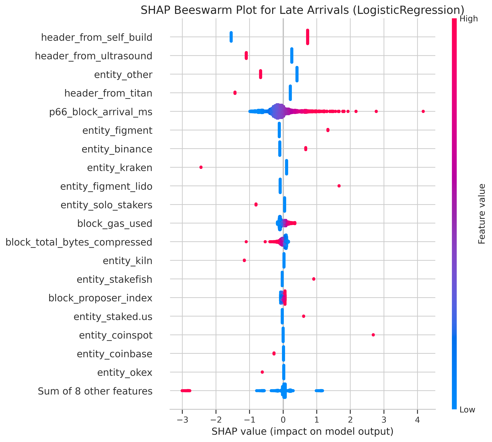


# Self-builder sample

## Logit regression - statsmodel report


```python
                           Logit Regression Results                           
==============================================================================
Dep. Variable:                      y   No. Observations:               998099
Model:                          Logit   Df Residuals:                   998074
Method:                           MLE   Df Model:                           24
Date:                Tue, 12 Aug 2025   Pseudo R-squ.:                  0.1586
Time:                        23:22:25   Log-Likelihood:            -4.3633e+05
converged:                       True   LL-Null:                   -5.1859e+05
Covariance Type:            nonrobust   LLR p-value:                     0.000
================================================================================================
                                   coef    std err          z      P>|z|      [0.025      0.975]
------------------------------------------------------------------------------------------------
p66_block_arrival_ms             0.4658      0.003    170.086      0.000       0.460       0.471
block_total_bytes_compressed    -0.0391      0.005     -8.010      0.000      -0.049      -0.030
block_proposer_index             0.0269      0.003      9.376      0.000       0.021       0.033
block_gas_used                   0.0605      0.005     13.103      0.000       0.051       0.070
block_tx_count                  -0.0380      0.005     -8.259      0.000      -0.047      -0.029
header_from_self_build          -1.5826    3.8e+04  -4.16e-05      1.000   -7.45e+04    7.45e+04
entity_abyss_finance            -0.3791    3.8e+04  -9.97e-06      1.000   -7.45e+04    7.45e+04
entity_binance                   1.5138    3.8e+04   3.98e-05      1.000   -7.45e+04    7.45e+04
entity_bitcoinsuisse            -1.8530    3.8e+04  -4.87e-05      1.000   -7.45e+04    7.45e+04
entity_blockdaemon              -2.3781    3.8e+04  -6.26e-05      1.000   -7.45e+04    7.45e+04
entity_coinbase                  0.3664    3.8e+04   9.64e-06      1.000   -7.45e+04    7.45e+04
entity_ether.fi                  0.1385    3.8e+04   3.64e-06      1.000   -7.45e+04    7.45e+04
entity_everstake                 0.6669    3.8e+04   1.75e-05      1.000   -7.45e+04    7.45e+04
entity_figment                   2.8643    3.8e+04   7.53e-05      1.000   -7.45e+04    7.45e+04
entity_kiln                     -0.3777    3.8e+04  -9.93e-06      1.000   -7.45e+04    7.45e+04
entity_kraken                   -1.9284    3.8e+04  -5.07e-05      1.000   -7.45e+04    7.45e+04
entity_lido                     -1.0553    3.8e+04  -2.78e-05      1.000   -7.45e+04    7.45e+04
entity_mantle                   -0.2492    3.8e+04  -6.56e-06      1.000   -7.45e+04    7.45e+04
entity_okex                      0.1028    3.8e+04    2.7e-06      1.000   -7.45e+04    7.45e+04
entity_other                    -0.1571    3.8e+04  -4.13e-06      1.000   -7.45e+04    7.45e+04
entity_p2porg                   -0.7139    3.8e+04  -1.88e-05      1.000   -7.45e+04    7.45e+04
entity_rocketpool                0.1756    3.8e+04   4.62e-06      1.000   -7.45e+04    7.45e+04
entity_solo_stakers             -0.3743    3.8e+04  -9.85e-06      1.000   -7.45e+04    7.45e+04
entity_staked.us                 1.1075    3.8e+04   2.91e-05      1.000   -7.45e+04    7.45e+04
entity_stakefish                 1.6527    3.8e+04   4.35e-05      1.000   -7.45e+04    7.45e+04
entity_upbit                    -0.7050    3.8e+04  -1.85e-05      1.000   -7.45e+04    7.45e+04
================================================================================================
```
## RandomForestClassifier outputs

### Model performance


```python

              precision    recall  f1-score   support

     on-time      0.787     0.999     0.881    784224
        late      0.832     0.010     0.019    213875

    accuracy                          0.787    998099
   macro avg      0.810     0.505     0.450    998099
weighted avg      0.797     0.787     0.696    998099

```

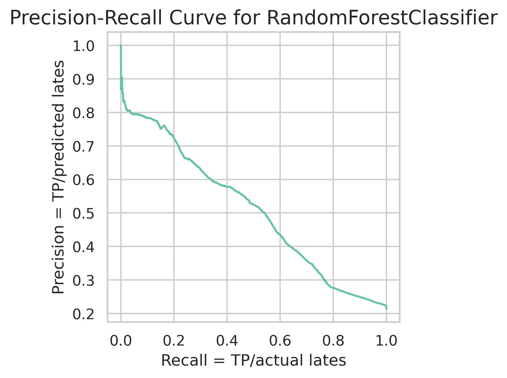

### Feature importance

|feature|importance|
| :---: | :---: |
|entity_figment|0.2912935296478266|
|entity_binance|0.24177889946911987|
|p66_block_arrival_ms|0.22889069055571462|
|entity_other|0.07559676022500963|
|entity_stakefish|0.050964029461414824|
|entity_kraken|0.048902667317413|
|entity_blockdaemon|0.020592580847936567|
|entity_solo_stakers|0.01146157031671498|
|entity_kiln|0.0074191040860254204|
|block_proposer_index|0.0068754399554873166|
|entity_bitcoinsuisse|0.004550984377903223|
|entity_staked.us|0.0023938144955906455|
|block_gas_used|0.0022359821342610377|
|block_total_bytes_compressed|0.0015259251143328713|
|entity_upbit|0.0012853018910436288|
|entity_lido|0.0011995880623620122|
|block_tx_count|0.0010589491482429496|
|entity_everstake|0.001016381359135656|
|entity_abyss_finance|0.0006708584630037239|
|entity_coinbase|0.0002869430714612592|


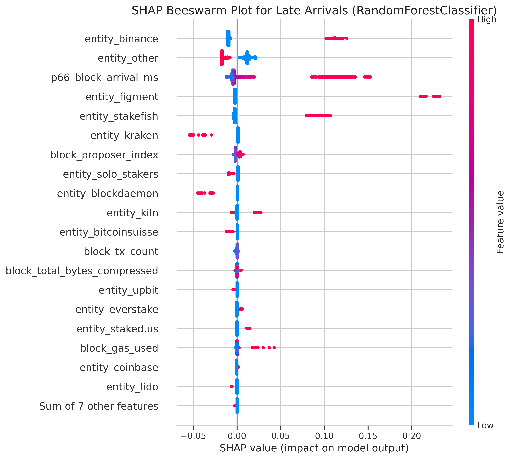


## LGBMClassifier outputs

### Model performance


```python

              precision    recall  f1-score   support

     on-time      0.825     0.974     0.893    784224
        late      0.714     0.241     0.361    213875

    accuracy                          0.817    998099
   macro avg      0.769     0.607     0.627    998099
weighted avg      0.801     0.817     0.779    998099

```

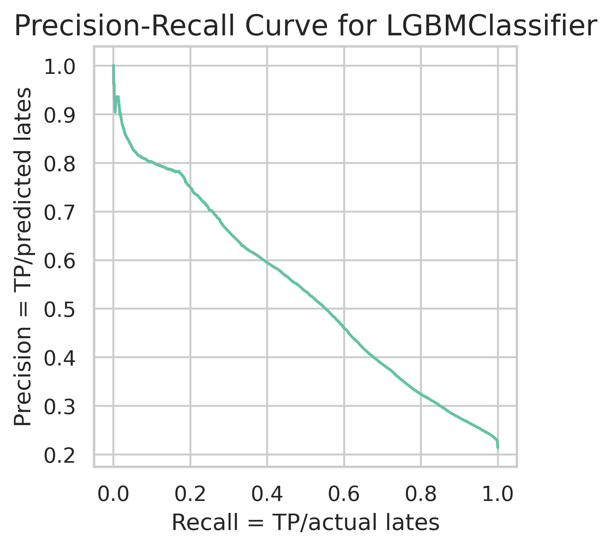

### Feature importance

|feature|importance|
| :---: | :---: |
|p66_block_arrival_ms|299|
|block_gas_used|40|
|block_proposer_index|36|
|entity_kraken|30|
|entity_figment|28|
|entity_kiln|27|
|entity_binance|25|
|entity_blockdaemon|25|
|block_total_bytes_compressed|24|
|entity_bitcoinsuisse|22|
|entity_stakefish|18|
|entity_other|14|
|entity_solo_stakers|14|
|entity_staked.us|13|
|entity_lido|13|
|entity_everstake|12|
|block_tx_count|11|
|entity_p2porg|10|
|entity_upbit|10|
|entity_abyss_finance|9|
|entity_coinbase|9|
|entity_ether.fi|5|


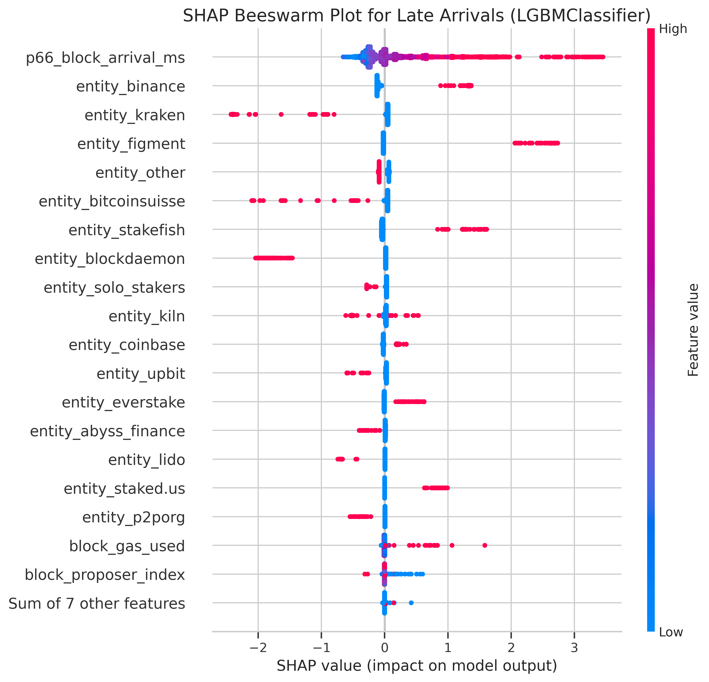


## LogisticRegression outputs

### Model performance


```python

              precision    recall  f1-score   support

     on-time      0.825     0.961     0.888    784224
        late      0.642     0.255     0.365    213875

    accuracy                          0.810    998099
   macro avg      0.734     0.608     0.626    998099
weighted avg      0.786     0.810     0.776    998099

```

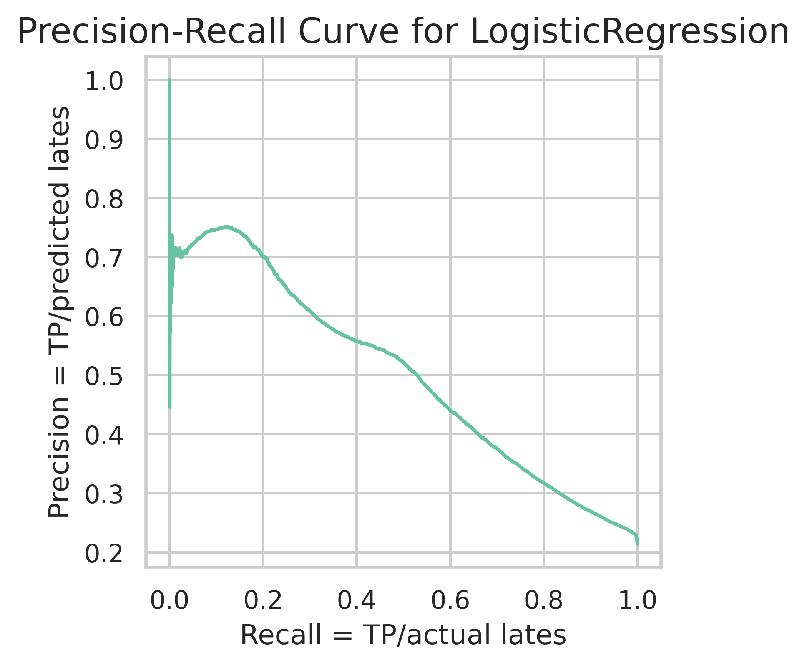

### Feature importance

|feature|importance|
| :---: | :---: |
|entity_figment|2.904332915032419|
|entity_stakefish|1.6986889580951736|
|entity_binance|1.5513052886835237|
|entity_staked.us|1.12984594259319|
|entity_everstake|0.7002654706786396|
|p66_block_arrival_ms|0.4658902998711686|
|entity_coinbase|0.39951960879741577|
|entity_rocketpool|0.2214865052749879|
|entity_ether.fi|0.1852470191999313|
|entity_okex|0.1549124188055099|
|block_gas_used|0.0594637054269318|
|block_proposer_index|0.027139970770484995|


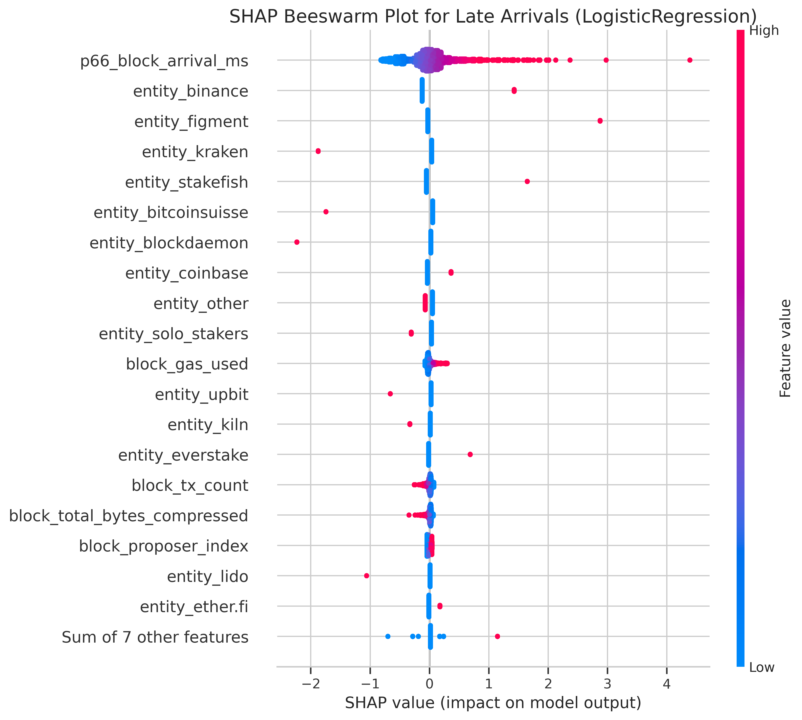


# Relay sample

## Logit regression - statsmodel report


```python
                           Logit Regression Results                           
==============================================================================
Dep. Variable:                      y   No. Observations:              1859560
Model:                          Logit   Df Residuals:                  1859533
Method:                           MLE   Df Model:                           26
Date:                Tue, 12 Aug 2025   Pseudo R-squ.:                 0.05833
Time:                        23:36:48   Log-Likelihood:                -93011.
converged:                      False   LL-Null:                       -98772.
Covariance Type:            nonrobust   LLR p-value:                     0.000
================================================================================================
                                   coef    std err          z      P>|z|      [0.025      0.975]
------------------------------------------------------------------------------------------------
const                           -4.4291        nan        nan        nan         nan         nan
p66_block_arrival_ms            -0.0849      0.008    -10.504      0.000      -0.101      -0.069
block_total_bytes_compressed    -0.0992      0.015     -6.518      0.000      -0.129      -0.069
block_proposer_index             0.0134      0.008      1.756      0.079      -0.002       0.028
block_gas_used                   0.1512      0.013     11.337      0.000       0.125       0.177
block_tx_count                   0.0557      0.012      4.514      0.000       0.032       0.080
header_from_titan               -2.3847   2.79e+05  -8.56e-06      1.000   -5.46e+05    5.46e+05
header_from_ultrasound          -2.0445   2.79e+05  -7.34e-06      1.000   -5.46e+05    5.46e+05
entity_abyss_finance             2.3814   2.88e+05   8.28e-06      1.000   -5.64e+05    5.64e+05
entity_binance                   2.4778   2.88e+05   8.61e-06      1.000   -5.64e+05    5.64e+05
entity_bitcoinsuisse            -0.3861   2.88e+05  -1.34e-06      1.000   -5.64e+05    5.64e+05
entity_blockdaemon              -0.5056   2.88e+05  -1.76e-06      1.000   -5.64e+05    5.64e+05
entity_coinbase                  1.3816   2.88e+05    4.8e-06      1.000   -5.64e+05    5.64e+05
entity_ether.fi                  2.9790   2.88e+05   1.04e-05      1.000   -5.64e+05    5.64e+05
entity_everstake                -0.8853   2.88e+05  -3.08e-06      1.000   -5.64e+05    5.64e+05
entity_figment                   2.7963   2.88e+05   9.72e-06      1.000   -5.64e+05    5.64e+05
entity_kiln                      0.0900   2.88e+05   3.13e-07      1.000   -5.64e+05    5.64e+05
entity_kraken                    0.8606   2.88e+05   2.99e-06      1.000   -5.64e+05    5.64e+05
entity_lido                     -0.0789   2.88e+05  -2.74e-07      1.000   -5.64e+05    5.64e+05
entity_mantle                    0.5502   2.88e+05   1.91e-06      1.000   -5.64e+05    5.64e+05
entity_okex                     -2.1100   2.88e+05  -7.34e-06      1.000   -5.64e+05    5.64e+05
entity_other                     1.5388   2.88e+05   5.35e-06      1.000   -5.64e+05    5.64e+05
entity_p2porg                   -1.2373   2.88e+05   -4.3e-06      1.000   -5.64e+05    5.64e+05
entity_rocketpool                2.2394   2.88e+05   7.79e-06      1.000   -5.64e+05    5.64e+05
entity_solo_stakers              1.5645   2.88e+05   5.44e-06      1.000   -5.64e+05    5.64e+05
entity_staked.us                 2.7460   2.88e+05   9.55e-06      1.000   -5.64e+05    5.64e+05
entity_stakefish                 2.8159   2.88e+05   9.79e-06      1.000   -5.64e+05    5.64e+05
entity_upbit                   -23.6473   2.89e+05   -8.2e-05      1.000   -5.66e+05    5.65e+05
================================================================================================
```
## RandomForestClassifier outputs

### Model performance


```python

              precision    recall  f1-score   support

     on-time      0.991     1.000     0.995   1842124
        late      0.000     0.000     0.000     17436

    accuracy                          0.991   1859560
   macro avg      0.495     0.500     0.498   1859560
weighted avg      0.981     0.991     0.986   1859560

```

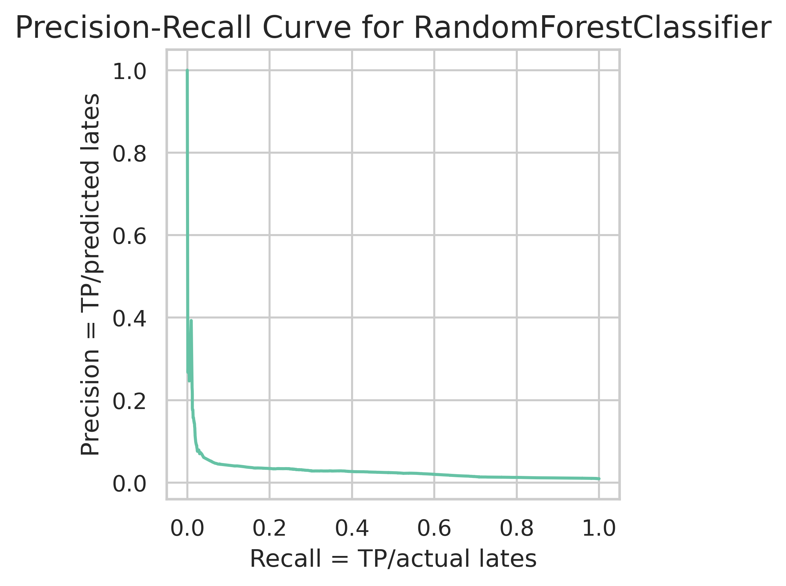

### Feature importance

|feature|importance|
| :---: | :---: |
|entity_ether.fi|0.33099249144790593|
|entity_figment|0.1343770075890301|
|entity_binance|0.10815074824159958|
|block_proposer_index|0.08503039596147259|
|entity_stakefish|0.051363290407030845|
|p66_block_arrival_ms|0.05107850792329989|
|entity_other|0.04987086370387551|
|entity_kiln|0.046076947285449595|
|block_tx_count|0.024691371106689834|
|entity_staked.us|0.02010760688615212|
|entity_okex|0.012516458958065108|
|block_total_bytes_compressed|0.012101458752425064|
|block_gas_used|0.012000973715140669|
|entity_everstake|0.011679169999881287|
|header_from_titan|0.011410247892124909|
|entity_kraken|0.010432753197734745|
|header_from_ultrasound|0.009579153173021765|
|entity_abyss_finance|0.004253185289609511|
|entity_solo_stakers|0.0042276495434093566|
|entity_upbit|0.0038680300144153116|
|entity_blockdaemon|0.003056372275223346|
|entity_coinbase|0.0027606837464977624|
|entity_bitcoinsuisse|0.0002405646310702844|
|entity_rocketpool|0.00013406825887497413|


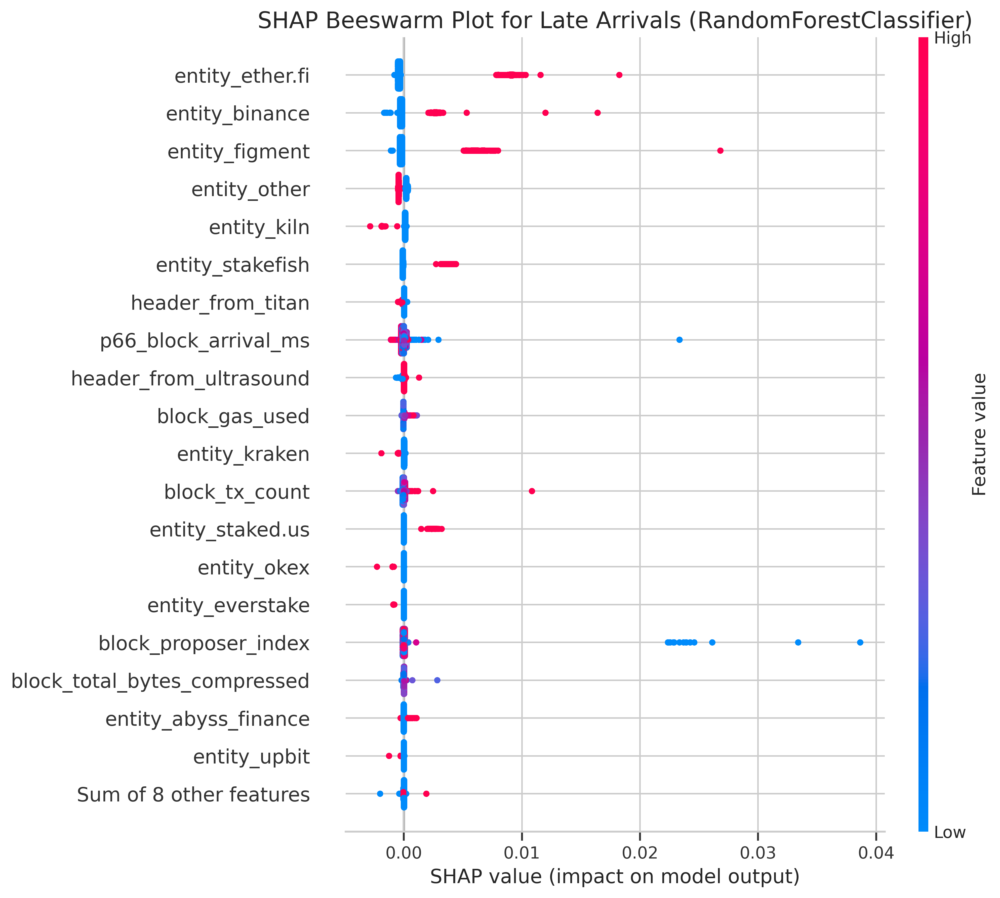


## LGBMClassifier outputs

### Model performance


```python

              precision    recall  f1-score   support

     on-time      0.991     1.000     0.995   1842124
        late      0.000     0.000     0.000     17436

    accuracy                          0.991   1859560
   macro avg      0.495     0.500     0.498   1859560
weighted avg      0.981     0.991     0.986   1859560

```

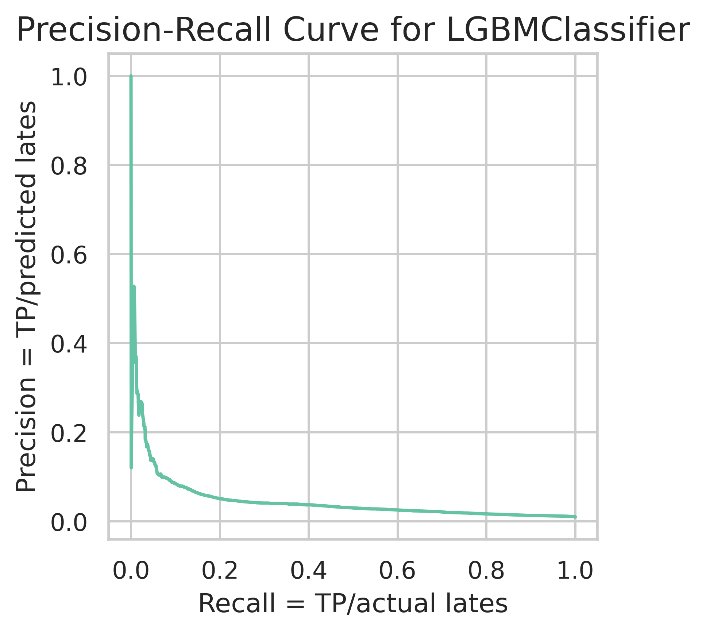

### Feature importance

|feature|importance|
| :---: | :---: |
|p66_block_arrival_ms|187|
|block_tx_count|82|
|block_proposer_index|79|
|block_gas_used|60|
|block_total_bytes_compressed|39|
|entity_ether.fi|23|
|entity_okex|19|
|header_from_titan|18|
|entity_upbit|17|
|entity_kiln|17|
|entity_figment|16|
|entity_everstake|16|
|entity_staked.us|15|
|entity_binance|14|
|entity_blockdaemon|14|
|entity_abyss_finance|13|
|entity_bitcoinsuisse|12|
|entity_stakefish|12|
|entity_p2porg|12|
|entity_kraken|10|
|entity_lido|9|
|entity_rocketpool|7|
|entity_mantle|5|
|entity_other|2|
|entity_coinbase|2|


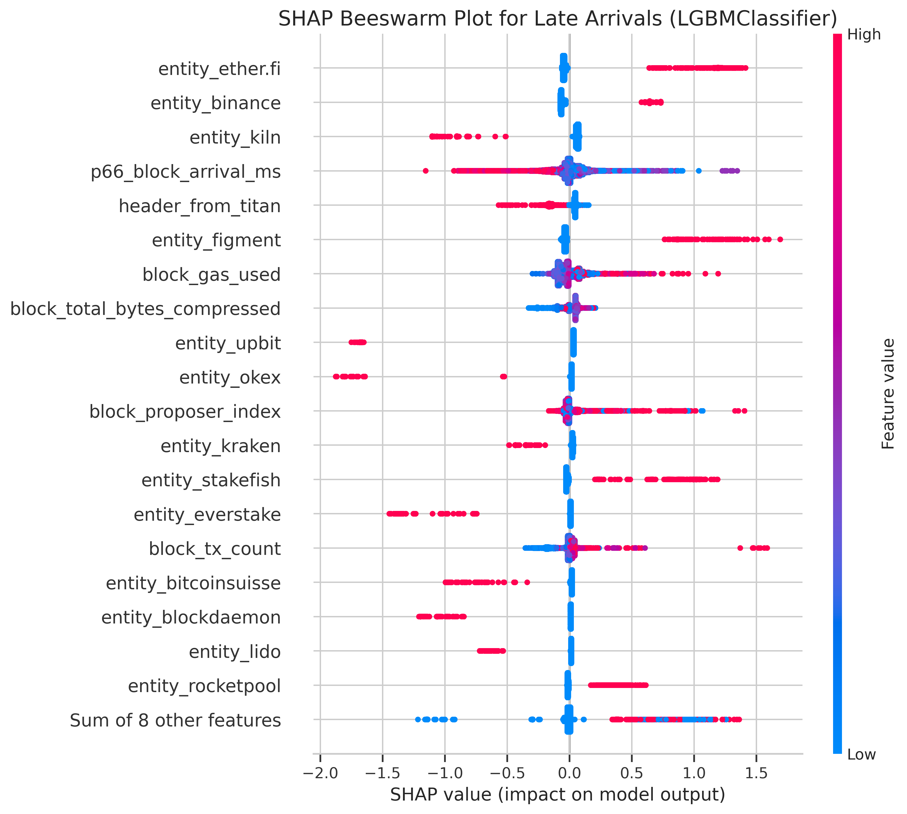


## LogisticRegression outputs

### Model performance


```python

              precision    recall  f1-score   support

     on-time      0.991     1.000     0.995   1842124
        late      0.000     0.000     0.000     17436

    accuracy                          0.991   1859560
   macro avg      0.495     0.500     0.498   1859560
weighted avg      0.981     0.991     0.986   1859560

```

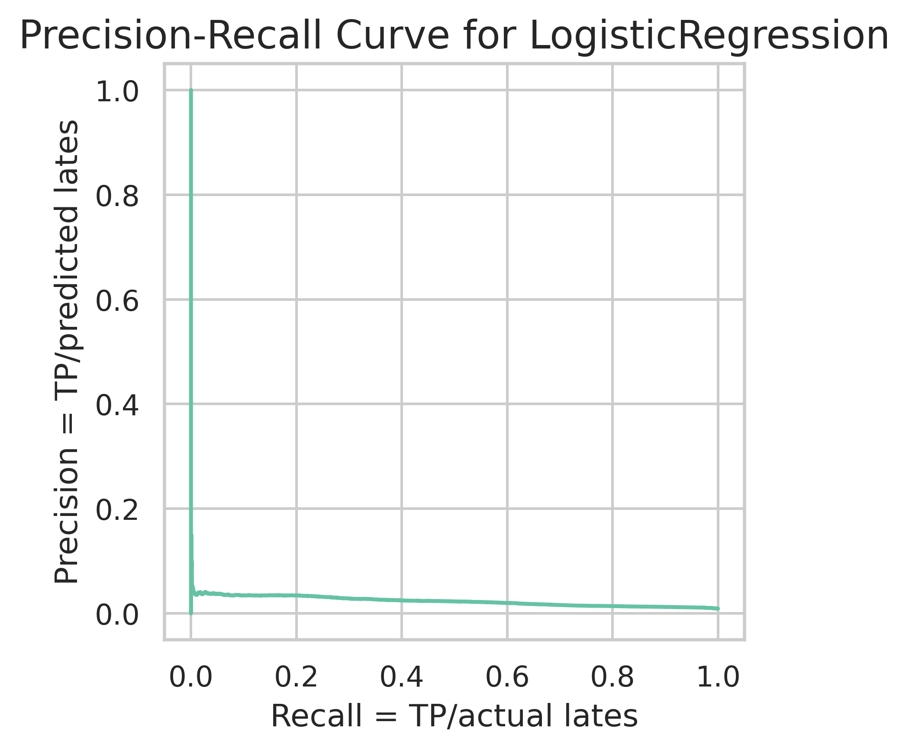

### Feature importance

|feature|importance|
| :---: | :---: |
|entity_stakefish|1.4815719674874372|
|entity_ether.fi|1.461427363672876|
|entity_figment|1.3862539533496288|
|entity_staked.us|1.2266724589072546|
|entity_binance|0.9270534623045081|
|entity_abyss_finance|0.8194765489799092|
|entity_rocketpool|0.5630122734727955|
|block_gas_used|0.1627941716840414|
|entity_solo_stakers|0.13331033662645886|
|block_tx_count|0.04341923938990373|
|entity_other|0.024542512185169528|
|block_proposer_index|0.004086899811492274|


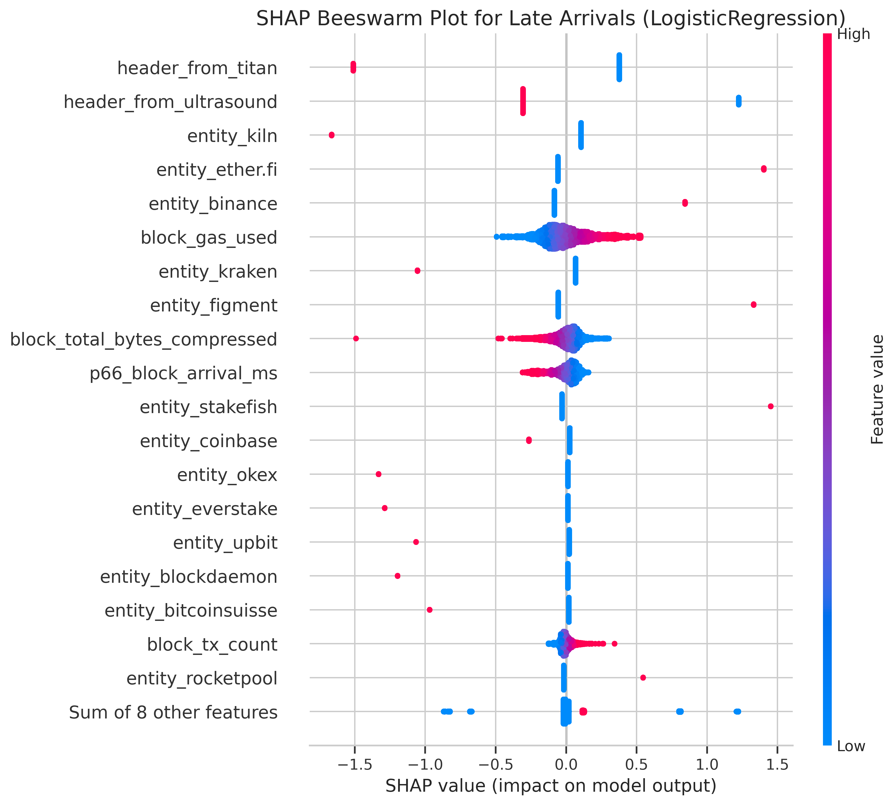


# No entity feature sample

## Logit regression - statsmodel report


```python
                           Logit Regression Results                           
==============================================================================
Dep. Variable:                      y   No. Observations:              2857659
Model:                          Logit   Df Residuals:                  2857651
Method:                           MLE   Df Model:                            7
Date:                Wed, 13 Aug 2025   Pseudo R-squ.:                  0.2492
Time:                        00:03:04   Log-Likelihood:            -6.0303e+05
converged:                       True   LL-Null:                   -8.0320e+05
Covariance Type:            nonrobust   LLR p-value:                     0.000
================================================================================================
                                   coef    std err          z      P>|z|      [0.025      0.975]
------------------------------------------------------------------------------------------------
const                           -2.7280   5.33e+04  -5.12e-05      1.000   -1.04e+05    1.04e+05
p66_block_arrival_ms             0.2984      0.002    154.380      0.000       0.295       0.302
block_total_bytes_compressed    -0.0550      0.006     -9.486      0.000      -0.066      -0.044
block_proposer_index             0.0268      0.002     11.471      0.000       0.022       0.031
block_gas_used                   0.0720      0.005     13.883      0.000       0.062       0.082
block_tx_count                  -0.0273      0.006     -4.802      0.000      -0.038      -0.016
header_from_self_build           1.4840   5.33e+04   2.78e-05      1.000   -1.04e+05    1.04e+05
header_from_titan               -2.2642   5.33e+04  -4.25e-05      1.000   -1.04e+05    1.04e+05
header_from_ultrasound          -1.9478   5.33e+04  -3.65e-05      1.000   -1.04e+05    1.04e+05
================================================================================================
```
## RandomForestClassifier outputs

### Model performance


```python

              precision    recall  f1-score   support

     on-time      0.919     1.000     0.958   2626348
        late      0.000     0.000     0.000    231311

    accuracy                          0.919   2857659
   macro avg      0.460     0.500     0.479   2857659
weighted avg      0.845     0.919     0.880   2857659

```

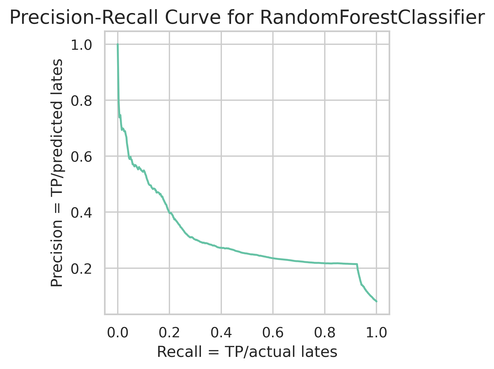

### Feature importance

|feature|importance|
| :---: | :---: |
|header_from_self_build|0.36617692533193774|
|block_gas_used|0.17389039913126936|
|block_total_bytes_compressed|0.13062618430550696|
|header_from_ultrasound|0.12135655052056188|
|p66_block_arrival_ms|0.0986998809032105|
|block_tx_count|0.06377634274823354|
|header_from_titan|0.0391601812187893|
|block_proposer_index|0.006313535840490725|


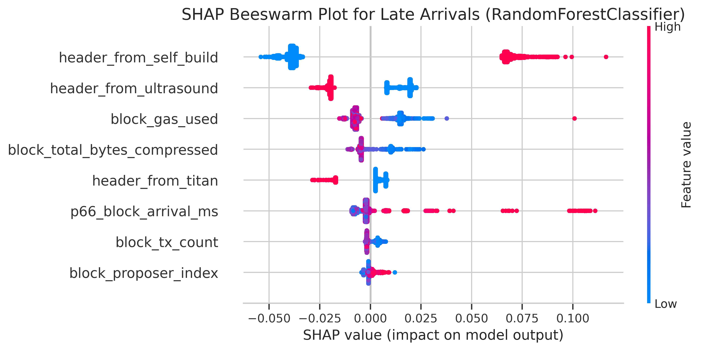


## LGBMClassifier outputs

### Model performance


```python

              precision    recall  f1-score   support

     on-time      0.924     0.996     0.959   2626348
        late      0.602     0.072     0.129    231311

    accuracy                          0.921   2857659
   macro avg      0.763     0.534     0.544   2857659
weighted avg      0.898     0.921     0.891   2857659

```

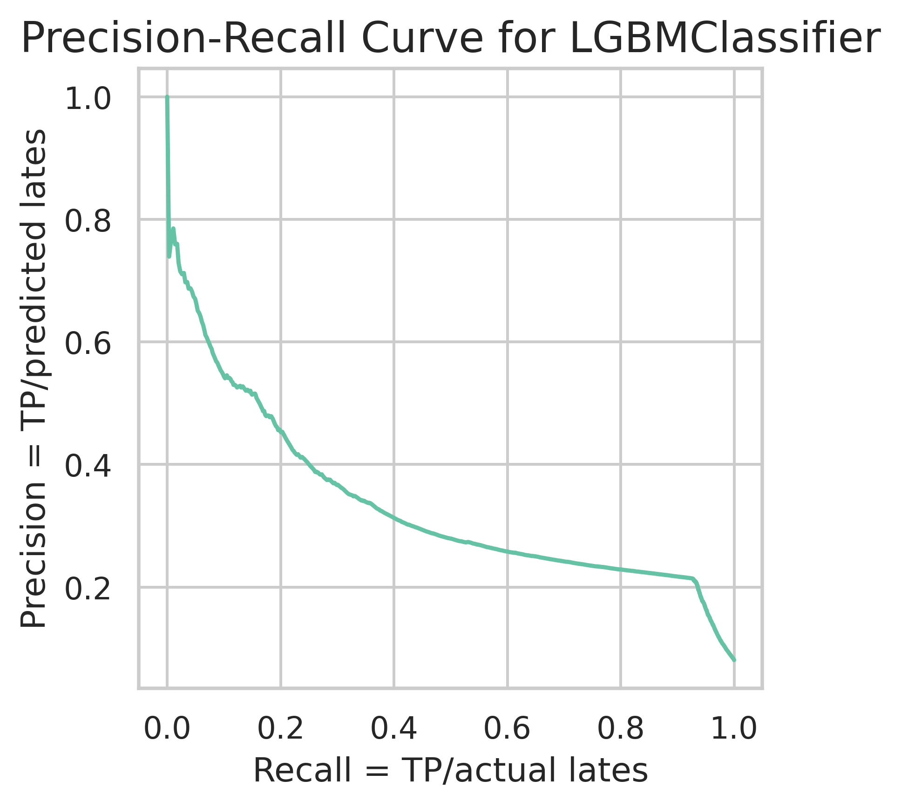

### Feature importance

|feature|importance|
| :---: | :---: |
|p66_block_arrival_ms|238|
|block_gas_used|120|
|block_proposer_index|99|
|block_total_bytes_compressed|93|
|block_tx_count|71|
|header_from_self_build|51|
|header_from_titan|27|
|header_from_ultrasound|1|


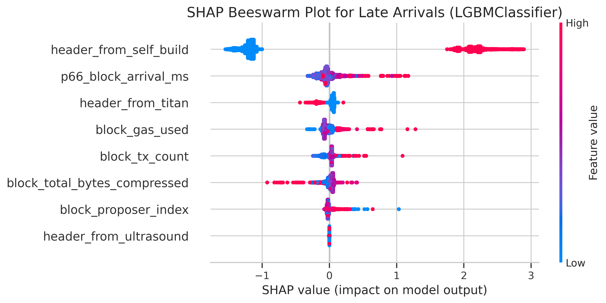


## LogisticRegression outputs

### Model performance


```python

              precision    recall  f1-score   support

     on-time      0.921     0.998     0.958   2626348
        late      0.486     0.022     0.043    231311

    accuracy                          0.919   2857659
   macro avg      0.703     0.510     0.500   2857659
weighted avg      0.885     0.919     0.884   2857659

```

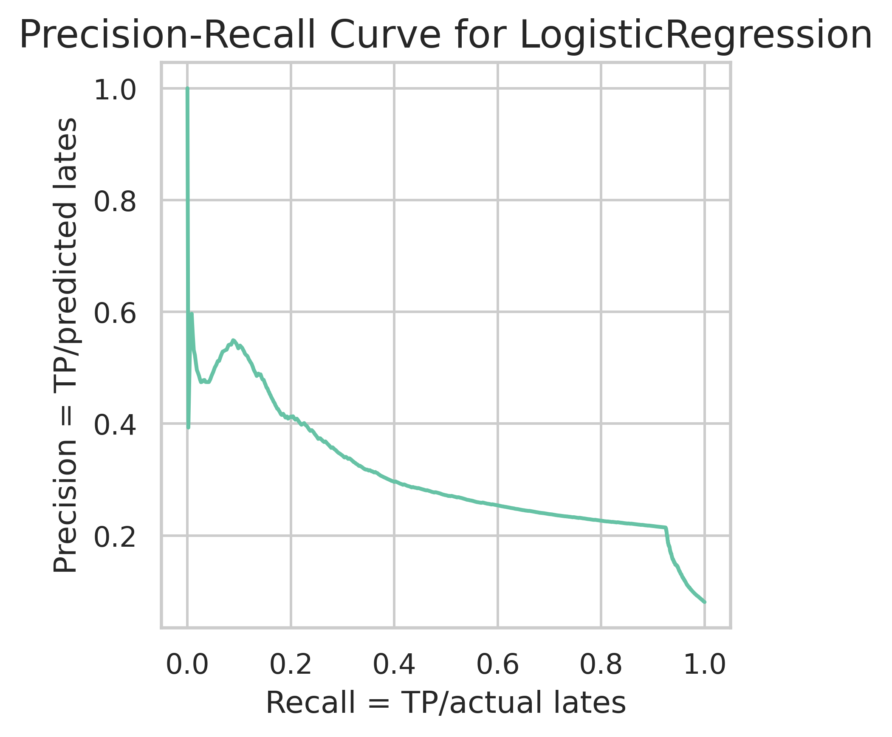

### Feature importance

|feature|importance|
| :---: | :---: |
|header_from_self_build|1.4817279251404916|
|p66_block_arrival_ms|0.2982136067332673|
|block_gas_used|0.06857757596639973|
|block_proposer_index|0.027063393613870154|


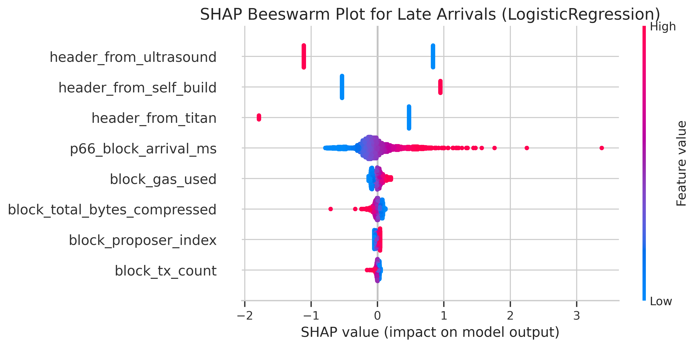


# Timings since slot start predictor

## Logit regression - statsmodel report


```python
                           Logit Regression Results                           
==============================================================================
Dep. Variable:                      y   No. Observations:              2857775
Model:                          Logit   Df Residuals:                  2857748
Method:                           MLE   Df Model:                           26
Date:                Wed, 13 Aug 2025   Pseudo R-squ.:                  0.1596
Time:                        00:19:49   Log-Likelihood:            -1.2797e+06
converged:                       True   LL-Null:                   -1.5227e+06
Covariance Type:            nonrobust   LLR p-value:                     0.000
================================================================================================
                                   coef    std err          z      P>|z|      [0.025      0.975]
------------------------------------------------------------------------------------------------
const                           -1.1671        nan        nan        nan         nan         nan
p66_block_arrival_ms             0.4720      0.002    296.724      0.000       0.469       0.475
block_total_bytes_compressed    -0.0428      0.003    -12.367      0.000      -0.050      -0.036
block_proposer_index            -0.0035      0.002     -2.161      0.031      -0.007      -0.000
block_gas_used                   0.0712      0.004     19.778      0.000       0.064       0.078
block_tx_count                  -0.0210      0.003     -6.732      0.000      -0.027      -0.015
header_from_self_build          -0.3037      3e+04  -1.01e-05      1.000   -5.88e+04    5.88e+04
header_from_titan               -0.5026   3.01e+04  -1.67e-05      1.000    -5.9e+04     5.9e+04
header_from_ultrasound          -0.3608   2.99e+04  -1.21e-05      1.000   -5.85e+04    5.85e+04
entity_abyss_finance            -0.2272   1.34e+04   -1.7e-05      1.000   -2.63e+04    2.63e+04
entity_binance                   1.4978   1.34e+04      0.000      1.000   -2.62e+04    2.63e+04
entity_bitcoinsuisse            -2.4129   1.34e+04     -0.000      1.000   -2.63e+04    2.62e+04
entity_blockdaemon              -2.3072   1.34e+04     -0.000      1.000   -2.63e+04    2.62e+04
entity_coinbase                  0.3107   1.34e+04   2.32e-05      1.000   -2.63e+04    2.63e+04
entity_ether.fi                  0.1703   1.34e+04   1.27e-05      1.000   -2.63e+04    2.63e+04
entity_everstake                 0.8598   1.34e+04   6.42e-05      1.000   -2.63e+04    2.63e+04
entity_figment                   2.8473   1.34e+04      0.000      1.000   -2.62e+04    2.63e+04
entity_kiln                     -0.3460   1.34e+04  -2.58e-05      1.000   -2.63e+04    2.63e+04
entity_kraken                   -2.0841   1.34e+04     -0.000      1.000   -2.63e+04    2.62e+04
entity_lido                     -1.1529   1.34e+04  -8.61e-05      1.000   -2.63e+04    2.62e+04
entity_mantle                   -0.2578   1.34e+04  -1.92e-05      1.000   -2.63e+04    2.63e+04
entity_okex                      0.1058   1.34e+04    7.9e-06      1.000   -2.63e+04    2.63e+04
entity_other                    -0.1464   1.34e+04  -1.09e-05      1.000   -2.63e+04    2.63e+04
entity_p2porg                   -0.5970   1.34e+04  -4.46e-05      1.000   -2.63e+04    2.63e+04
entity_rocketpool                0.2941   1.34e+04    2.2e-05      1.000   -2.63e+04    2.63e+04
entity_solo_stakers             -0.3836   1.34e+04  -2.86e-05      1.000   -2.63e+04    2.63e+04
entity_staked.us                 1.0624   1.34e+04   7.93e-05      1.000   -2.62e+04    2.63e+04
entity_stakefish                 2.0847   1.34e+04      0.000      1.000   -2.62e+04    2.63e+04
entity_upbit                    -0.4853   1.34e+04  -3.62e-05      1.000   -2.63e+04    2.63e+04
================================================================================================
```
## RandomForestClassifier outputs

### Model performance


```python

              precision    recall  f1-score   support

     on-time      0.782     0.997     0.876   2215519
        late      0.792     0.040     0.075    642256

    accuracy                          0.782   2857775
   macro avg      0.787     0.518     0.476   2857775
weighted avg      0.784     0.782     0.696   2857775

```


### Feature importance

|feature|importance|
| :---: | :---: |
|entity_figment|0.34605507428038523|
|entity_binance|0.2296964157718191|
|p66_block_arrival_ms|0.14039017399658069|
|entity_stakefish|0.08345455162854515|
|entity_other|0.06260637019165086|
|entity_kraken|0.042612809773910264|
|entity_solo_stakers|0.030688488448225252|
|entity_blockdaemon|0.0169283887256993|
|entity_kiln|0.01221006438345677|
|entity_staked.us|0.008148078871255866|
|entity_bitcoinsuisse|0.007696884380678408|
|entity_lido|0.006173879552245241|
|entity_everstake|0.003159962838254003|
|entity_p2porg|0.0031220047502843527|
|header_from_ultrasound|0.0012289442657407034|
|block_gas_used|0.0010702961579135421|
|entity_abyss_finance|0.0010512351880771977|
|block_total_bytes_compressed|0.001020969457348743|
|block_tx_count|0.0008559482196762664|
|header_from_self_build|0.0006274551713322458|
|entity_upbit|0.0005623451825982662|
|block_proposer_index|0.00046332192443591523|
|header_from_titan|0.00017633683988639557|


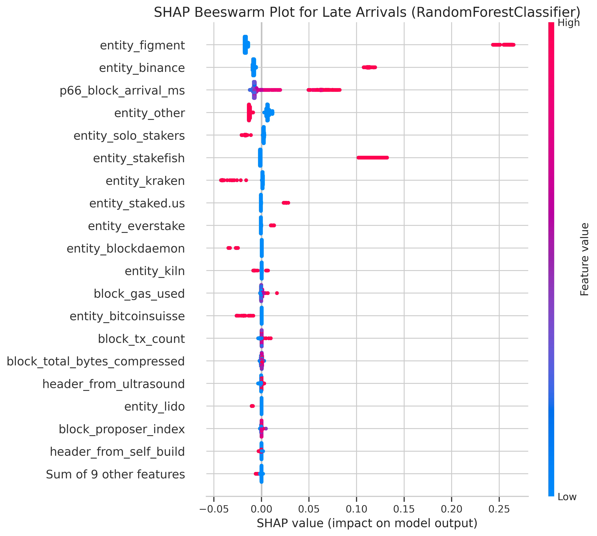


## LGBMClassifier outputs

### Model performance


```python

              precision    recall  f1-score   support

     on-time      0.815     0.972     0.887   2215519
        late      0.715     0.241     0.361    642256

    accuracy                          0.808   2857775
   macro avg      0.765     0.607     0.624   2857775
weighted avg      0.793     0.808     0.769   2857775

```

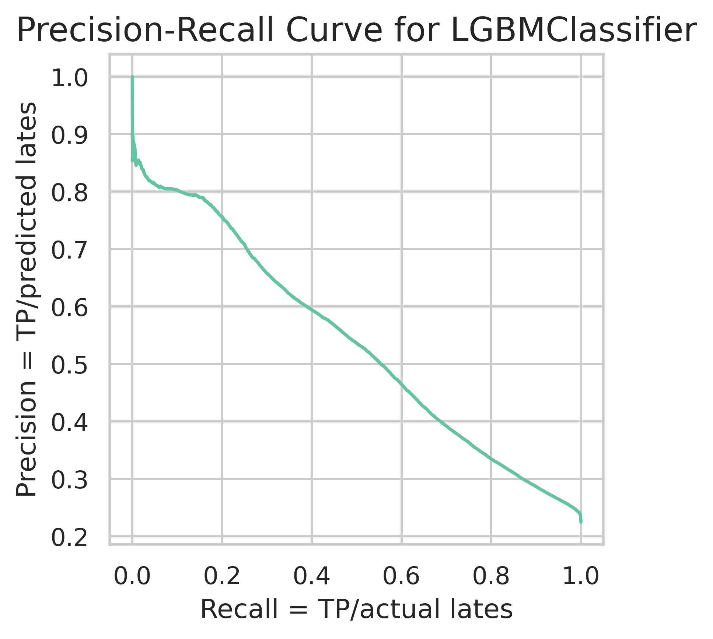

### Feature importance

|feature|importance|
| :---: | :---: |
|p66_block_arrival_ms|319|
|entity_kraken|33|
|entity_figment|28|
|block_gas_used|28|
|entity_bitcoinsuisse|27|
|block_proposer_index|25|
|entity_blockdaemon|25|
|entity_stakefish|23|
|entity_binance|21|
|entity_kiln|18|
|header_from_ultrasound|18|
|entity_other|16|
|entity_solo_stakers|16|
|entity_lido|15|
|entity_staked.us|13|
|entity_everstake|12|
|block_tx_count|11|
|entity_upbit|10|
|block_total_bytes_compressed|9|
|entity_p2porg|8|
|entity_abyss_finance|7|
|entity_coinbase|7|
|header_from_titan|6|
|entity_mantle|3|
|entity_rocketpool|2|


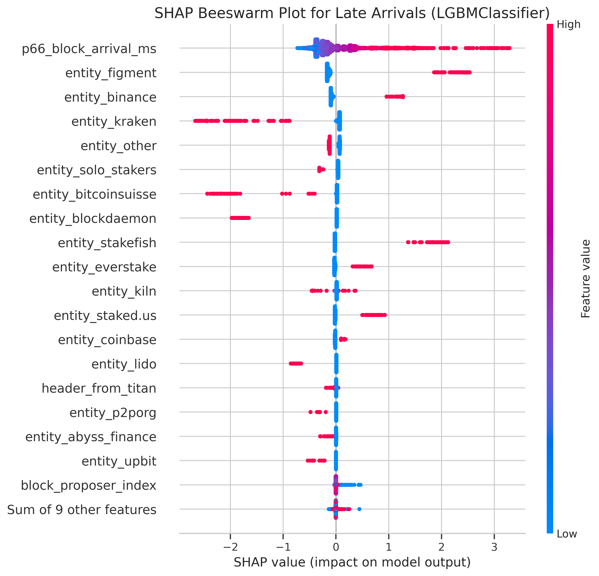


## LogisticRegression outputs

### Model performance


```python

              precision    recall  f1-score   support

     on-time      0.818     0.960     0.883   2215519
        late      0.655     0.264     0.376    642256

    accuracy                          0.803   2857775
   macro avg      0.737     0.612     0.630   2857775
weighted avg      0.781     0.803     0.769   2857775

```

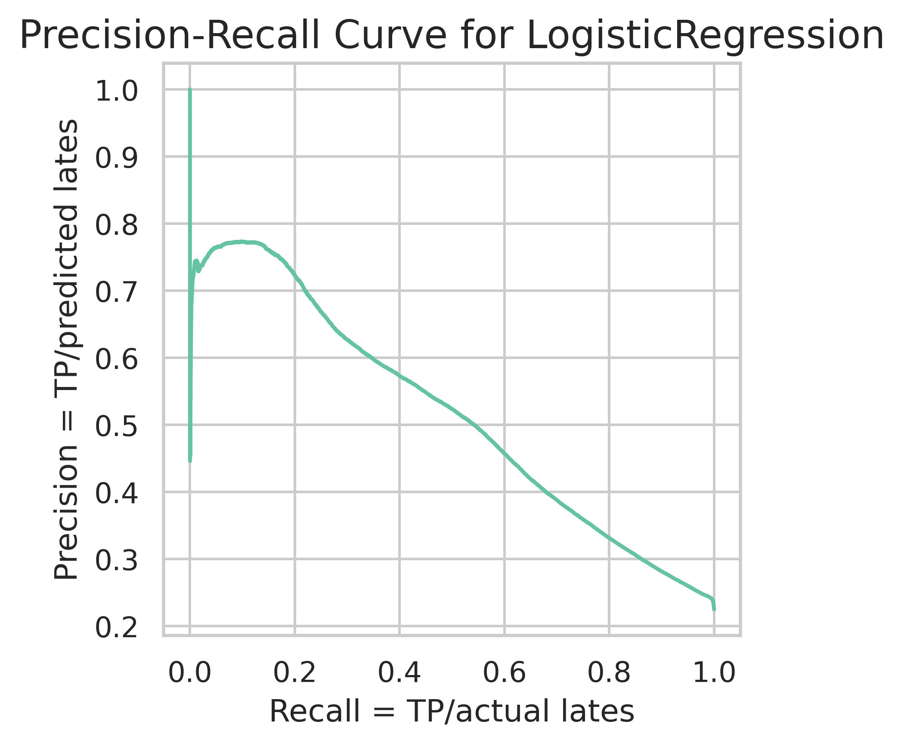

### Feature importance

|feature|importance|
| :---: | :---: |
|entity_figment|2.843650641493499|
|entity_stakefish|2.0876275983807933|
|entity_binance|1.4962602928911732|
|entity_staked.us|1.043615889895176|
|entity_everstake|0.8570532440517838|
|p66_block_arrival_ms|0.4718053602555099|
|entity_coinbase|0.3017662555163642|
|entity_rocketpool|0.2890989697691846|
|entity_ether.fi|0.16909341303557854|
|entity_okex|0.11182742245203493|
|block_gas_used|0.07271712417851628|


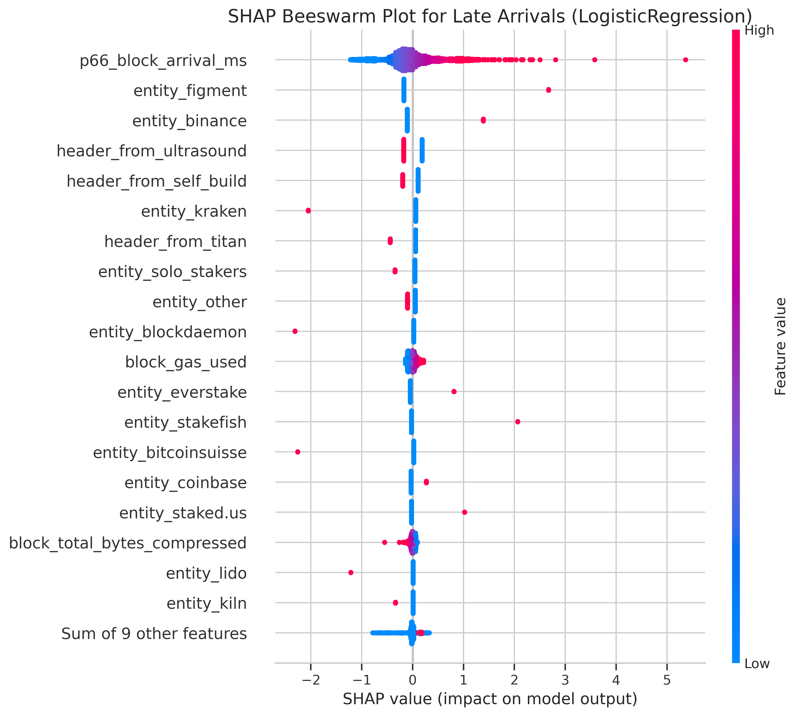

