Late arrivals model report
==========================


* [Original sample](#original-sample)
	* [Logit regression - statsmodel report](#logit-regression---statsmodel-report)
	* [RandomForestClassifier outputs](#randomforestclassifier-outputs)
	* [LGBMClassifier outputs](#lgbmclassifier-outputs)
	* [LogisticRegression outputs](#logisticregression-outputs)
* [Balanced sample (50% of each predictor class)](#balanced-sample-50-of-each-predictor-class)
	* [Logit regression - statsmodel report](#logit-regression---statsmodel-report)
	* [RandomForestClassifier outputs](#randomforestclassifier-outputs)
	* [LGBMClassifier outputs](#lgbmclassifier-outputs)
	* [LogisticRegression outputs](#logisticregression-outputs)
* [Self-builder balanced sample](#self-builder-balanced-sample)
	* [Logit regression - statsmodel report](#logit-regression---statsmodel-report)
	* [RandomForestClassifier outputs](#randomforestclassifier-outputs)
	* [LGBMClassifier outputs](#lgbmclassifier-outputs)
	* [LogisticRegression outputs](#logisticregression-outputs)
* [Relay balanced sample](#relay-balanced-sample)
	* [Logit regression - statsmodel report](#logit-regression---statsmodel-report)
	* [RandomForestClassifier outputs](#randomforestclassifier-outputs)
	* [LGBMClassifier outputs](#lgbmclassifier-outputs)
	* [LogisticRegression outputs](#logisticregression-outputs)
* [No entity feature balanced sample](#no-entity-feature-balanced-sample)
	* [Logit regression - statsmodel report](#logit-regression---statsmodel-report)
	* [RandomForestClassifier outputs](#randomforestclassifier-outputs)
	* [LGBMClassifier outputs](#lgbmclassifier-outputs)
	* [LogisticRegression outputs](#logisticregression-outputs)
* [Timings since slot start balanced predictor](#timings-since-slot-start-balanced-predictor)
	* [Logit regression - statsmodel report](#logit-regression---statsmodel-report)
	* [RandomForestClassifier outputs](#randomforestclassifier-outputs)
	* [LGBMClassifier outputs](#lgbmclassifier-outputs)
	* [LogisticRegression outputs](#logisticregression-outputs)


***
## Introduction


This report summarises the main outputs from the model trained in the script 
[`late_atts_model_runner.py`](https://github.com/misilva73/eth-slot-analysis/blob/main/src/late_atts_model_runner.py).

We collected data on the attestation arrival times for two types of slots - slots from 
relays (titan and ultrasound) and slots from self-builders. For the relays, we compute the 
attestation arrival since the block was published by the relay (to account for timing games), 
while for self-builders, we compute the attestation arrival since the start of the slot 
(i.e., assuming no timing games or other delays). 

We gathered additional data on the slot and the attester and trained different models 
that predict whether an attestation was late, which is defined as taking more than 4.5s. We 
use these models to compute feature importance and SHAP values to surface which properties of the 
slot or the attester explain late arrivals.

This report was generated from the data in `sample_12243620_12294020` at 19-08-2025 11:56:51.

# Original sample

## Logit regression - statsmodel report


```python
                           Logit Regression Results                           
==============================================================================
Dep. Variable:                      y   No. Observations:             10603541
Model:                          Logit   Df Residuals:                 10603511
Method:                           MLE   Df Model:                           29
Date:                Wed, 20 Aug 2025   Pseudo R-squ.:                  0.2918
Time:                        05:55:39   Log-Likelihood:            -2.6157e+06
converged:                       True   LL-Null:                   -3.6934e+06
Covariance Type:            nonrobust   LLR p-value:                     0.000
================================================================================================
                                   coef    std err          z      P>|z|      [0.025      0.975]
------------------------------------------------------------------------------------------------
const                           -3.0378        nan        nan        nan         nan         nan
p66_block_arrival_ms             0.3308      0.001    322.008      0.000       0.329       0.333
block_total_bytes_compressed    -0.0245      0.003     -8.748      0.000      -0.030      -0.019
block_proposer_index             0.0181      0.001     16.041      0.000       0.016       0.020
block_gas_used                   0.0766      0.002     37.219      0.000       0.073       0.081
block_blob_count                 0.0447      0.001     37.860      0.000       0.042       0.047
block_tx_count                  -0.0175      0.002     -8.142      0.000      -0.022      -0.013
header_from_self_build           1.5677        nan        nan        nan         nan         nan
header_from_titan               -2.4553        nan        nan        nan         nan         nan
header_from_ultrasound          -2.1503        nan        nan        nan         nan         nan
entity_abyss_finance            -0.3775   1.31e+04  -2.88e-05      1.000   -2.57e+04    2.57e+04
entity_binance                   1.5968   1.31e+04      0.000      1.000   -2.57e+04    2.57e+04
entity_bitcoinsuisse            -1.7706   1.31e+04     -0.000      1.000   -2.57e+04    2.57e+04
entity_blockdaemon              -2.6420   1.31e+04     -0.000      1.000   -2.57e+04    2.57e+04
entity_coinbase                  0.2638   1.31e+04   2.01e-05      1.000   -2.57e+04    2.57e+04
entity_ether.fi                  0.2956   1.31e+04   2.26e-05      1.000   -2.57e+04    2.57e+04
entity_everstake                 0.3465   1.31e+04   2.65e-05      1.000   -2.57e+04    2.57e+04
entity_figment                   2.5549   1.31e+04      0.000      1.000   -2.57e+04    2.57e+04
entity_kiln                     -0.6716   1.31e+04  -5.13e-05      1.000   -2.57e+04    2.57e+04
entity_kraken                   -1.8813   1.31e+04     -0.000      1.000   -2.57e+04    2.57e+04
entity_lido                     -0.3200   1.31e+04  -2.44e-05      1.000   -2.57e+04    2.57e+04
entity_liquid_collective         1.0100   1.31e+04   7.71e-05      1.000   -2.57e+04    2.57e+04
entity_mantle                   -0.1784   1.31e+04  -1.36e-05      1.000   -2.57e+04    2.57e+04
entity_okex                     -0.1598   1.31e+04  -1.22e-05      1.000   -2.57e+04    2.57e+04
entity_other                    -0.1127   1.31e+04  -8.61e-06      1.000   -2.57e+04    2.57e+04
entity_p2porg                   -0.7960   1.31e+04  -6.08e-05      1.000   -2.57e+04    2.57e+04
entity_rocketpool                0.1371   1.31e+04   1.05e-05      1.000   -2.57e+04    2.57e+04
entity_solo_stakers             -0.4064   1.31e+04   -3.1e-05      1.000   -2.57e+04    2.57e+04
entity_staked.us                 1.2963   1.31e+04    9.9e-05      1.000   -2.57e+04    2.57e+04
entity_stakefish                 0.1398   1.31e+04   1.07e-05      1.000   -2.57e+04    2.57e+04
entity_upbit                    -1.3625   1.31e+04     -0.000      1.000   -2.57e+04    2.57e+04
================================================================================================
```
## RandomForestClassifier outputs

### Model performance


```python

              precision    recall  f1-score   support

     on-time      0.889     1.000     0.941   9428014
        late      0.000     0.000     0.000   1175527

    accuracy                          0.889  10603541
   macro avg      0.445     0.500     0.471  10603541
weighted avg      0.791     0.889     0.837  10603541

```

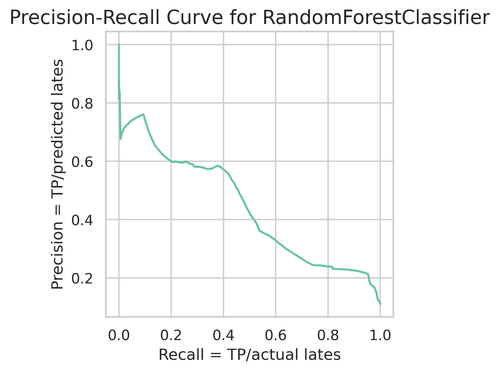

### Feature importance

|feature|importance|
| :---: | :---: |
|header_from_self_build|0.2690565744334873|
|header_from_ultrasound|0.22864033562505368|
|entity_binance|0.10499626403055347|
|entity_figment|0.09629367005450667|
|block_total_bytes_compressed|0.09532742329293194|
|block_gas_used|0.06405660221962045|
|block_tx_count|0.06025066479196277|
|p66_block_arrival_ms|0.03846797613298413|
|header_from_titan|0.011530334329409118|
|entity_other|0.007124602899777689|
|entity_kraken|0.007046091318037942|
|entity_blockdaemon|0.0048740700458763785|
|block_blob_count|0.0033688742246428716|
|entity_solo_stakers|0.0026554836353962436|
|entity_kiln|0.0016462963798299017|
|entity_staked.us|0.0013440982746103396|
|block_proposer_index|0.0009024966259347149|
|entity_upbit|0.0008717526142565701|
|entity_bitcoinsuisse|0.00045036773055164887|
|entity_ether.fi|0.00036964492182781983|
|entity_liquid_collective|0.00036205648654883646|
|entity_abyss_finance|0.00016626790562657723|
|entity_coinbase|9.802479881785561e-05|
|entity_p2porg|7.228479090578771e-05|
|entity_okex|1.290741361396471e-05|
|entity_lido|9.627051783187562e-06|
|entity_everstake|3.8644006924194806e-06|
|entity_stakefish|1.3435707597619494e-06|


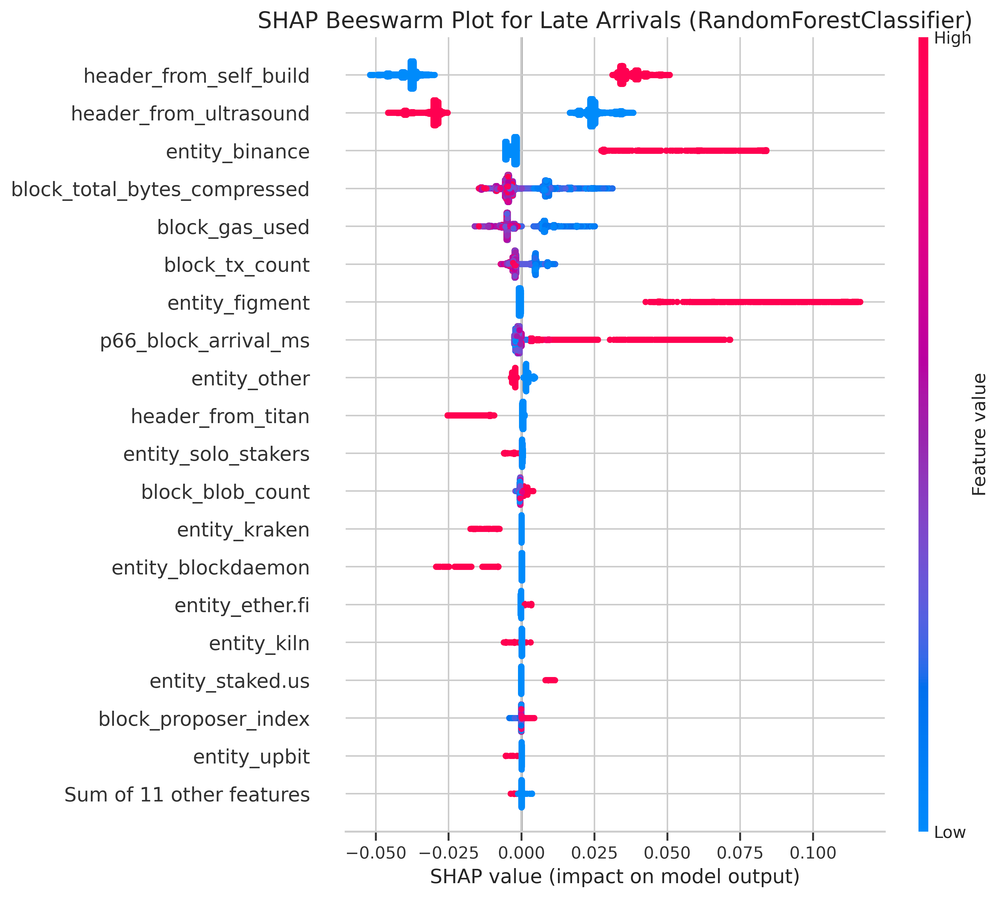


## LGBMClassifier outputs

### Model performance


```python

              precision    recall  f1-score   support

     on-time      0.912     0.986     0.948   9428014
        late      0.677     0.239     0.353   1175527

    accuracy                          0.903  10603541
   macro avg      0.794     0.612     0.650  10603541
weighted avg      0.886     0.903     0.882  10603541

```

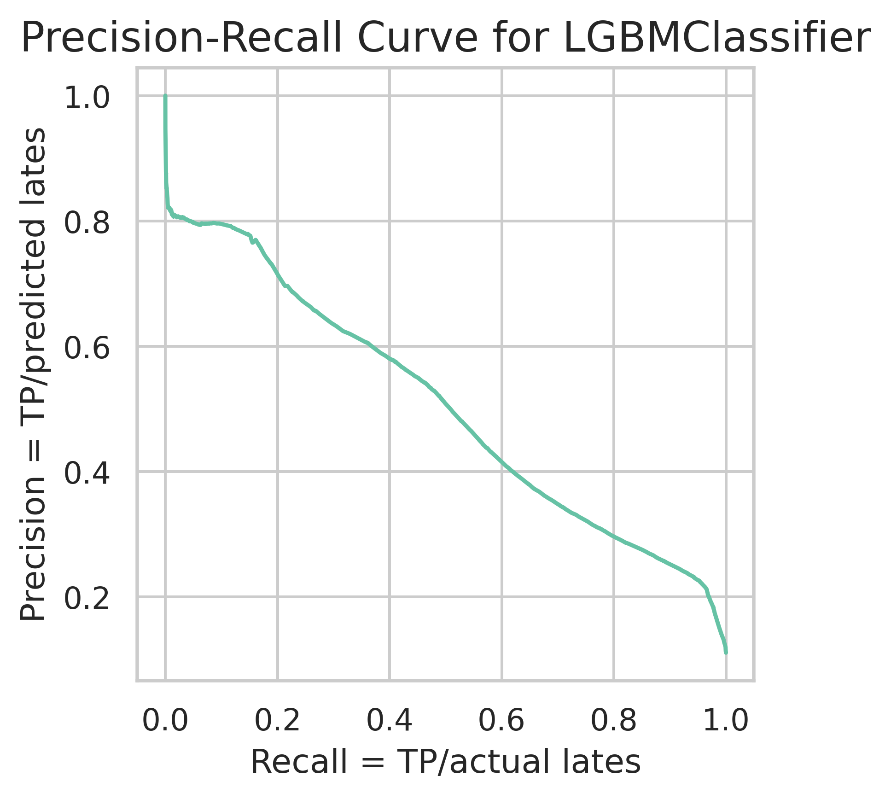

### Feature importance

|feature|importance|
| :---: | :---: |
|p66_block_arrival_ms|275|
|header_from_self_build|78|
|entity_staked.us|39|
|entity_ether.fi|36|
|entity_binance|29|
|entity_figment|28|
|entity_kraken|27|
|entity_blockdaemon|23|
|entity_kiln|22|
|entity_bitcoinsuisse|19|
|block_gas_used|16|
|entity_upbit|15|
|entity_stakefish|12|
|entity_solo_stakers|12|
|entity_liquid_collective|11|
|entity_everstake|10|
|block_total_bytes_compressed|10|
|entity_p2porg|8|
|entity_abyss_finance|7|
|entity_coinbase|7|
|entity_other|7|
|entity_okex|4|
|block_proposer_index|2|
|block_blob_count|2|
|block_tx_count|1|


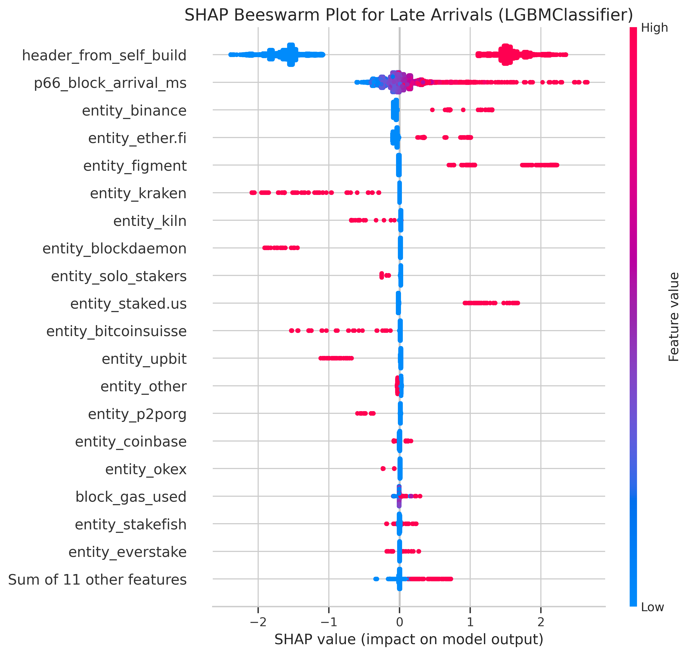


## LogisticRegression outputs

### Model performance


```python

              precision    recall  f1-score   support

     on-time      0.914     0.981     0.947   9428014
        late      0.635     0.262     0.371   1175527

    accuracy                          0.901  10603541
   macro avg      0.775     0.622     0.659  10603541
weighted avg      0.883     0.901     0.883  10603541

```

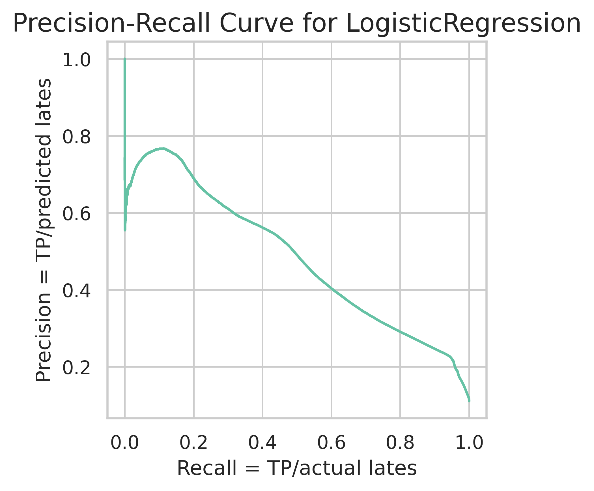

### Feature importance

|feature|importance|
| :---: | :---: |
|entity_figment|2.548470638148457|
|entity_binance|1.6058191308639445|
|header_from_self_build|1.5781786601803307|
|entity_staked.us|1.3016265158035958|
|entity_liquid_collective|1.0031596592744898|
|entity_everstake|0.34702531592891317|
|p66_block_arrival_ms|0.33156538841988487|
|entity_ether.fi|0.294394710829757|
|entity_coinbase|0.2625548045395417|
|entity_stakefish|0.1452714549732308|
|entity_rocketpool|0.13729531006940374|
|block_gas_used|0.07788866489054645|
|block_blob_count|0.045189964586033075|
|block_proposer_index|0.018510160418580262|


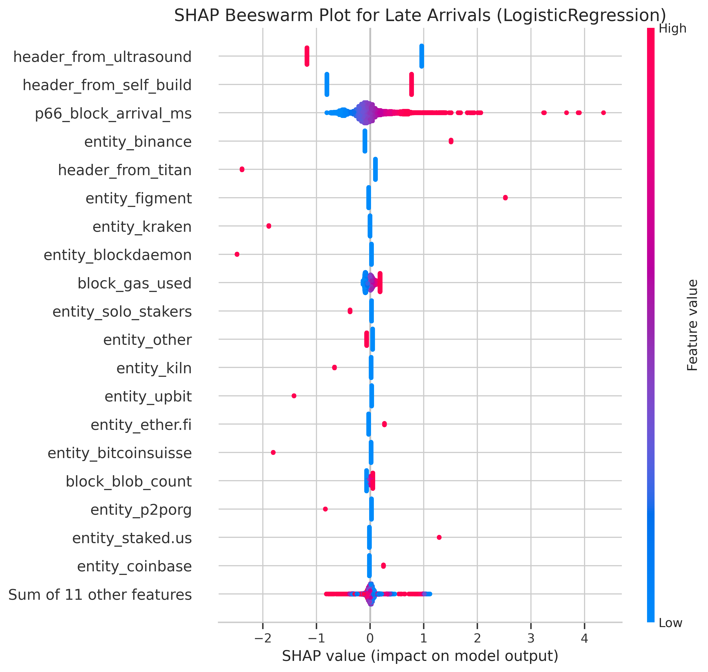


# Balanced sample (50% of each predictor class)

## Logit regression - statsmodel report


```python
                           Logit Regression Results                           
==============================================================================
Dep. Variable:                      y   No. Observations:              2350770
Model:                          Logit   Df Residuals:                  2350741
Method:                           MLE   Df Model:                           28
Date:                Wed, 20 Aug 2025   Pseudo R-squ.:                  0.3884
Time:                        08:39:36   Log-Likelihood:            -9.9662e+05
converged:                       True   LL-Null:                   -1.6294e+06
Covariance Type:            nonrobust   LLR p-value:                     0.000
================================================================================================
                                   coef    std err          z      P>|z|      [0.025      0.975]
------------------------------------------------------------------------------------------------
const                           -1.0165        nan        nan        nan         nan         nan
p66_block_arrival_ms             0.4685      0.002    222.969      0.000       0.464       0.473
block_total_bytes_compressed    -0.0393      0.004     -9.591      0.000      -0.047      -0.031
block_proposer_index             0.0213      0.002     11.964      0.000       0.018       0.025
block_gas_used                   0.0937      0.003     29.780      0.000       0.088       0.100
block_blob_count                 0.0531      0.002     29.054      0.000       0.050       0.057
block_tx_count                  -0.0239      0.003     -7.349      0.000      -0.030      -0.018
header_from_self_build           2.2859   3.96e+04   5.78e-05      1.000   -7.75e+04    7.75e+04
header_from_titan               -1.8198   3.96e+04   -4.6e-05      1.000   -7.75e+04    7.75e+04
header_from_ultrasound          -1.4826   3.96e+04  -3.75e-05      1.000   -7.75e+04    7.75e+04
entity_abyss_finance            -1.0083        nan        nan        nan         nan         nan
entity_binance                   0.9039        nan        nan        nan         nan         nan
entity_blockdaemon              -3.2939        nan        nan        nan         nan         nan
entity_bridgetower_lido          0.9267        nan        nan        nan         nan         nan
entity_coinbase                 -0.3952        nan        nan        nan         nan         nan
entity_coinspot                  2.4999        nan        nan        nan         nan         nan
entity_ether.fi                 -0.0716        nan        nan        nan         nan         nan
entity_everstake                -0.4217        nan        nan        nan         nan         nan
entity_figment                   1.5779        nan        nan        nan         nan         nan
entity_figment_lido              2.0137        nan        nan        nan         nan         nan
entity_kiln                     -1.4237        nan        nan        nan         nan         nan
entity_kraken                   -2.7611        nan        nan        nan         nan         nan
entity_liquid_collective         0.3538        nan        nan        nan         nan         nan
entity_okex                     -0.8302        nan        nan        nan         nan         nan
entity_other                    -1.2242        nan        nan        nan         nan         nan
entity_rocketpool               -0.4845        nan        nan        nan         nan         nan
entity_senseinode_lido           0.9802        nan        nan        nan         nan         nan
entity_solo_stakers             -1.0505        nan        nan        nan         nan         nan
entity_staked.us                 1.0508        nan        nan        nan         nan         nan
entity_stakefish                -0.6670        nan        nan        nan         nan         nan
entity_stakewise                 2.3087        nan        nan        nan         nan         nan
================================================================================================
```
## RandomForestClassifier outputs

### Model performance


```python

              precision    recall  f1-score   support

     on-time      0.900     0.582     0.707   1175243
        late      0.691     0.935     0.795   1175527

    accuracy                          0.759   2350770
   macro avg      0.796     0.759     0.751   2350770
weighted avg      0.796     0.759     0.751   2350770

```

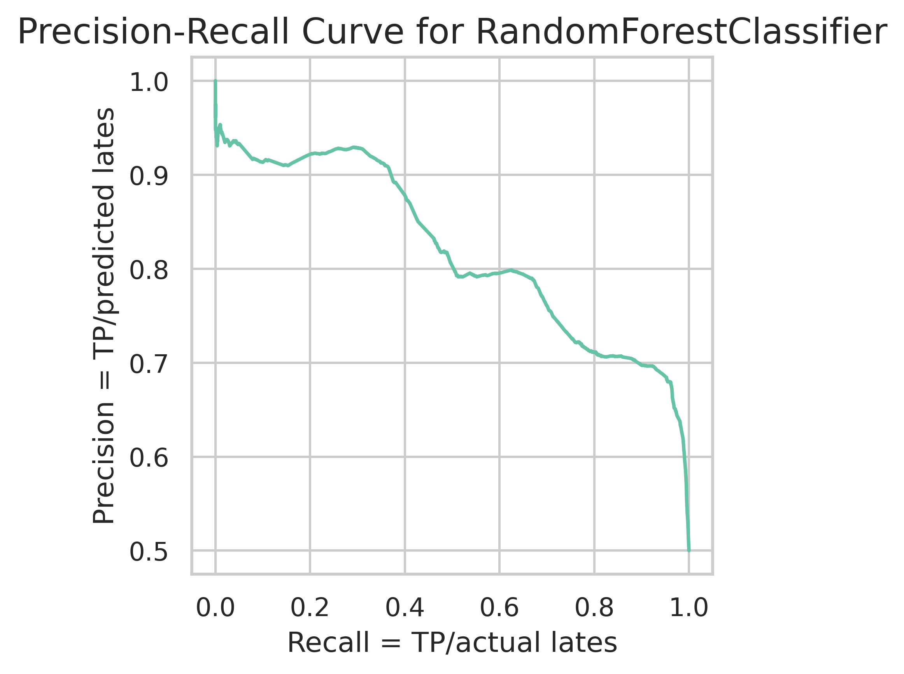

### Feature importance

|feature|importance|
| :---: | :---: |
|header_from_self_build|0.3005100828105622|
|header_from_ultrasound|0.23768806404264484|
|block_gas_used|0.10374365674105494|
|block_total_bytes_compressed|0.10005426793526458|
|entity_other|0.05900305573669167|
|block_tx_count|0.04655116441663019|
|entity_figment|0.04065029310554567|
|entity_binance|0.039008348025049946|
|header_from_titan|0.024830978906600666|
|p66_block_arrival_ms|0.01352489183853037|
|entity_kraken|0.011651896118957101|
|entity_blockdaemon|0.004835785085642849|
|entity_figment_lido|0.004753896357919233|
|entity_stakewise|0.0038158539062433995|
|block_proposer_index|0.0023334855518447814|
|entity_coinspot|0.0018957646946950778|
|block_blob_count|0.0014186054609617003|
|entity_kiln|0.0009035382291725844|
|entity_senseinode_lido|0.0008723373080243449|
|entity_ether.fi|0.0006526137402184186|
|entity_staked.us|0.0006483180355766949|
|entity_solo_stakers|0.00045029199571267026|
|entity_bridgetower_lido|6.814030162384724e-05|
|entity_liquid_collective|4.9612588859947917e-05|
|entity_abyss_finance|4.519963513700583e-05|
|entity_everstake|1.874924244275281e-05|
|entity_coinbase|1.280351056594763e-05|
|entity_stakefish|8.304677826278979e-06|


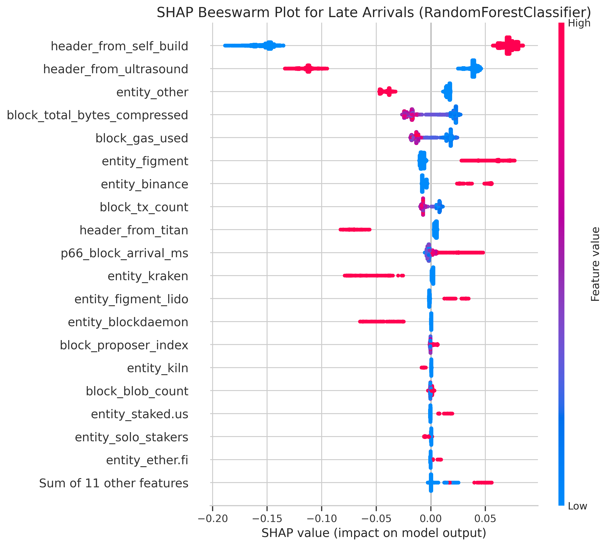


## LGBMClassifier outputs

### Model performance


```python

              precision    recall  f1-score   support

     on-time      0.814     0.773     0.793   1175243
        late      0.784     0.824     0.803   1175527

    accuracy                          0.798   2350770
   macro avg      0.799     0.798     0.798   2350770
weighted avg      0.799     0.798     0.798   2350770

```

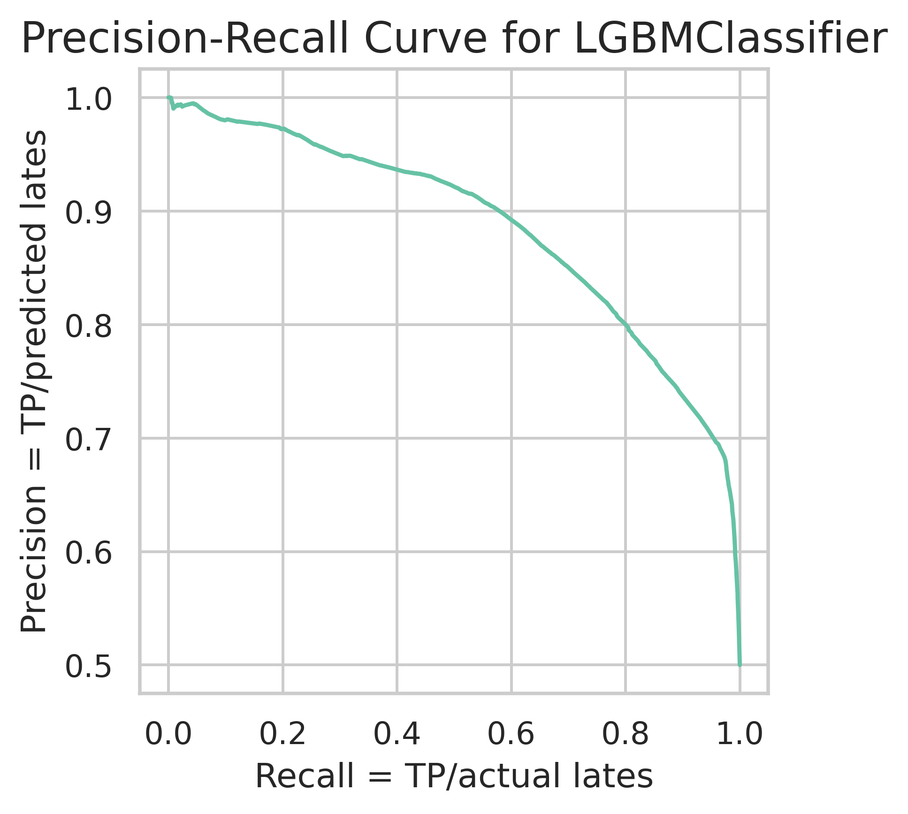

### Feature importance

|feature|importance|
| :---: | :---: |
|p66_block_arrival_ms|246|
|header_from_self_build|132|
|entity_figment|30|
|entity_other|29|
|entity_binance|25|
|entity_figment_lido|24|
|entity_stakewise|23|
|entity_kraken|22|
|entity_coinspot|22|
|entity_ether.fi|21|
|entity_staked.us|20|
|entity_blockdaemon|20|
|entity_bridgetower_lido|13|
|entity_senseinode_lido|13|
|entity_kiln|12|
|entity_solo_stakers|11|
|block_gas_used|9|
|entity_liquid_collective|7|
|entity_abyss_finance|5|
|entity_stakefish|3|
|block_blob_count|3|
|block_proposer_index|2|
|entity_coinbase|2|
|entity_okex|2|
|block_total_bytes_compressed|1|
|block_tx_count|1|
|entity_everstake|1|
|header_from_titan|1|


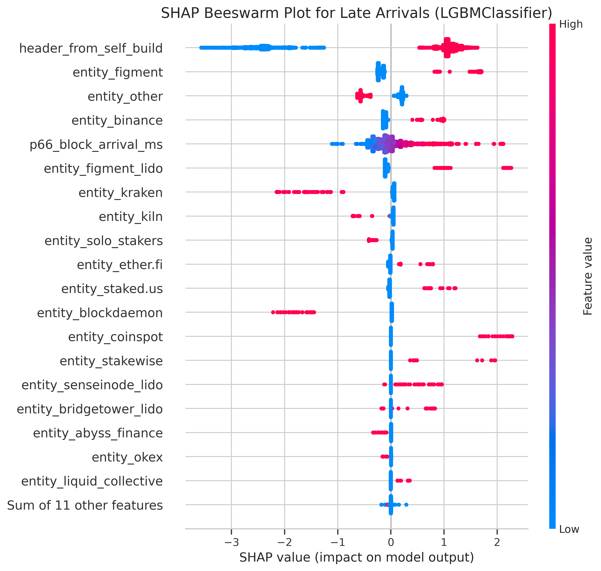


## LogisticRegression outputs

### Model performance


```python

              precision    recall  f1-score   support

     on-time      0.816     0.763     0.789   1175243
        late      0.777     0.829     0.802   1175527

    accuracy                          0.796   2350770
   macro avg      0.797     0.796     0.795   2350770
weighted avg      0.797     0.796     0.795   2350770

```

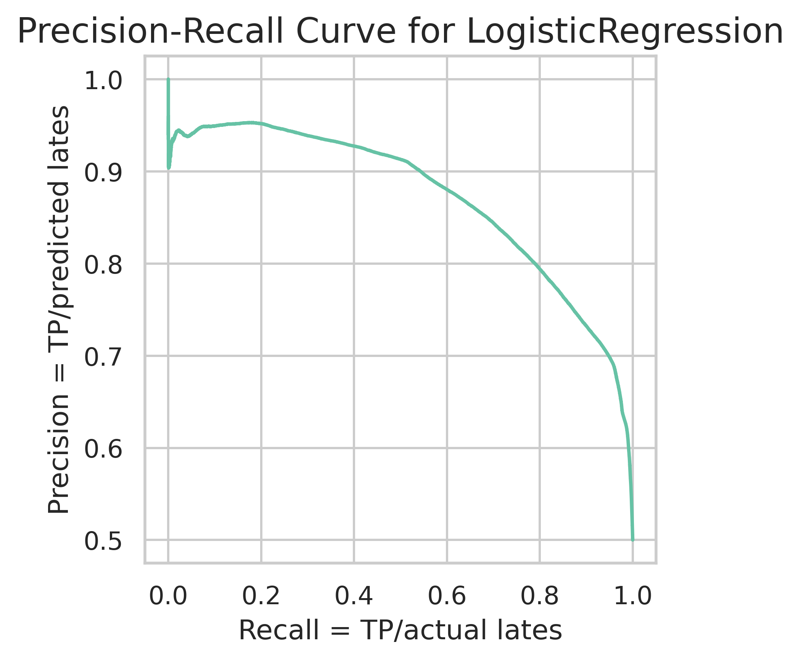

### Feature importance

|feature|importance|
| :---: | :---: |
|entity_coinspot|2.461447116984|
|entity_stakewise|2.294566734868107|
|header_from_self_build|2.286934342165684|
|entity_figment_lido|2.0145937586299936|
|entity_figment|1.573266504851565|
|entity_staked.us|1.0419351158749917|
|entity_senseinode_lido|0.9741092482751924|
|entity_bridgetower_lido|0.9178916395280083|
|entity_binance|0.9034627652327779|
|p66_block_arrival_ms|0.46803996046245533|
|entity_liquid_collective|0.34328854691376365|
|block_gas_used|0.0935986154356818|
|block_blob_count|0.05306526259557932|
|block_proposer_index|0.020810456754620222|


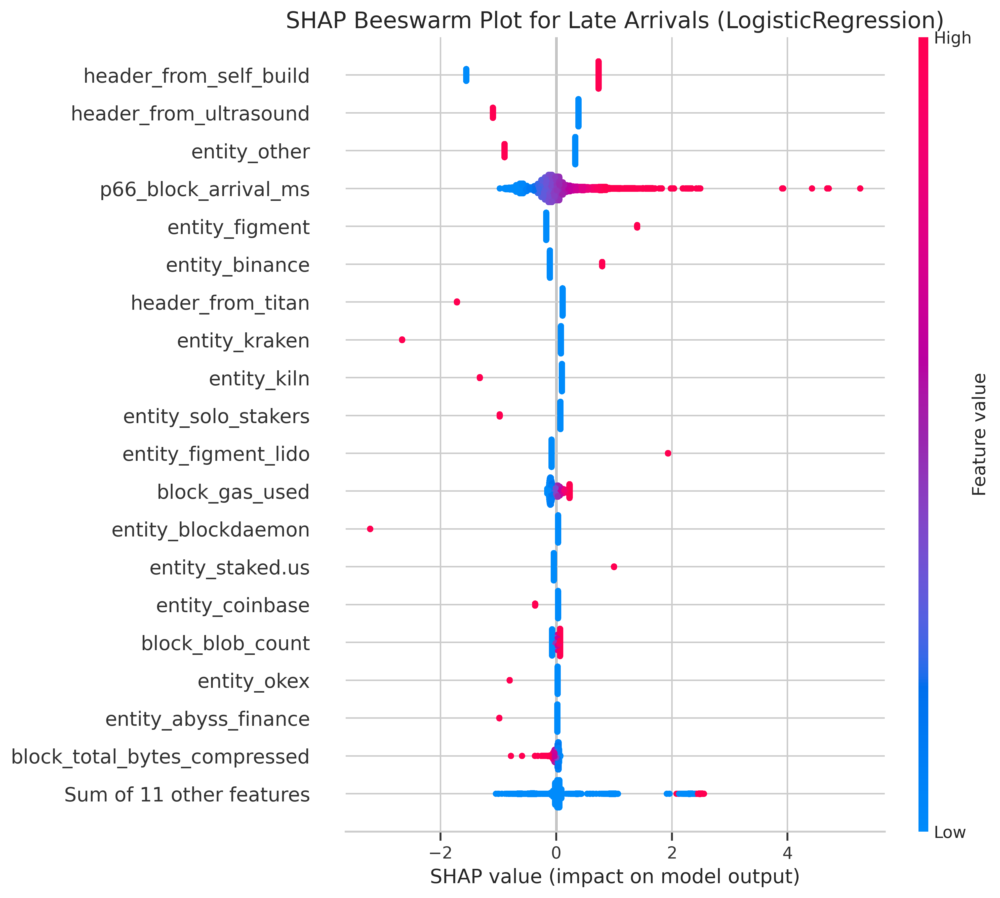


# Self-builder balanced sample

## Logit regression - statsmodel report


```python
                           Logit Regression Results                           
==============================================================================
Dep. Variable:                      y   No. Observations:              2240522
Model:                          Logit   Df Residuals:                  2240497
Method:                           MLE   Df Model:                           24
Date:                Wed, 20 Aug 2025   Pseudo R-squ.:                  0.2016
Time:                        09:16:20   Log-Likelihood:            -1.2399e+06
converged:                       True   LL-Null:                   -1.5530e+06
Covariance Type:            nonrobust   LLR p-value:                     0.000
================================================================================================
                                   coef    std err          z      P>|z|      [0.025      0.975]
------------------------------------------------------------------------------------------------
p66_block_arrival_ms             0.5240      0.002    277.525      0.000       0.520       0.528
block_total_bytes_compressed    -0.0411      0.003    -12.535      0.000      -0.048      -0.035
block_proposer_index             0.0080      0.002      5.023      0.000       0.005       0.011
block_gas_used                   0.0761      0.002     30.500      0.000       0.071       0.081
block_blob_count                 0.0506      0.002     31.909      0.000       0.047       0.054
block_tx_count                  -0.0138      0.003     -4.851      0.000      -0.019      -0.008
header_from_self_build           0.3328        nan        nan        nan         nan         nan
entity_abyss_finance            -1.1200        nan        nan        nan         nan         nan
entity_binance                   1.1512        nan        nan        nan         nan         nan
entity_blockdaemon              -3.2630        nan        nan        nan         nan         nan
entity_bridgetower_lido          1.4458        nan        nan        nan         nan         nan
entity_coinbase                 -0.2561        nan        nan        nan         nan         nan
entity_ether.fi                 -0.4231        nan        nan        nan         nan         nan
entity_everstake                -0.2010        nan        nan        nan         nan         nan
entity_figment                   2.3686        nan        nan        nan         nan         nan
entity_figment_lido              5.5079        nan        nan        nan         nan         nan
entity_kiln                     -1.2727        nan        nan        nan         nan         nan
entity_kraken                   -2.6158        nan        nan        nan         nan         nan
entity_liquid_collective         0.5356        nan        nan        nan         nan         nan
entity_okex                     -0.6639        nan        nan        nan         nan         nan
entity_other                    -1.0018        nan        nan        nan         nan         nan
entity_rocketpool               -0.4554        nan        nan        nan         nan         nan
entity_senseinode_lido           1.3876        nan        nan        nan         nan         nan
entity_solo_stakers             -0.9758        nan        nan        nan         nan         nan
entity_staked.us                 0.6347        nan        nan        nan         nan         nan
entity_stakefish                -0.4498        nan        nan        nan         nan         nan
================================================================================================
```
## RandomForestClassifier outputs

### Model performance


```python

              precision    recall  f1-score   support

     on-time      0.688     0.696     0.692   1120261
        late      0.692     0.685     0.689   1120261

    accuracy                          0.690   2240522
   macro avg      0.690     0.690     0.690   2240522
weighted avg      0.690     0.690     0.690   2240522

```

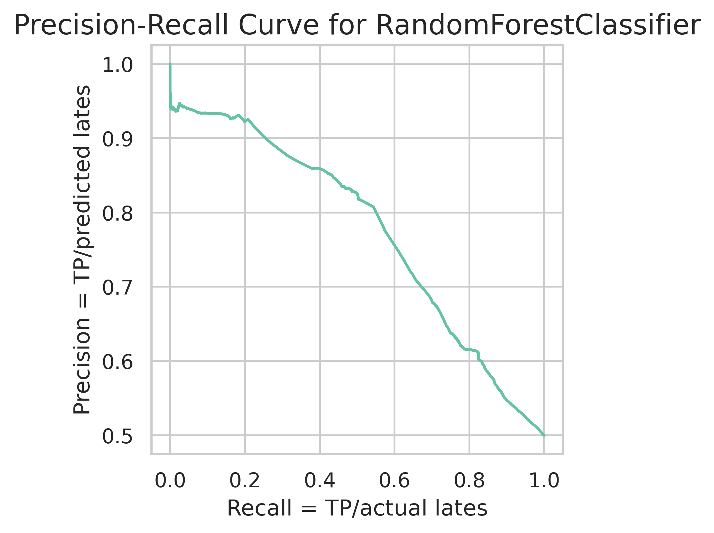

### Feature importance

|feature|importance|
| :---: | :---: |
|entity_other|0.27068185914920245|
|entity_figment|0.22690622870528462|
|entity_binance|0.16637876169435462|
|p66_block_arrival_ms|0.11427456758416184|
|entity_figment_lido|0.0658693564307505|
|entity_kraken|0.06365356457659646|
|entity_blockdaemon|0.024816877915471436|
|entity_solo_stakers|0.015715121950976914|
|entity_kiln|0.014847616091572102|
|entity_senseinode_lido|0.010421771291834914|
|entity_bridgetower_lido|0.010110314628634319|
|entity_staked.us|0.0039542056514928385|
|entity_abyss_finance|0.00270732085670652|
|block_proposer_index|0.002666076969065069|
|entity_ether.fi|0.0018796247230945303|
|block_total_bytes_compressed|0.0014028017888782721|
|entity_liquid_collective|0.0011971441968137494|
|block_tx_count|0.0008617612662358495|
|block_gas_used|0.0008463820455868092|
|block_blob_count|0.0003288605501413761|
|entity_stakefish|0.00022555380521946782|
|entity_everstake|0.00015516540429392697|
|entity_okex|9.906272363130212e-05|


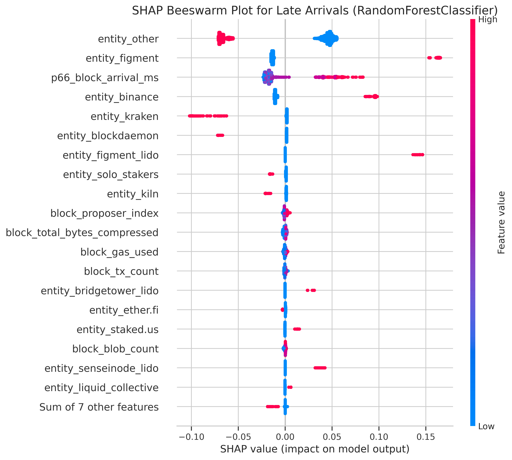


## LGBMClassifier outputs

### Model performance


```python

              precision    recall  f1-score   support

     on-time      0.681     0.843     0.753   1120261
        late      0.794     0.605     0.687   1120261

    accuracy                          0.724   2240522
   macro avg      0.738     0.724     0.720   2240522
weighted avg      0.738     0.724     0.720   2240522

```


### Feature importance

|feature|importance|
| :---: | :---: |
|p66_block_arrival_ms|343|
|entity_figment_lido|33|
|entity_figment|30|
|entity_kraken|27|
|entity_blockdaemon|24|
|entity_binance|23|
|entity_other|23|
|block_tx_count|23|
|block_gas_used|21|
|entity_senseinode_lido|19|
|entity_bridgetower_lido|17|
|block_total_bytes_compressed|15|
|entity_kiln|15|
|block_blob_count|15|
|entity_staked.us|14|
|entity_solo_stakers|14|
|entity_abyss_finance|11|
|entity_liquid_collective|11|
|block_proposer_index|7|
|entity_everstake|6|
|entity_stakefish|5|
|entity_okex|2|
|entity_coinbase|2|


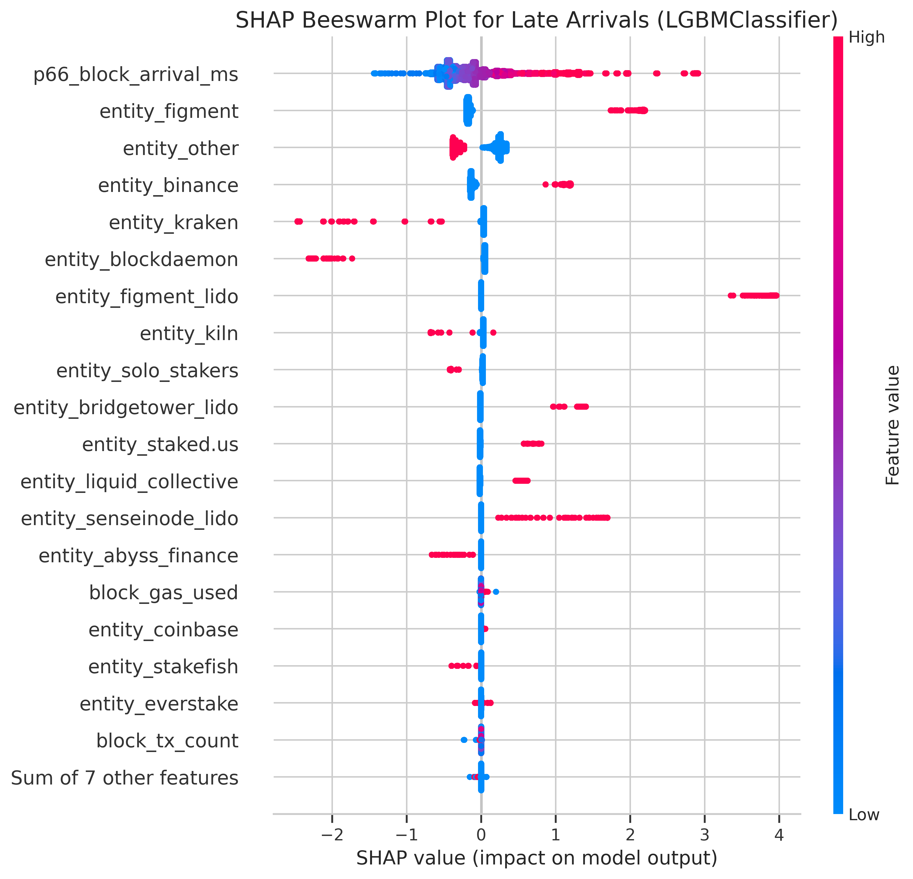


## LogisticRegression outputs

### Model performance


```python

              precision    recall  f1-score   support

     on-time      0.683     0.819     0.745   1120261
        late      0.774     0.620     0.689   1120261

    accuracy                          0.720   2240522
   macro avg      0.729     0.720     0.717   2240522
weighted avg      0.729     0.720     0.717   2240522

```

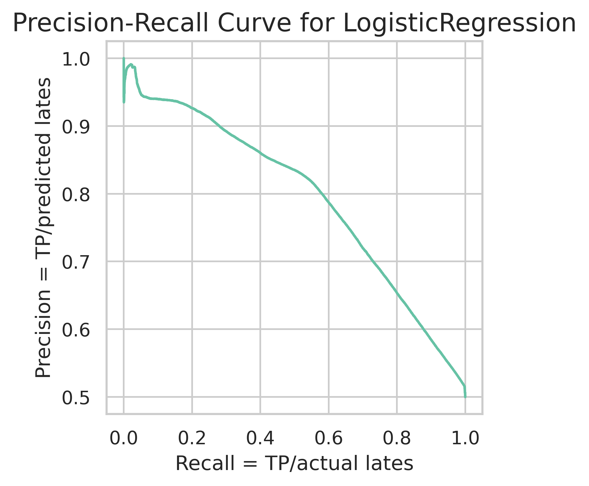

### Feature importance

|feature|importance|
| :---: | :---: |
|entity_figment_lido|5.116993181854045|
|entity_figment|2.373662912992714|
|entity_bridgetower_lido|1.4519539124534533|
|entity_senseinode_lido|1.3958178433962591|
|entity_binance|1.1662744776543554|
|entity_staked.us|0.6285062557253425|
|entity_liquid_collective|0.5359240167759168|
|p66_block_arrival_ms|0.5232418636413791|
|header_from_self_build|0.16034678732005783|
|block_gas_used|0.07536047125814868|
|block_blob_count|0.0502307293219705|
|block_proposer_index|0.007798740795305765|


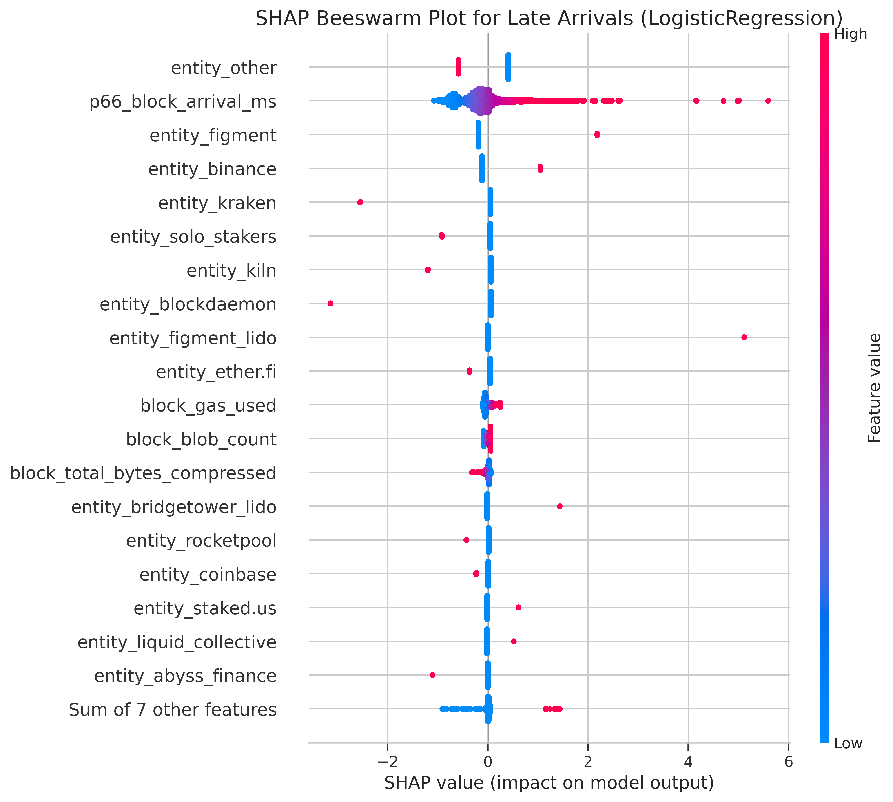


# Relay balanced sample

## Logit regression - statsmodel report


```python
                           Logit Regression Results                           
==============================================================================
Dep. Variable:                      y   No. Observations:               110515
Model:                          Logit   Df Residuals:                   110494
Method:                           MLE   Df Model:                           20
Date:                Wed, 20 Aug 2025   Pseudo R-squ.:                  0.2568
Time:                        09:49:34   Log-Likelihood:                -56932.
converged:                       True   LL-Null:                       -76603.
Covariance Type:            nonrobust   LLR p-value:                     0.000
================================================================================================
                                   coef    std err          z      P>|z|      [0.025      0.975]
------------------------------------------------------------------------------------------------
const                           -0.0211        nan        nan        nan         nan         nan
p66_block_arrival_ms            -0.0268      0.008     -3.553      0.000      -0.042      -0.012
block_total_bytes_compressed     0.0072      0.011      0.670      0.503      -0.014       0.028
block_proposer_index             0.0298      0.007      4.065      0.000       0.015       0.044
block_gas_used                   0.1421      0.010     14.585      0.000       0.123       0.161
block_blob_count                 0.0585      0.007      7.912      0.000       0.044       0.073
block_tx_count                  -0.0101      0.010     -1.014      0.310      -0.030       0.009
header_from_titan               -0.1043        nan        nan        nan         nan         nan
header_from_ultrasound           0.0833        nan        nan        nan         nan         nan
entity_abyss_finance             0.5148   2.88e+05   1.79e-06      1.000   -5.64e+05    5.64e+05
entity_binance                   0.4294   2.88e+05   1.49e-06      1.000   -5.64e+05    5.64e+05
entity_coinbase                 -0.8411   2.88e+05  -2.92e-06      1.000   -5.64e+05    5.64e+05
entity_coinspot                  1.9193   2.88e+05   6.67e-06      1.000   -5.64e+05    5.64e+05
entity_ether.fi                  1.2992   2.88e+05   4.52e-06      1.000   -5.64e+05    5.64e+05
entity_everstake                -2.9613   2.88e+05  -1.03e-05      1.000   -5.64e+05    5.64e+05
entity_figment                   0.4849   2.88e+05   1.69e-06      1.000   -5.64e+05    5.64e+05
entity_kiln                     -2.3375   2.88e+05  -8.12e-06      1.000   -5.64e+05    5.64e+05
entity_kraken                   -1.8764   2.88e+05  -6.52e-06      1.000   -5.64e+05    5.64e+05
entity_other                    -1.2807   2.88e+05  -4.45e-06      1.000   -5.64e+05    5.64e+05
entity_rocketpool                0.1415   2.88e+05   4.92e-07      1.000   -5.64e+05    5.64e+05
entity_solo_stakers             -0.6438   2.88e+05  -2.24e-06      1.000   -5.64e+05    5.64e+05
entity_staked.us                 1.7532   2.88e+05   6.09e-06      1.000   -5.64e+05    5.64e+05
entity_stakewise                 3.3774   2.88e+05   1.17e-05      1.000   -5.64e+05    5.64e+05
================================================================================================
```
## RandomForestClassifier outputs

### Model performance


```python

              precision    recall  f1-score   support

     on-time      0.762     0.755     0.758     55249
        late      0.757     0.764     0.761     55266

    accuracy                          0.760    110515
   macro avg      0.760     0.760     0.760    110515
weighted avg      0.760     0.760     0.760    110515

```

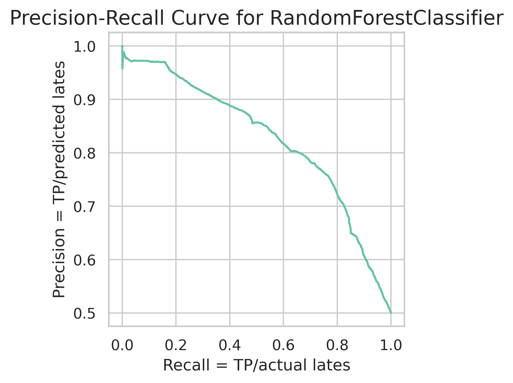

### Feature importance

|feature|importance|
| :---: | :---: |
|entity_other|0.2960922900195069|
|entity_stakewise|0.2307986516833753|
|entity_ether.fi|0.15621764922766215|
|entity_staked.us|0.09331621076862551|
|entity_kiln|0.07584347072205919|
|entity_kraken|0.02863533741478449|
|entity_coinbase|0.022751620870812745|
|entity_binance|0.020111512815885413|
|entity_everstake|0.019761613413593913|
|entity_coinspot|0.016594873286519197|
|entity_solo_stakers|0.013546782233497206|
|p66_block_arrival_ms|0.008849688130688349|
|entity_figment|0.008671382946587354|
|entity_abyss_finance|0.0021160534135593588|
|block_gas_used|0.0019412571330289228|
|block_proposer_index|0.0015749225788377083|
|block_tx_count|0.0012835801063980428|
|block_total_bytes_compressed|0.0012413908479594964|
|block_blob_count|0.00029638199617878445|
|entity_rocketpool|0.00015074078594769886|
|header_from_ultrasound|0.00011252747013811876|
|header_from_titan|9.206213435417081e-05|


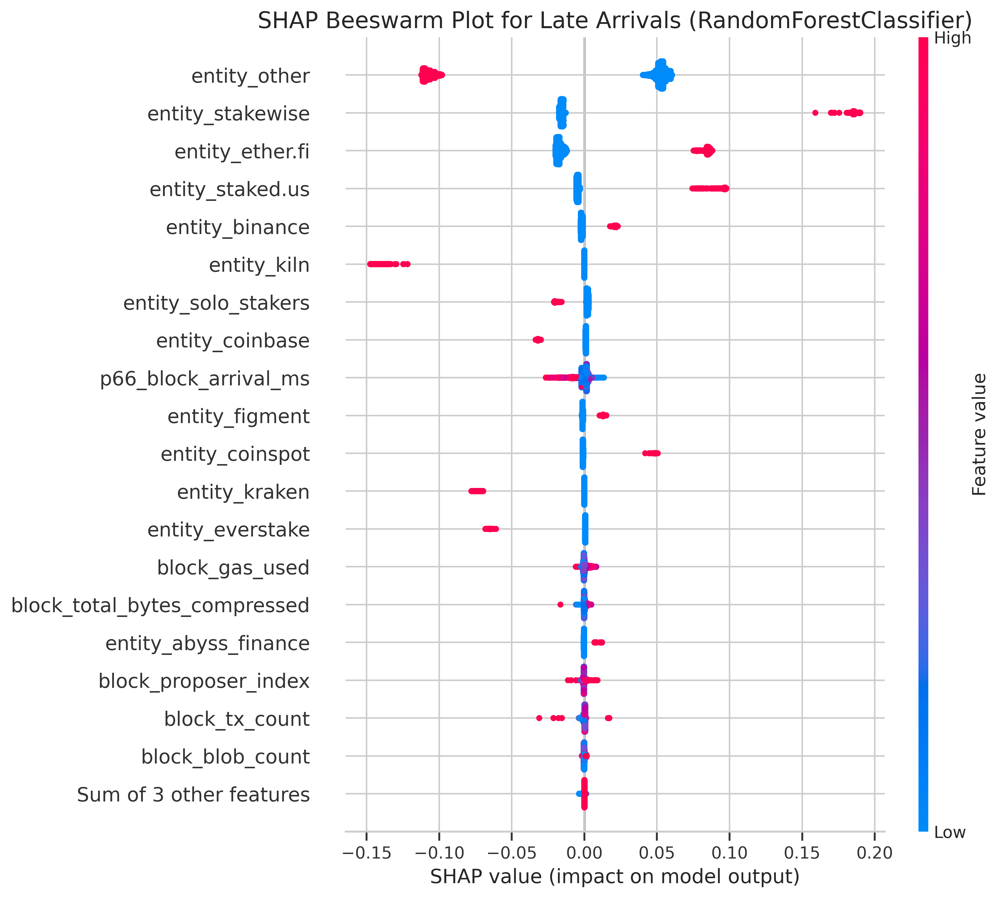


## LGBMClassifier outputs

### Model performance


```python

              precision    recall  f1-score   support

     on-time      0.764     0.761     0.762     55249
        late      0.762     0.765     0.763     55266

    accuracy                          0.763    110515
   macro avg      0.763     0.763     0.763    110515
weighted avg      0.763     0.763     0.763    110515

```

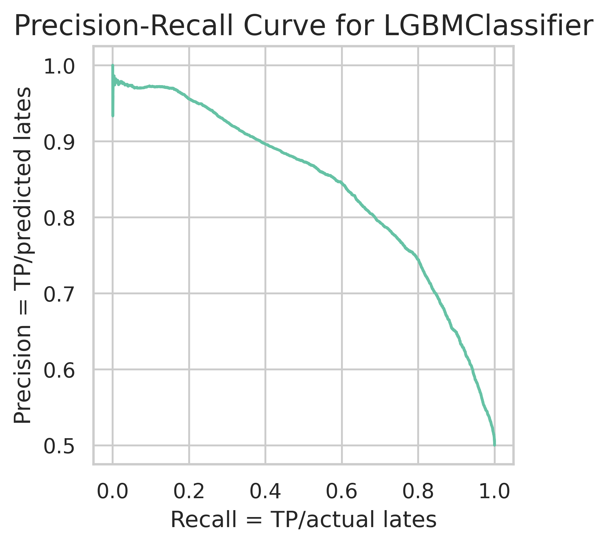

### Feature importance

|feature|importance|
| :---: | :---: |
|p66_block_arrival_ms|209|
|block_proposer_index|71|
|block_gas_used|66|
|block_tx_count|42|
|block_total_bytes_compressed|39|
|entity_other|35|
|entity_stakewise|31|
|entity_kiln|27|
|entity_everstake|25|
|entity_kraken|24|
|block_blob_count|21|
|entity_coinbase|21|
|entity_solo_stakers|20|
|entity_staked.us|17|
|entity_coinspot|15|
|entity_ether.fi|12|
|entity_figment|8|
|entity_abyss_finance|6|
|header_from_titan|3|
|entity_binance|2|


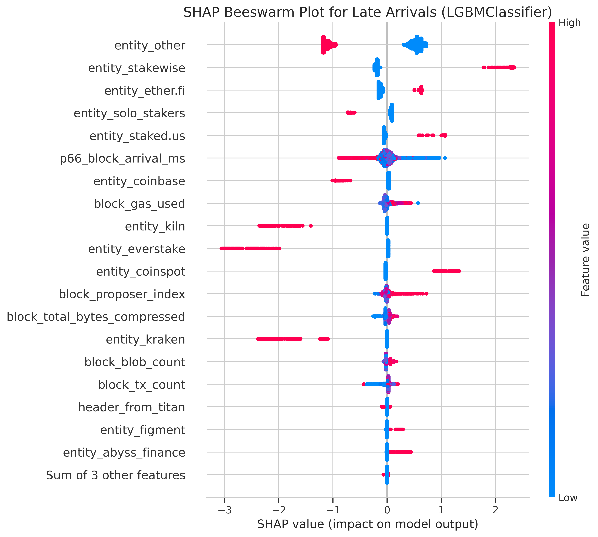


## LogisticRegression outputs

### Model performance


```python

              precision    recall  f1-score   support

     on-time      0.760     0.759     0.760     55249
        late      0.759     0.760     0.760     55266

    accuracy                          0.760    110515
   macro avg      0.760     0.760     0.760    110515
weighted avg      0.760     0.760     0.760    110515

```

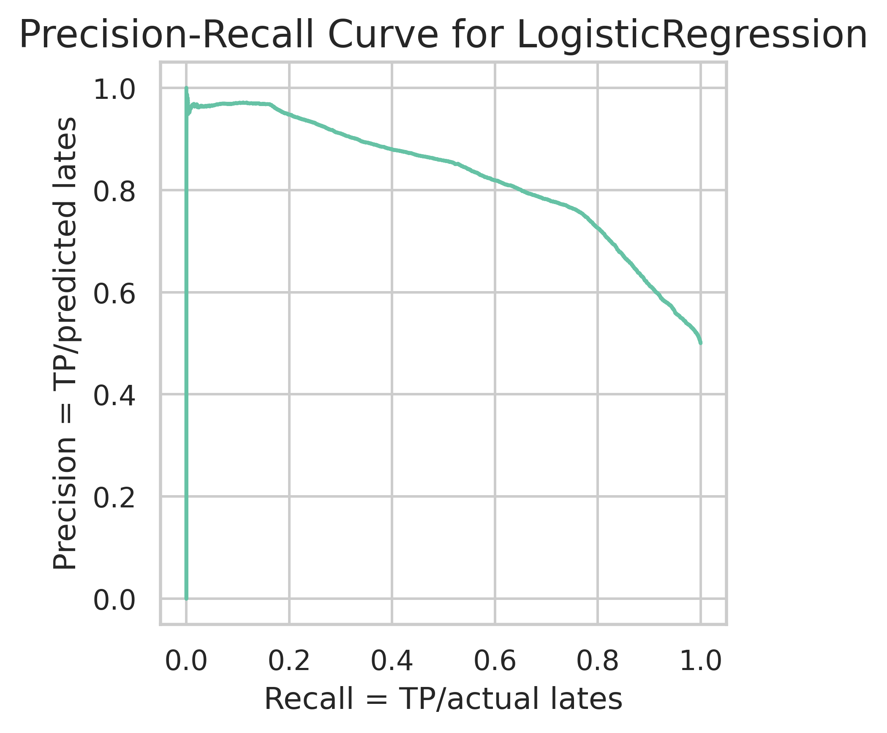

### Feature importance

|feature|importance|
| :---: | :---: |
|entity_stakewise|3.3577562584179836|
|entity_coinspot|1.9379378093308213|
|entity_staked.us|1.746236892533224|
|entity_ether.fi|1.282835071712844|
|entity_abyss_finance|0.4873664149961075|
|entity_figment|0.47672557400294546|
|entity_binance|0.4164603916644643|
|block_gas_used|0.14084718093821483|
|entity_rocketpool|0.10958232690039911|
|header_from_ultrasound|0.08639026960299218|
|block_blob_count|0.058542683737568026|
|block_proposer_index|0.029155614405402704|
|block_total_bytes_compressed|0.008922681828205702|


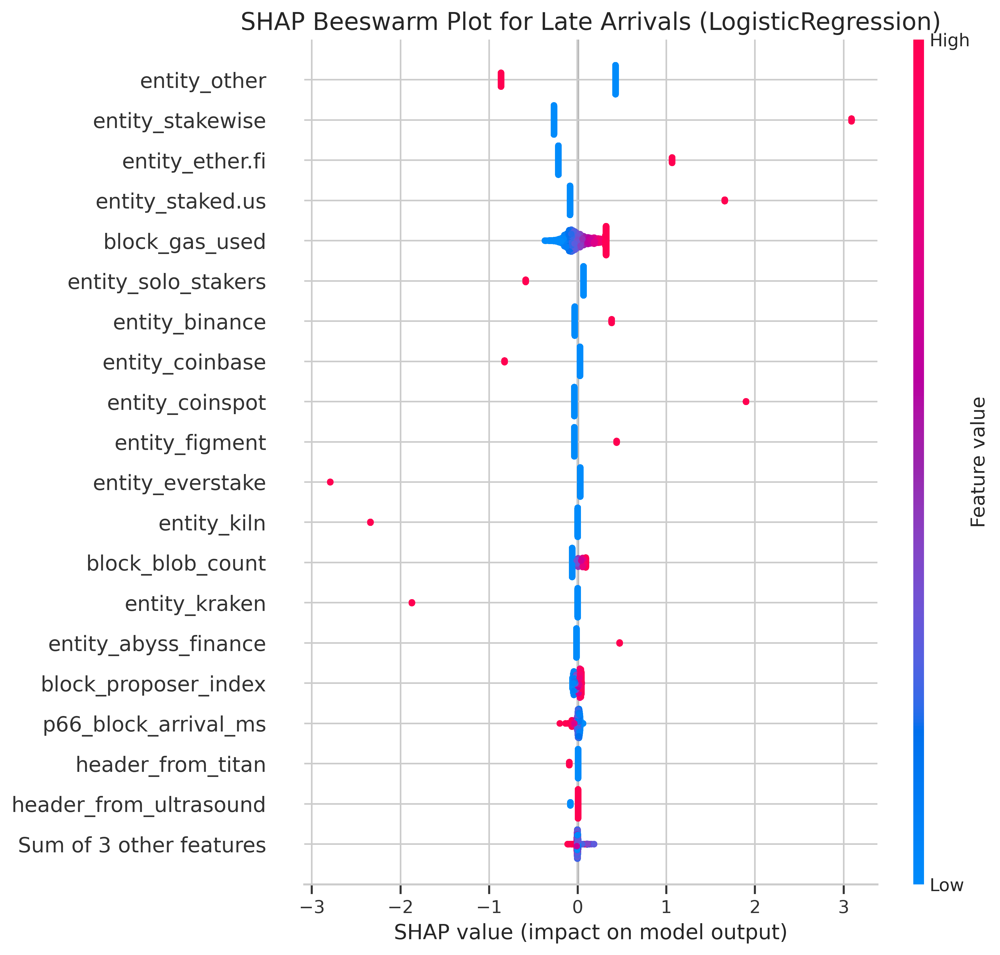


# No entity feature balanced sample

## Logit regression - statsmodel report


```python
                           Logit Regression Results                           
==============================================================================
Dep. Variable:                      y   No. Observations:              2350770
Model:                          Logit   Df Residuals:                  2350760
Method:                           MLE   Df Model:                            9
Date:                Wed, 20 Aug 2025   Pseudo R-squ.:                  0.2626
Time:                        09:51:22   Log-Likelihood:            -1.2015e+06
converged:                       True   LL-Null:                   -1.6294e+06
Covariance Type:            nonrobust   LLR p-value:                     0.000
================================================================================================
                                   coef    std err          z      P>|z|      [0.025      0.975]
------------------------------------------------------------------------------------------------
const                           -1.1363        nan        nan        nan         nan         nan
p66_block_arrival_ms             0.3188      0.002    168.235      0.000       0.315       0.322
block_total_bytes_compressed    -0.0191      0.004     -5.144      0.000      -0.026      -0.012
block_proposer_index             0.0152      0.002      9.485      0.000       0.012       0.018
block_gas_used                   0.0654      0.003     22.828      0.000       0.060       0.071
block_blob_count                 0.0395      0.002     24.003      0.000       0.036       0.043
block_tx_count                  -0.0168      0.003     -5.679      0.000      -0.023      -0.011
header_from_self_build           1.9589        nan        nan        nan         nan         nan
header_from_titan               -1.6869        nan        nan        nan         nan         nan
header_from_ultrasound          -1.4083        nan        nan        nan         nan         nan
================================================================================================
```
## RandomForestClassifier outputs

### Model performance


```python

              precision    recall  f1-score   support

     on-time      0.922     0.556     0.694   1175243
        late      0.682     0.953     0.795   1175527

    accuracy                          0.755   2350770
   macro avg      0.802     0.755     0.744   2350770
weighted avg      0.802     0.755     0.744   2350770

```

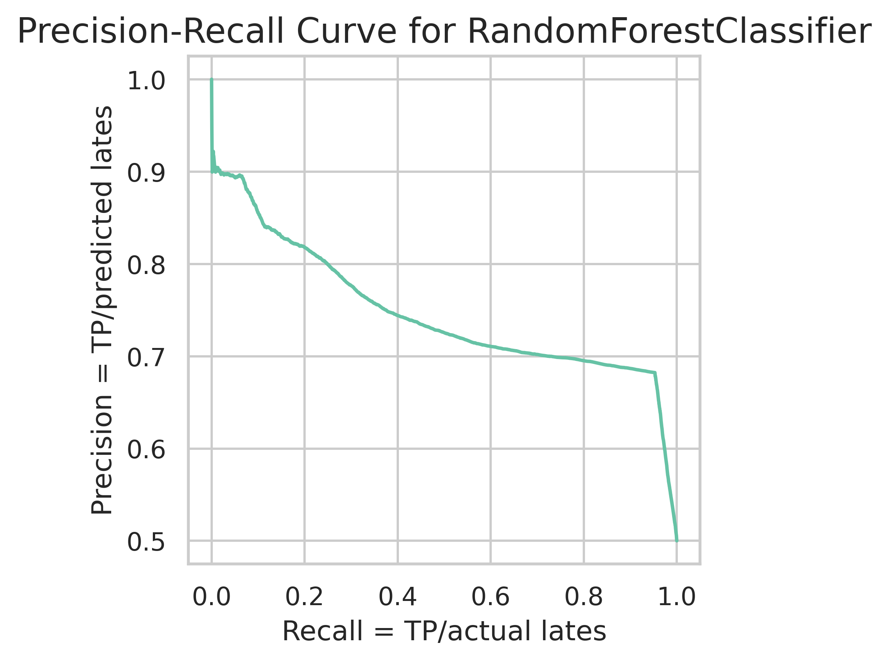

### Feature importance

|feature|importance|
| :---: | :---: |
|header_from_self_build|0.5651689423351826|
|header_from_ultrasound|0.2618531057856224|
|block_total_bytes_compressed|0.060583714611877434|
|block_gas_used|0.03387829865213137|
|header_from_titan|0.029883291915555152|
|block_tx_count|0.028320511666853697|
|p66_block_arrival_ms|0.019398018462556246|
|block_proposer_index|0.000627922123285871|
|block_blob_count|0.00028619444693532103|


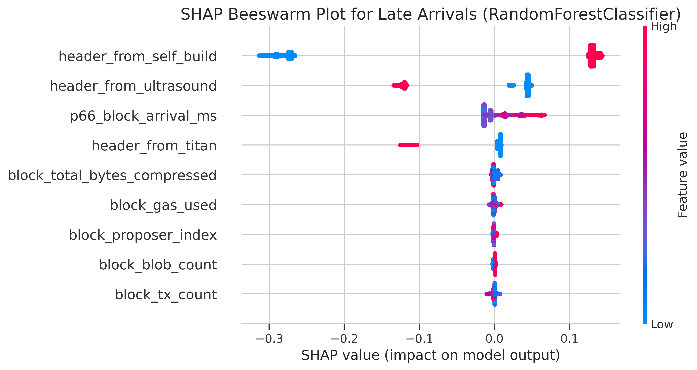


## LGBMClassifier outputs

### Model performance


```python

              precision    recall  f1-score   support

     on-time      0.922     0.556     0.694   1175243
        late      0.682     0.953     0.795   1175527

    accuracy                          0.755   2350770
   macro avg      0.802     0.755     0.744   2350770
weighted avg      0.802     0.755     0.744   2350770

```

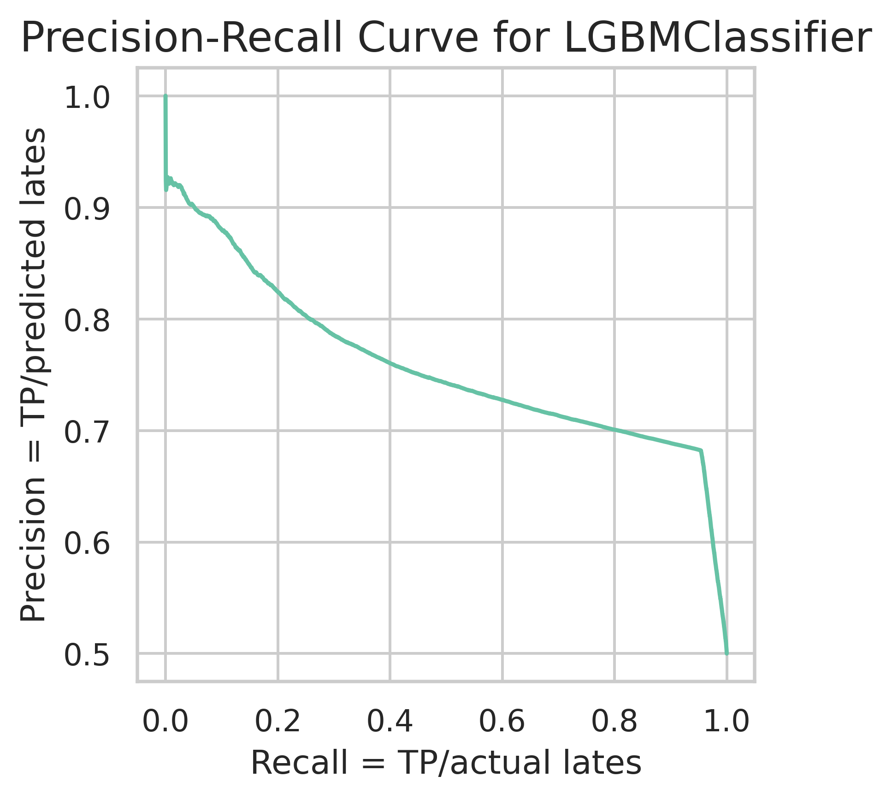

### Feature importance

|feature|importance|
| :---: | :---: |
|p66_block_arrival_ms|291|
|block_gas_used|94|
|block_total_bytes_compressed|81|
|block_proposer_index|80|
|header_from_self_build|59|
|block_tx_count|42|
|block_blob_count|38|
|header_from_titan|11|


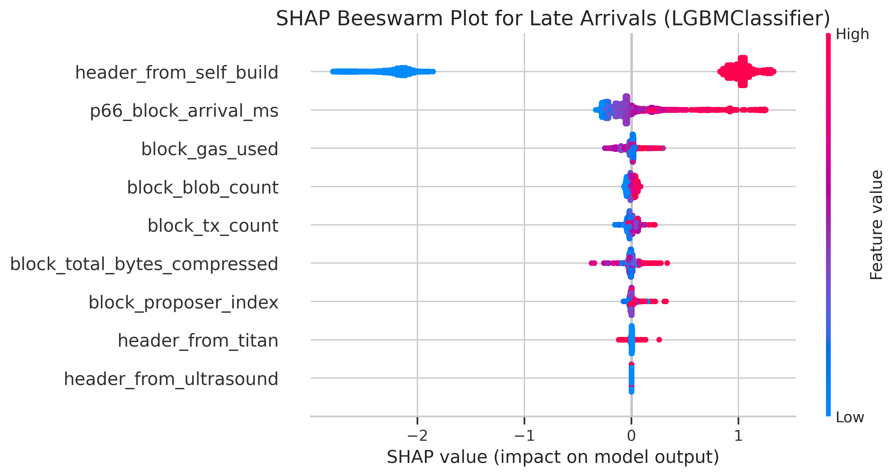


## LogisticRegression outputs

### Model performance


```python

              precision    recall  f1-score   support

     on-time      0.922     0.556     0.694   1175243
        late      0.682     0.953     0.795   1175527

    accuracy                          0.755   2350770
   macro avg      0.802     0.755     0.744   2350770
weighted avg      0.802     0.755     0.744   2350770

```

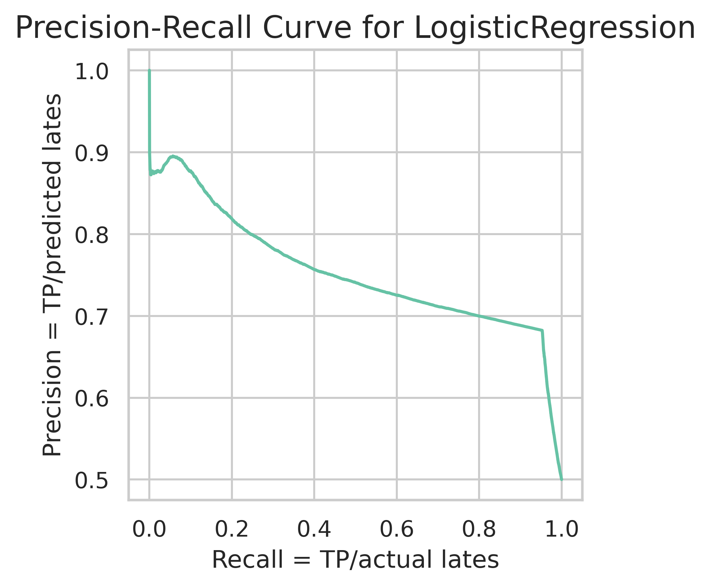

### Feature importance

|feature|importance|
| :---: | :---: |
|header_from_self_build|1.9571864284875577|
|p66_block_arrival_ms|0.31901218598347236|
|block_gas_used|0.06686846571129508|
|block_blob_count|0.04003562876067044|
|block_proposer_index|0.015641716335569506|


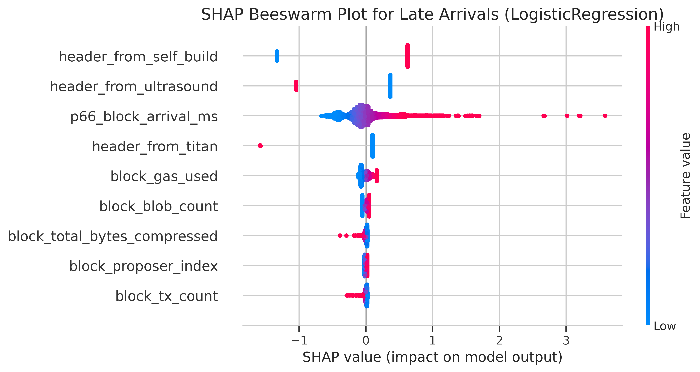


# Timings since slot start balanced predictor

## Logit regression - statsmodel report


```python
                           Logit Regression Results                           
==============================================================================
Dep. Variable:                      y   No. Observations:              4755448
Model:                          Logit   Df Residuals:                  4755420
Method:                           MLE   Df Model:                           27
Date:                Wed, 20 Aug 2025   Pseudo R-squ.:                  0.1964
Time:                        10:09:08   Log-Likelihood:            -2.6488e+06
converged:                       True   LL-Null:                   -3.2962e+06
Covariance Type:            nonrobust   LLR p-value:                     0.000
================================================================================================
                                   coef    std err          z      P>|z|      [0.025      0.975]
------------------------------------------------------------------------------------------------
const                            0.2823        nan        nan        nan         nan         nan
p66_block_arrival_ms             0.5649      0.001    442.997      0.000       0.562       0.567
block_total_bytes_compressed    -0.0342      0.002    -16.461      0.000      -0.038      -0.030
block_proposer_index            -0.0056      0.001     -5.259      0.000      -0.008      -0.004
block_gas_used                   0.0850      0.002     46.785      0.000       0.081       0.089
block_blob_count                 0.0375      0.001     34.294      0.000       0.035       0.040
block_tx_count                  -0.0199      0.002    -11.184      0.000      -0.023      -0.016
header_from_self_build           0.1556        nan        nan        nan         nan         nan
header_from_titan                0.0761        nan        nan        nan         nan         nan
header_from_ultrasound           0.0507        nan        nan        nan         nan         nan
entity_abyss_finance            -0.9324        nan        nan        nan         nan         nan
entity_binance                   1.0583        nan        nan        nan         nan         nan
entity_blockdaemon              -3.2142        nan        nan        nan         nan         nan
entity_bridgetower_lido          1.3862        nan        nan        nan         nan         nan
entity_coinbase                 -0.3306        nan        nan        nan         nan         nan
entity_ether.fi                 -0.4705        nan        nan        nan         nan         nan
entity_everstake                -0.1025        nan        nan        nan         nan         nan
entity_figment                   2.2754        nan        nan        nan         nan         nan
entity_figment_lido              5.3369        nan        nan        nan         nan         nan
entity_kiln                     -1.3759        nan        nan        nan         nan         nan
entity_kraken                   -2.5509        nan        nan        nan         nan         nan
entity_liquid_collective         0.4420        nan        nan        nan         nan         nan
entity_okex                     -0.6942        nan        nan        nan         nan         nan
entity_other                    -1.0192        nan        nan        nan         nan         nan
entity_rocketpool               -0.4120        nan        nan        nan         nan         nan
entity_senseinode_lido           1.6692        nan        nan        nan         nan         nan
entity_solo_stakers             -1.0256        nan        nan        nan         nan         nan
entity_staked.us                 0.5253        nan        nan        nan         nan         nan
entity_stakefish                -0.2828        nan        nan        nan         nan         nan
================================================================================================
```
## RandomForestClassifier outputs

### Model performance


```python

              precision    recall  f1-score   support

     on-time      0.643     0.877     0.742   2377724
        late      0.807     0.513     0.627   2377724

    accuracy                          0.695   4755448
   macro avg      0.725     0.695     0.685   4755448
weighted avg      0.725     0.695     0.685   4755448

```

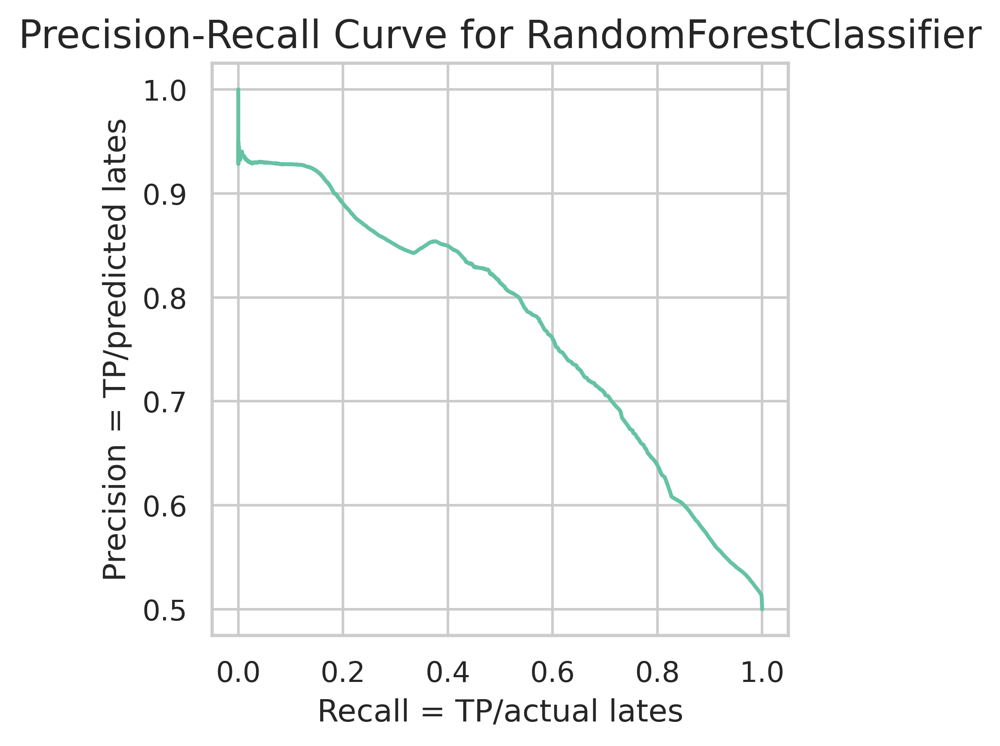

### Feature importance

|feature|importance|
| :---: | :---: |
|entity_figment|0.2556532609945161|
|entity_binance|0.22577910321579714|
|entity_other|0.19558848965811126|
|p66_block_arrival_ms|0.11569805094268336|
|entity_kraken|0.05150808254385753|
|entity_figment_lido|0.04883184673871368|
|entity_blockdaemon|0.033469065666971685|
|entity_kiln|0.020687608177546685|
|entity_bridgetower_lido|0.012119450545936472|
|entity_solo_stakers|0.01192589940337899|
|entity_senseinode_lido|0.011785966035566057|
|entity_staked.us|0.004451246391896549|
|block_tx_count|0.0022585130733262172|
|block_total_bytes_compressed|0.002219367109165919|
|entity_liquid_collective|0.0012475429383304183|
|block_gas_used|0.0011852568735074608|
|header_from_self_build|0.0010765380988811551|
|entity_ether.fi|0.0010523621167860832|
|entity_abyss_finance|0.0009790088744225797|
|entity_stakefish|0.0008159890134592545|
|block_proposer_index|0.00039901991591533454|
|entity_okex|0.00032181483941099326|
|header_from_ultrasound|0.00025375669301068047|
|block_blob_count|0.00022338672401576122|
|entity_coinbase|0.0002231673935866528|
|header_from_titan|0.00018145537391572|
|entity_everstake|6.475064729030071e-05|


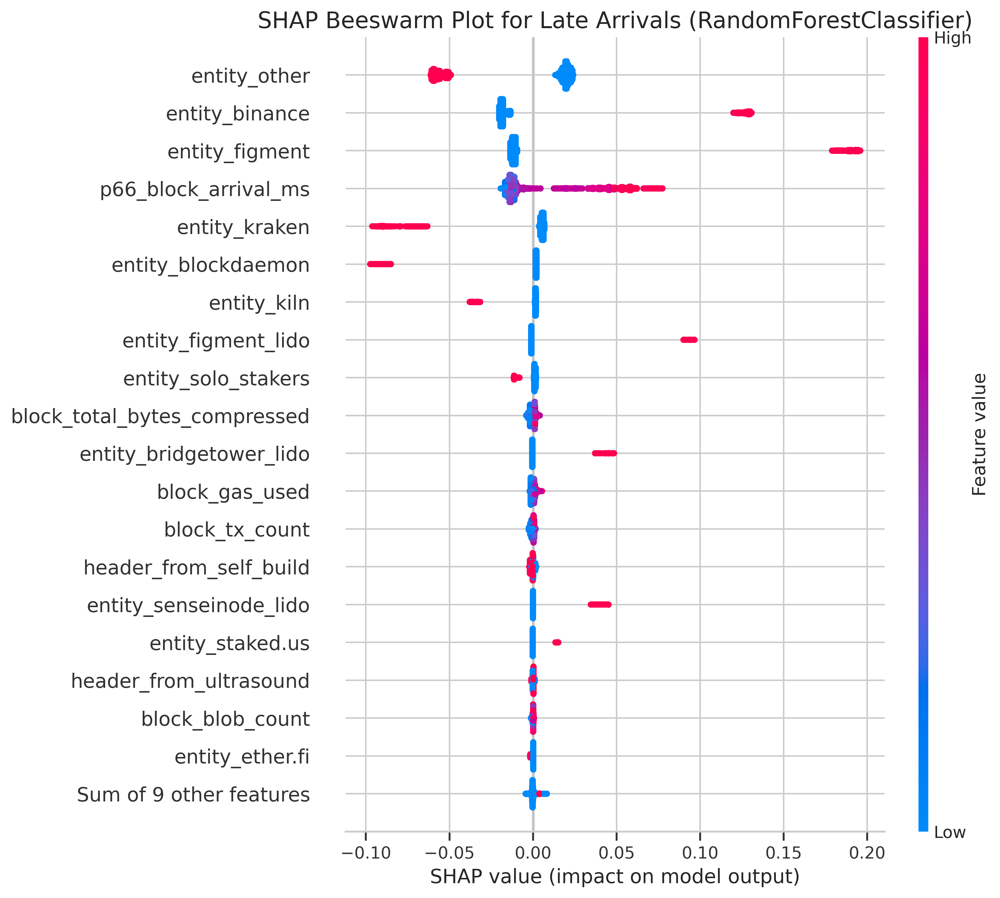


## LGBMClassifier outputs

### Model performance


```python

              precision    recall  f1-score   support

     on-time      0.686     0.817     0.746   2377724
        late      0.774     0.627     0.693   2377724

    accuracy                          0.722   4755448
   macro avg      0.730     0.722     0.719   4755448
weighted avg      0.730     0.722     0.719   4755448

```

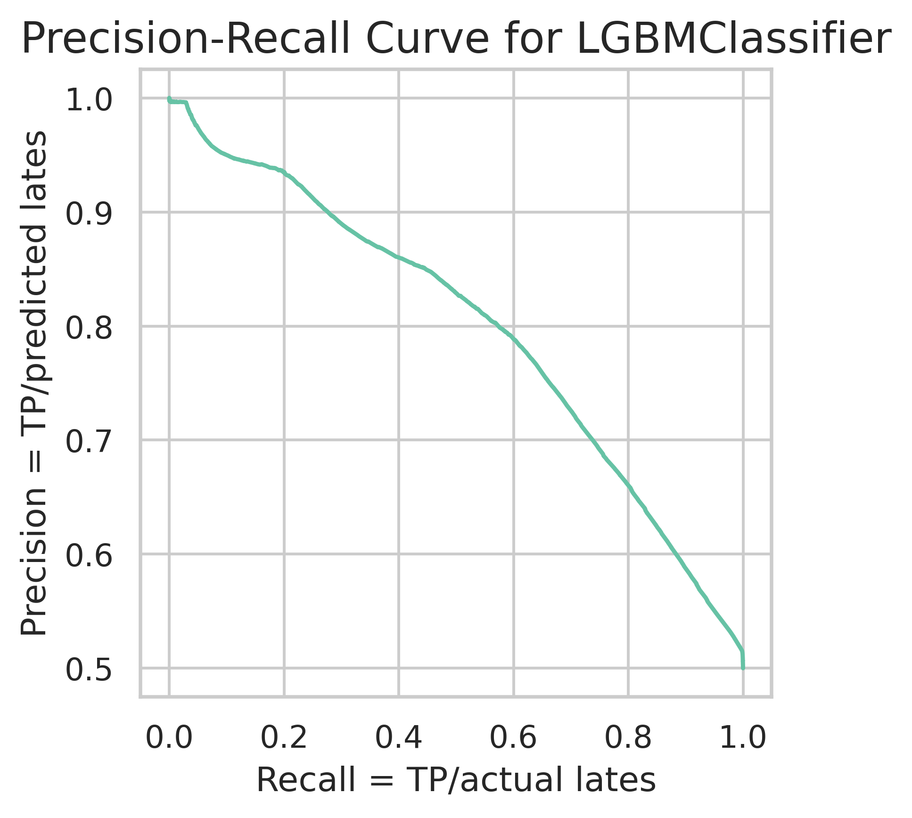

### Feature importance

|feature|importance|
| :---: | :---: |
|p66_block_arrival_ms|359|
|entity_figment_lido|33|
|block_gas_used|31|
|entity_figment|30|
|entity_kraken|27|
|entity_blockdaemon|26|
|entity_binance|24|
|entity_senseinode_lido|22|
|entity_other|21|
|entity_bridgetower_lido|17|
|entity_kiln|17|
|entity_solo_stakers|14|
|entity_staked.us|13|
|entity_liquid_collective|11|
|block_total_bytes_compressed|9|
|block_tx_count|8|
|entity_abyss_finance|8|
|block_proposer_index|6|
|entity_stakefish|6|
|block_blob_count|5|
|entity_everstake|5|
|header_from_titan|4|
|entity_okex|2|
|header_from_self_build|1|
|entity_coinbase|1|


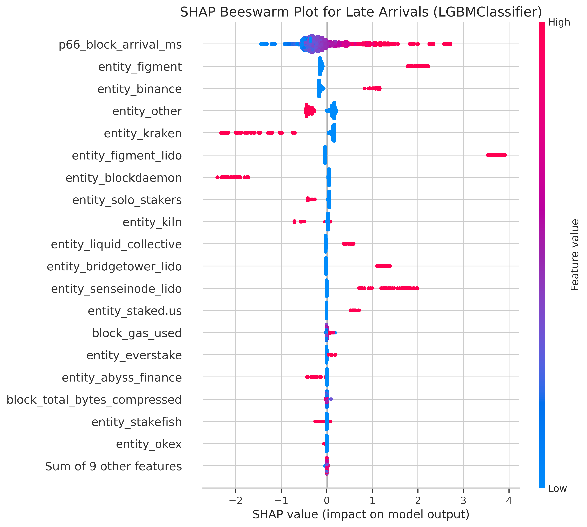


## LogisticRegression outputs

### Model performance


```python

              precision    recall  f1-score   support

     on-time      0.687     0.804     0.741   2377724
        late      0.764     0.633     0.693   2377724

    accuracy                          0.719   4755448
   macro avg      0.725     0.719     0.717   4755448
weighted avg      0.725     0.719     0.717   4755448

```


### Feature importance

|feature|importance|
| :---: | :---: |
|entity_figment_lido|5.234383879664838|
|entity_figment|2.292021059368135|
|entity_senseinode_lido|1.629357293443226|
|entity_bridgetower_lido|1.3862585456724823|
|entity_binance|1.064471106510995|
|p66_block_arrival_ms|0.5649481524082608|
|entity_staked.us|0.5276677388295474|
|entity_liquid_collective|0.45560405590026964|
|header_from_self_build|0.15414285750780835|
|block_gas_used|0.0851176922515859|
|header_from_titan|0.07269488789396418|
|header_from_ultrasound|0.04877184084359648|
|block_blob_count|0.03714889843700961|


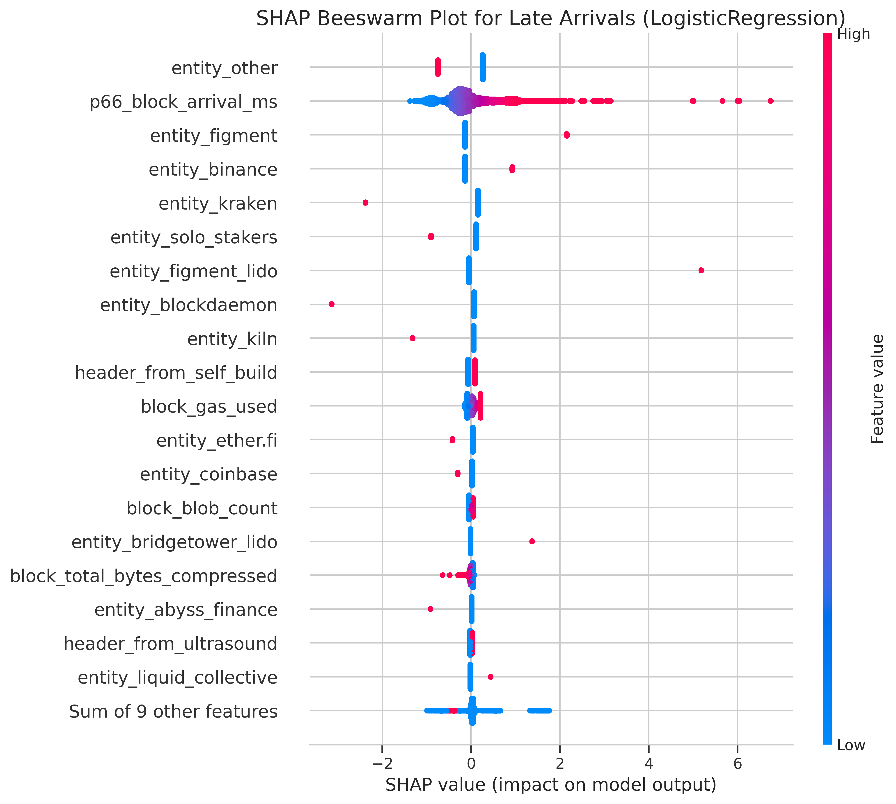

