Late arrivals model report
==========================


* [Original sample](#original-sample)
	* [Logit regression - statsmodel report](#logit-regression---statsmodel-report)
	* [RandomForestClassifier outputs](#randomforestclassifier-outputs)
	* [LGBMClassifier outputs](#lgbmclassifier-outputs)
	* [LogisticRegression outputs](#logisticregression-outputs)
* [Balanced sample (50% of each predictor class)](#balanced-sample-50-of-each-predictor-class)
	* [Logit regression - statsmodel report](#logit-regression---statsmodel-report)
	* [RandomForestClassifier outputs](#randomforestclassifier-outputs)
	* [LGBMClassifier outputs](#lgbmclassifier-outputs)
	* [LogisticRegression outputs](#logisticregression-outputs)
* [Self-builder balanced sample](#self-builder-balanced-sample)
	* [Logit regression - statsmodel report](#logit-regression---statsmodel-report)
	* [RandomForestClassifier outputs](#randomforestclassifier-outputs)
	* [LGBMClassifier outputs](#lgbmclassifier-outputs)
	* [LogisticRegression outputs](#logisticregression-outputs)
* [Relay balanced sample](#relay-balanced-sample)
	* [Logit regression - statsmodel report](#logit-regression---statsmodel-report)
	* [RandomForestClassifier outputs](#randomforestclassifier-outputs)
	* [LGBMClassifier outputs](#lgbmclassifier-outputs)
	* [LogisticRegression outputs](#logisticregression-outputs)
* [No entity feature balanced sample](#no-entity-feature-balanced-sample)
	* [Logit regression - statsmodel report](#logit-regression---statsmodel-report)
	* [RandomForestClassifier outputs](#randomforestclassifier-outputs)
	* [LGBMClassifier outputs](#lgbmclassifier-outputs)
	* [LogisticRegression outputs](#logisticregression-outputs)
* [Timings since slot start balanced predictor](#timings-since-slot-start-balanced-predictor)
	* [Logit regression - statsmodel report](#logit-regression---statsmodel-report)
	* [RandomForestClassifier outputs](#randomforestclassifier-outputs)
	* [LGBMClassifier outputs](#lgbmclassifier-outputs)
	* [LogisticRegression outputs](#logisticregression-outputs)


***
## Introduction


This report summarises the main outputs from the model trained in the script 
[`late_atts_model_runner.py`](https://github.com/misilva73/eth-slot-analysis/blob/main/src/late_atts_model_runner.py).

We collected data on the attestation arrival times for two types of slots - slots from 
relays (titan and ultrasound) and slots from self-builders. For the relays, we compute the 
attestation arrival since the block was published by the relay (to account for timing games), 
while for self-builders, we compute the attestation arrival since the start of the slot 
(i.e., assuming no timing games or other delays). 

We gathered additional data on the slot and the attester and trained different models 
that predict whether an attestation was late, which is defined as taking more than 4.5s. We 
use these models to compute feature importance and SHAP values to surface which properties of the 
slot or the attester explain late arrivals.

This report was generated from the data in `sample_12243620_12294020` at 26-08-2025 19:35:20.

# Original sample

## Logit regression - statsmodel report


```python
                           Logit Regression Results                           
==============================================================================
Dep. Variable:                      y   No. Observations:             10564110
Model:                          Logit   Df Residuals:                 10564080
Method:                           MLE   Df Model:                           29
Date:                Wed, 27 Aug 2025   Pseudo R-squ.:                  0.2879
Time:                        14:06:31   Log-Likelihood:            -2.6324e+06
converged:                       True   LL-Null:                   -3.6966e+06
Covariance Type:            nonrobust   LLR p-value:                     0.000
================================================================================================
                                   coef    std err          z      P>|z|      [0.025      0.975]
------------------------------------------------------------------------------------------------
const                           -3.3948        nan        nan        nan         nan         nan
p66_block_arrival_ms             0.3267      0.001    318.692      0.000       0.325       0.329
block_total_bytes_compressed    -0.0194      0.003     -7.079      0.000      -0.025      -0.014
block_proposer_index             0.0168      0.001     14.995      0.000       0.015       0.019
block_gas_used                   0.0784      0.002     38.030      0.000       0.074       0.082
block_blob_count                 0.0449      0.001     38.340      0.000       0.043       0.047
block_tx_count                  -0.0185      0.002     -8.565      0.000      -0.023      -0.014
header_from_flashbots           -1.6251        nan        nan        nan         nan         nan
header_from_self_build           1.9402        nan        nan        nan         nan         nan
header_from_titan               -1.9882        nan        nan        nan         nan         nan
header_from_ultrasound          -1.7217        nan        nan        nan         nan         nan
entity_abyss_finance            -0.4033        nan        nan        nan         nan         nan
entity_binance                   1.5749        nan        nan        nan         nan         nan
entity_bitcoinsuisse            -1.7878        nan        nan        nan         nan         nan
entity_blockdaemon              -2.6480        nan        nan        nan         nan         nan
entity_coinbase                  0.2490        nan        nan        nan         nan         nan
entity_ether.fi                  0.2778        nan        nan        nan         nan         nan
entity_everstake                 0.3276        nan        nan        nan         nan         nan
entity_figment                   2.5364        nan        nan        nan         nan         nan
entity_kiln                     -0.6757        nan        nan        nan         nan         nan
entity_kraken                   -1.8791        nan        nan        nan         nan         nan
entity_lido                     -0.3390        nan        nan        nan         nan         nan
entity_liquid_collective         1.0024        nan        nan        nan         nan         nan
entity_mantle                   -0.2020        nan        nan        nan         nan         nan
entity_okex                     -0.1811        nan        nan        nan         nan         nan
entity_other                    -0.1290        nan        nan        nan         nan         nan
entity_p2porg                   -0.8130        nan        nan        nan         nan         nan
entity_rocketpool                0.1206        nan        nan        nan         nan         nan
entity_solo_stakers             -0.4242        nan        nan        nan         nan         nan
entity_staked.us                 1.2609        nan        nan        nan         nan         nan
entity_stakefish                 0.1167        nan        nan        nan         nan         nan
entity_upbit                    -1.3787        nan        nan        nan         nan         nan
================================================================================================
```
## RandomForestClassifier outputs

### Model performance


```python

              precision    recall  f1-score   support

     on-time      0.888     1.000     0.941   9384781
        late      0.000     0.000     0.000   1179329

    accuracy                          0.888  10564110
   macro avg      0.444     0.500     0.470  10564110
weighted avg      0.789     0.888     0.836  10564110

```

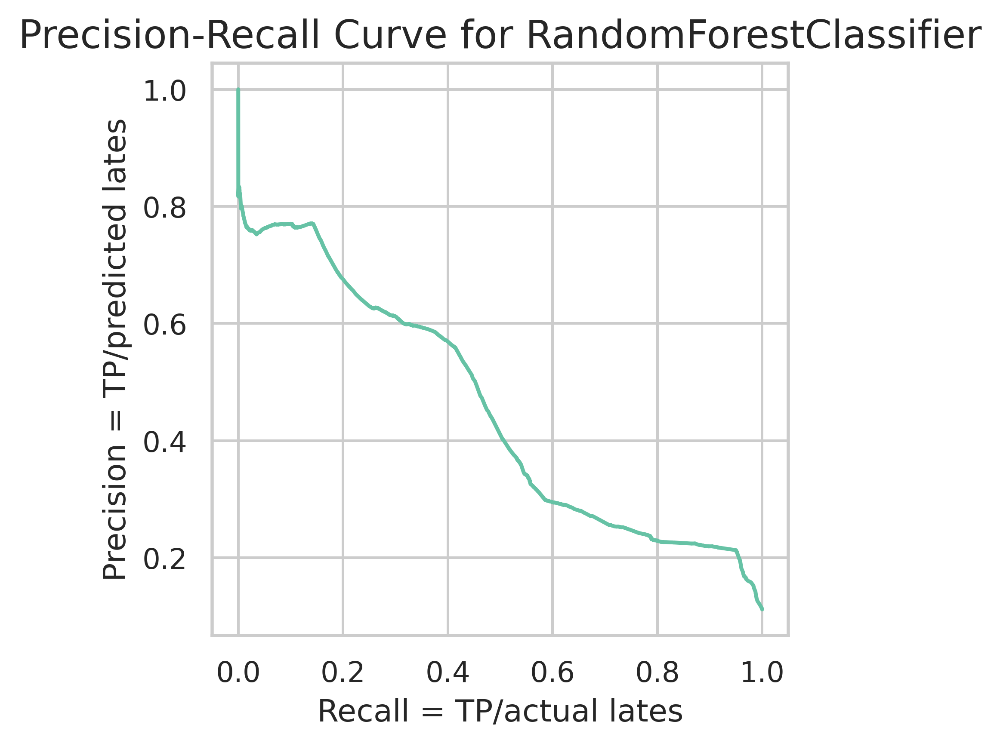

### Feature importance

|feature|importance|
| :---: | :---: |
|header_from_self_build|0.2934720402310161|
|header_from_ultrasound|0.22363368893957652|
|entity_figment|0.13671745453832468|
|block_total_bytes_compressed|0.07267089345808138|
|block_gas_used|0.064288844697946|
|entity_binance|0.056610529259061494|
|block_tx_count|0.04549668037042698|
|p66_block_arrival_ms|0.03328660797494033|
|entity_other|0.01738899624379368|
|header_from_flashbots|0.015572816026026297|
|header_from_titan|0.01279061904011066|
|entity_kraken|0.009268953408538378|
|entity_solo_stakers|0.004340631440561225|
|block_blob_count|0.0037410199020404466|
|entity_staked.us|0.0034723313411701433|
|entity_blockdaemon|0.003467623046906859|
|entity_liquid_collective|0.0007954425183897397|
|entity_kiln|0.0007674937010353213|
|block_proposer_index|0.0006637535763451222|
|entity_bitcoinsuisse|0.0006616257636552899|
|entity_upbit|0.0004570451419860885|
|entity_ether.fi|0.00031834552798987794|
|entity_p2porg|9.742922211567086e-05|
|entity_mantle|1.103187595734373e-05|
|entity_coinbase|3.8766903319099584e-06|
|entity_okex|1.5240422978358402e-06|
|entity_stakefish|1.3680890701332762e-06|
|entity_everstake|9.044542406112566e-07|
|entity_abyss_finance|4.294780640188227e-07|


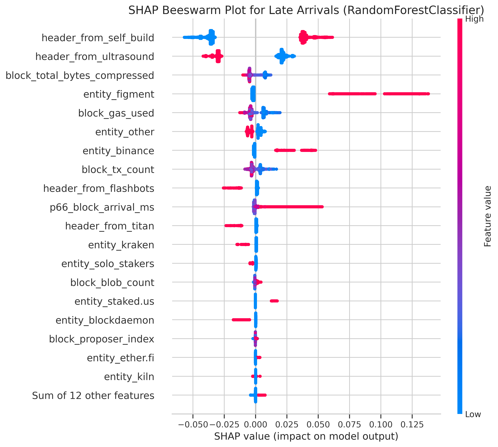


## LGBMClassifier outputs

### Model performance


```python

              precision    recall  f1-score   support

     on-time      0.912     0.986     0.947   9384781
        late      0.675     0.239     0.353   1179329

    accuracy                          0.902  10564110
   macro avg      0.793     0.612     0.650  10564110
weighted avg      0.885     0.902     0.881  10564110

```

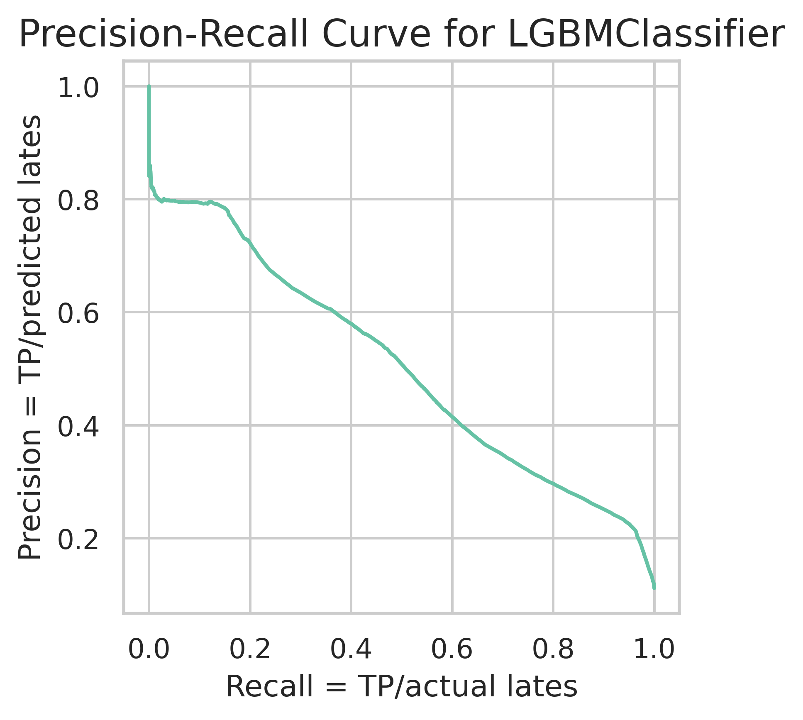

### Feature importance

|feature|importance|
| :---: | :---: |
|p66_block_arrival_ms|262|
|header_from_self_build|74|
|entity_ether.fi|36|
|entity_figment|36|
|entity_staked.us|36|
|entity_binance|32|
|entity_kraken|26|
|entity_blockdaemon|24|
|entity_bitcoinsuisse|20|
|block_gas_used|18|
|entity_kiln|16|
|block_total_bytes_compressed|16|
|entity_upbit|15|
|entity_liquid_collective|12|
|entity_stakefish|11|
|entity_solo_stakers|11|
|entity_p2porg|8|
|entity_coinbase|8|
|entity_everstake|7|
|header_from_flashbots|7|
|entity_abyss_finance|6|
|entity_other|6|
|header_from_ultrasound|5|
|block_tx_count|3|
|entity_okex|2|
|block_blob_count|2|
|block_proposer_index|1|


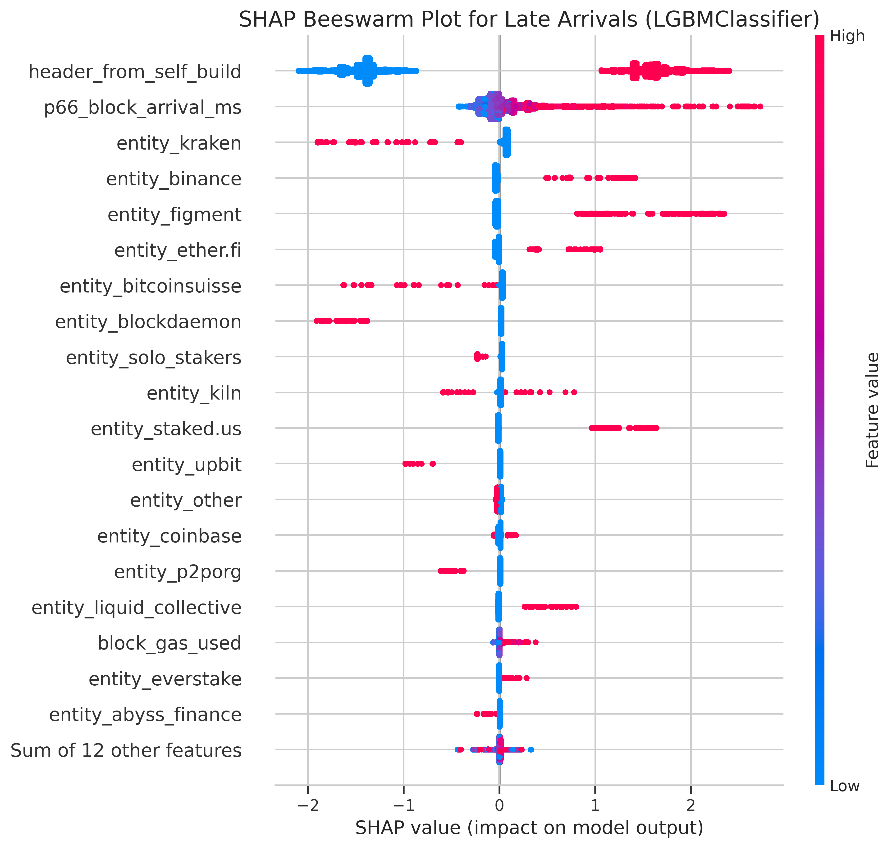


## LogisticRegression outputs

### Model performance


```python

              precision    recall  f1-score   support

     on-time      0.913     0.982     0.946   9384781
        late      0.636     0.257     0.366   1179329

    accuracy                          0.901  10564110
   macro avg      0.775     0.619     0.656  10564110
weighted avg      0.882     0.901     0.881  10564110

```

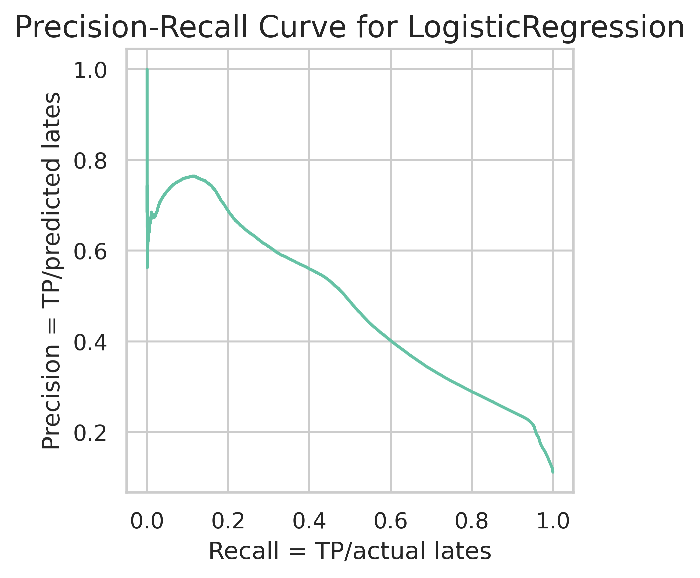

### Feature importance

|feature|importance|
| :---: | :---: |
|entity_figment|2.5448532208735175|
|header_from_self_build|1.9360135765371354|
|entity_binance|1.5782216111153482|
|entity_staked.us|1.258850445531985|
|entity_liquid_collective|0.9931030001445239|
|p66_block_arrival_ms|0.32710548401901085|
|entity_everstake|0.32324265485986886|
|entity_ether.fi|0.2731419612127969|
|entity_coinbase|0.2443483630928483|
|entity_stakefish|0.11776603852265467|
|entity_rocketpool|0.11651334076443175|
|block_gas_used|0.0827588125826305|
|block_blob_count|0.04502487646845177|
|block_proposer_index|0.016837411183221997|


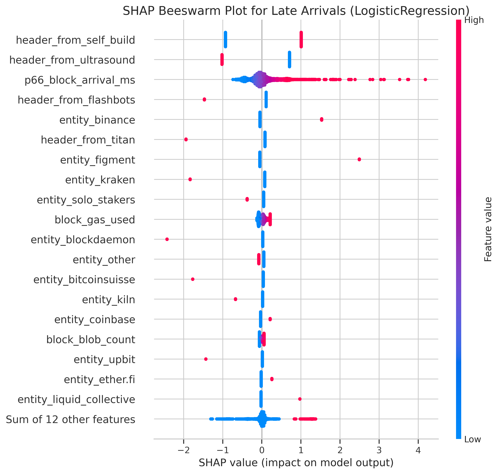


# Balanced sample (50% of each predictor class)

## Logit regression - statsmodel report


```python
                           Logit Regression Results                           
==============================================================================
Dep. Variable:                      y   No. Observations:              2358454
Model:                          Logit   Df Residuals:                  2358424
Method:                           MLE   Df Model:                           29
Date:                Wed, 27 Aug 2025   Pseudo R-squ.:                  0.3825
Time:                        16:42:38   Log-Likelihood:            -1.0095e+06
converged:                       True   LL-Null:                   -1.6348e+06
Covariance Type:            nonrobust   LLR p-value:                     0.000
================================================================================================
                                   coef    std err          z      P>|z|      [0.025      0.975]
------------------------------------------------------------------------------------------------
const                           -1.2362        nan        nan        nan         nan         nan
p66_block_arrival_ms             0.4568      0.002    220.404      0.000       0.453       0.461
block_total_bytes_compressed    -0.0252      0.004     -6.166      0.000      -0.033      -0.017
block_proposer_index             0.0167      0.002      9.447      0.000       0.013       0.020
block_gas_used                   0.0909      0.003     28.799      0.000       0.085       0.097
block_blob_count                 0.0487      0.002     26.887      0.000       0.045       0.052
block_tx_count                  -0.0258      0.003     -7.834      0.000      -0.032      -0.019
header_from_flashbots           -1.0668   3.56e+04     -3e-05      1.000   -6.97e+04    6.97e+04
header_from_self_build           2.5071   3.56e+04   7.05e-05      1.000   -6.97e+04    6.97e+04
header_from_titan               -1.4776   3.56e+04  -4.15e-05      1.000   -6.97e+04    6.97e+04
header_from_ultrasound          -1.1989   3.56e+04  -3.37e-05      1.000   -6.97e+04    6.97e+04
entity_abyss_finance            -1.0280   3.73e+04  -2.76e-05      1.000    -7.3e+04     7.3e+04
entity_binance                   0.8882   3.73e+04   2.38e-05      1.000    -7.3e+04     7.3e+04
entity_blockdaemon              -3.2656   3.73e+04  -8.76e-05      1.000    -7.3e+04     7.3e+04
entity_bridgetower_lido          0.8935   3.73e+04    2.4e-05      1.000    -7.3e+04     7.3e+04
entity_coinbase                 -0.4030   3.73e+04  -1.08e-05      1.000    -7.3e+04     7.3e+04
entity_coinspot                  2.6054   3.73e+04   6.99e-05      1.000    -7.3e+04     7.3e+04
entity_ether.fi                 -0.0988   3.73e+04  -2.65e-06      1.000    -7.3e+04     7.3e+04
entity_everstake                -0.4472   3.73e+04   -1.2e-05      1.000    -7.3e+04     7.3e+04
entity_figment                   1.5969   3.73e+04   4.29e-05      1.000    -7.3e+04     7.3e+04
entity_figment_lido              2.0211   3.73e+04   5.42e-05      1.000    -7.3e+04     7.3e+04
entity_kiln                     -1.4184   3.73e+04  -3.81e-05      1.000    -7.3e+04     7.3e+04
entity_kraken                   -2.7471   3.73e+04  -7.37e-05      1.000    -7.3e+04     7.3e+04
entity_liquid_collective         0.3879   3.73e+04   1.04e-05      1.000    -7.3e+04     7.3e+04
entity_okex                     -0.8228   3.73e+04  -2.21e-05      1.000    -7.3e+04     7.3e+04
entity_other                    -1.2371   3.73e+04  -3.32e-05      1.000    -7.3e+04     7.3e+04
entity_rocketpool               -0.5107   3.73e+04  -1.37e-05      1.000    -7.3e+04     7.3e+04
entity_senseinode_lido           1.0040   3.73e+04   2.69e-05      1.000    -7.3e+04     7.3e+04
entity_solo_stakers             -1.0666   3.73e+04  -2.86e-05      1.000    -7.3e+04     7.3e+04
entity_staked.us                 0.9498   3.73e+04   2.55e-05      1.000    -7.3e+04     7.3e+04
entity_stakefish                -0.6763   3.73e+04  -1.81e-05      1.000    -7.3e+04     7.3e+04
entity_stakewise                 2.1385   3.73e+04   5.74e-05      1.000    -7.3e+04     7.3e+04
================================================================================================
```
## RandomForestClassifier outputs

### Model performance


```python

              precision    recall  f1-score   support

     on-time      0.869     0.595     0.707   1179125
        late      0.692     0.910     0.787   1179329

    accuracy                          0.753   2358454
   macro avg      0.781     0.753     0.747   2358454
weighted avg      0.781     0.753     0.747   2358454

```

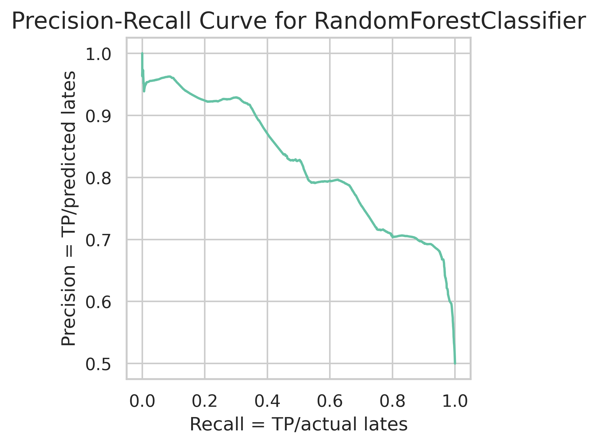

### Feature importance

|feature|importance|
| :---: | :---: |
|header_from_self_build|0.2770825009655871|
|header_from_ultrasound|0.22675877461795715|
|block_total_bytes_compressed|0.10954096111449224|
|block_gas_used|0.08062612077258201|
|entity_other|0.0658986288641178|
|block_tx_count|0.056463350235468016|
|entity_figment|0.05224101439860284|
|entity_binance|0.03865373286788072|
|header_from_flashbots|0.026153716265258035|
|header_from_titan|0.015640874249330604|
|p66_block_arrival_ms|0.014292110700459115|
|entity_kraken|0.010322556791949428|
|entity_figment_lido|0.0059806525879619364|
|entity_blockdaemon|0.005098402027102901|
|entity_stakewise|0.0039665560440858985|
|block_blob_count|0.003667698989411814|
|entity_solo_stakers|0.0021736468209791857|
|entity_coinspot|0.0017825592494983883|
|block_proposer_index|0.001489532392333788|
|entity_ether.fi|0.0007418807331537806|
|entity_kiln|0.0005935065366918039|
|entity_staked.us|0.00043672863331627144|
|entity_senseinode_lido|0.00021531746427819952|
|entity_bridgetower_lido|8.779494830903147e-05|
|entity_coinbase|4.55461382808204e-05|
|entity_abyss_finance|3.6540808542034966e-05|
|entity_okex|8.83142498423416e-06|
|entity_everstake|4.6335738488271874e-07|


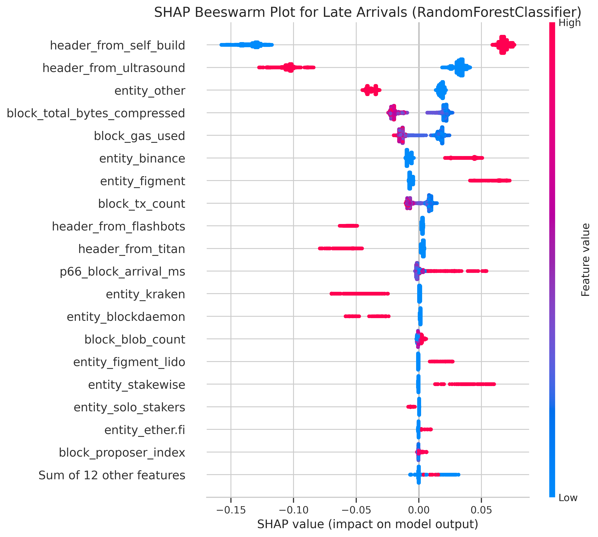


## LGBMClassifier outputs

### Model performance


```python

              precision    recall  f1-score   support

     on-time      0.814     0.772     0.793   1179125
        late      0.783     0.824     0.803   1179329

    accuracy                          0.798   2358454
   macro avg      0.799     0.798     0.798   2358454
weighted avg      0.799     0.798     0.798   2358454

```

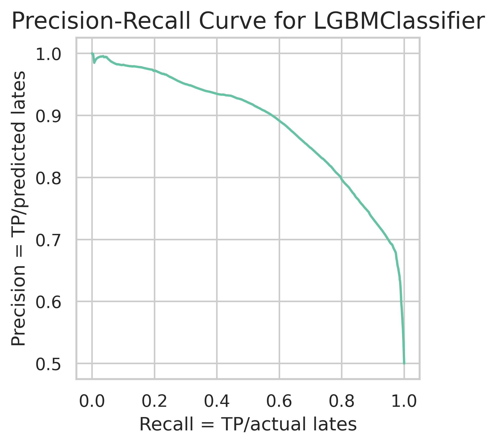

### Feature importance

|feature|importance|
| :---: | :---: |
|p66_block_arrival_ms|253|
|header_from_self_build|110|
|entity_figment|31|
|entity_other|29|
|entity_binance|26|
|entity_figment_lido|25|
|entity_coinspot|23|
|entity_stakewise|22|
|entity_kraken|21|
|entity_blockdaemon|20|
|entity_ether.fi|18|
|entity_staked.us|18|
|header_from_ultrasound|18|
|entity_senseinode_lido|16|
|entity_bridgetower_lido|12|
|entity_kiln|12|
|entity_solo_stakers|10|
|entity_abyss_finance|7|
|entity_liquid_collective|7|
|header_from_flashbots|6|
|entity_stakefish|4|
|block_gas_used|3|
|block_proposer_index|2|
|block_tx_count|2|
|entity_okex|2|
|header_from_titan|2|
|block_blob_count|1|


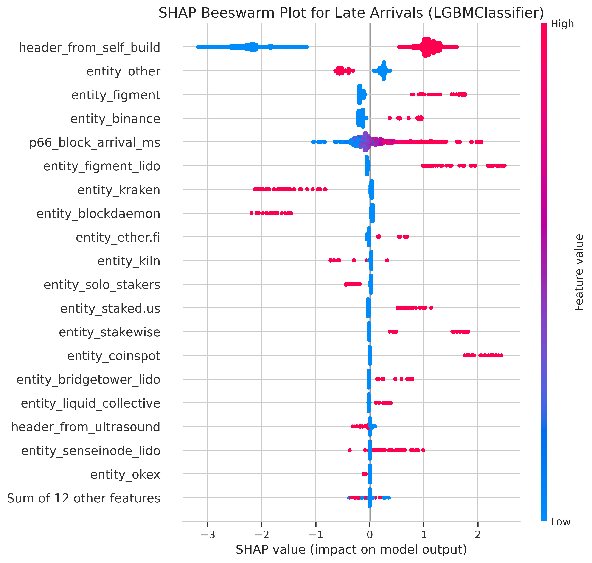


## LogisticRegression outputs

### Model performance


```python

              precision    recall  f1-score   support

     on-time      0.811     0.765     0.787   1179125
        late      0.778     0.821     0.799   1179329

    accuracy                          0.793   2358454
   macro avg      0.794     0.793     0.793   2358454
weighted avg      0.794     0.793     0.793   2358454

```

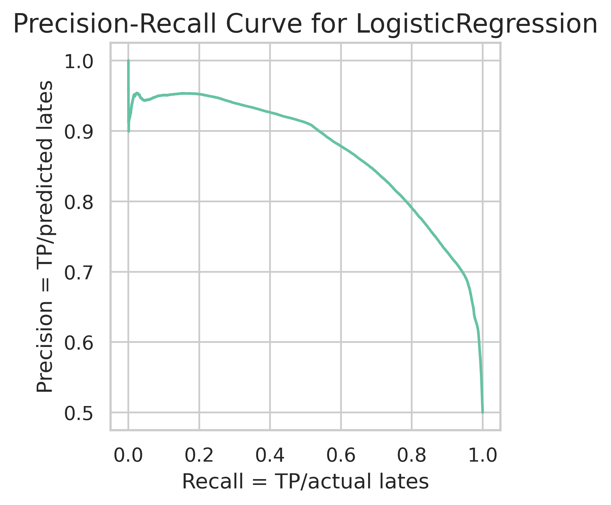

### Feature importance

|feature|importance|
| :---: | :---: |
|entity_coinspot|2.568482025688309|
|header_from_self_build|2.5090596010984587|
|entity_stakewise|2.1559761376970603|
|entity_figment_lido|2.0469727325685247|
|entity_figment|1.5940055663444954|
|entity_senseinode_lido|1.0108614701921976|
|entity_staked.us|0.9233767639182461|
|entity_bridgetower_lido|0.8940601006028078|
|entity_binance|0.88358228320577|
|p66_block_arrival_ms|0.4560308797405963|
|entity_liquid_collective|0.3676427499511792|
|block_gas_used|0.0906395463965026|
|block_blob_count|0.0494323668264547|
|block_proposer_index|0.017242047301756797|


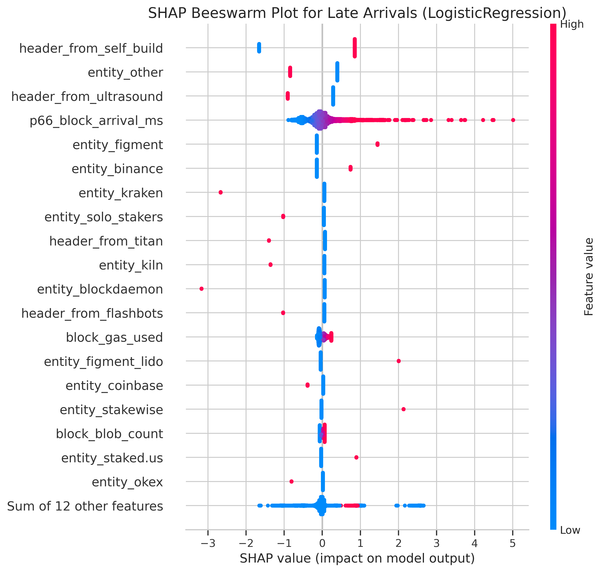


# Self-builder balanced sample

## Logit regression - statsmodel report


```python
                           Logit Regression Results                           
==============================================================================
Dep. Variable:                      y   No. Observations:              2240804
Model:                          Logit   Df Residuals:                  2240779
Method:                           MLE   Df Model:                           24
Date:                Wed, 27 Aug 2025   Pseudo R-squ.:                  0.2023
Time:                        17:24:47   Log-Likelihood:            -1.2390e+06
converged:                       True   LL-Null:                   -1.5532e+06
Covariance Type:            nonrobust   LLR p-value:                     0.000
================================================================================================
                                   coef    std err          z      P>|z|      [0.025      0.975]
------------------------------------------------------------------------------------------------
p66_block_arrival_ms             0.5280      0.002    276.823      0.000       0.524       0.532
block_total_bytes_compressed    -0.0382      0.003    -11.570      0.000      -0.045      -0.032
block_proposer_index             0.0087      0.002      5.439      0.000       0.006       0.012
block_gas_used                   0.0790      0.003     31.325      0.000       0.074       0.084
block_blob_count                 0.0512      0.002     32.309      0.000       0.048       0.054
block_tx_count                  -0.0161      0.003     -5.566      0.000      -0.022      -0.010
header_from_self_build           0.3263        nan        nan        nan         nan         nan
entity_abyss_finance            -1.1043        nan        nan        nan         nan         nan
entity_binance                   1.1638        nan        nan        nan         nan         nan
entity_blockdaemon              -3.2674        nan        nan        nan         nan         nan
entity_bridgetower_lido          1.4358        nan        nan        nan         nan         nan
entity_coinbase                 -0.2443        nan        nan        nan         nan         nan
entity_ether.fi                 -0.4137        nan        nan        nan         nan         nan
entity_everstake                -0.1920        nan        nan        nan         nan         nan
entity_figment                   2.3827        nan        nan        nan         nan         nan
entity_figment_lido              5.3335        nan        nan        nan         nan         nan
entity_kiln                     -1.2603        nan        nan        nan         nan         nan
entity_kraken                   -2.5980        nan        nan        nan         nan         nan
entity_liquid_collective         0.5731        nan        nan        nan         nan         nan
entity_okex                     -0.6509        nan        nan        nan         nan         nan
entity_other                    -0.9952        nan        nan        nan         nan         nan
entity_rocketpool               -0.4442        nan        nan        nan         nan         nan
entity_senseinode_lido           1.4044        nan        nan        nan         nan         nan
entity_solo_stakers             -0.9771        nan        nan        nan         nan         nan
entity_staked.us                 0.6208        nan        nan        nan         nan         nan
entity_stakefish                -0.4404        nan        nan        nan         nan         nan
================================================================================================
```
## RandomForestClassifier outputs

### Model performance


```python

              precision    recall  f1-score   support

     on-time      0.672     0.847     0.749   1120402
        late      0.793     0.587     0.674   1120402

    accuracy                          0.717   2240804
   macro avg      0.732     0.717     0.712   2240804
weighted avg      0.732     0.717     0.712   2240804

```

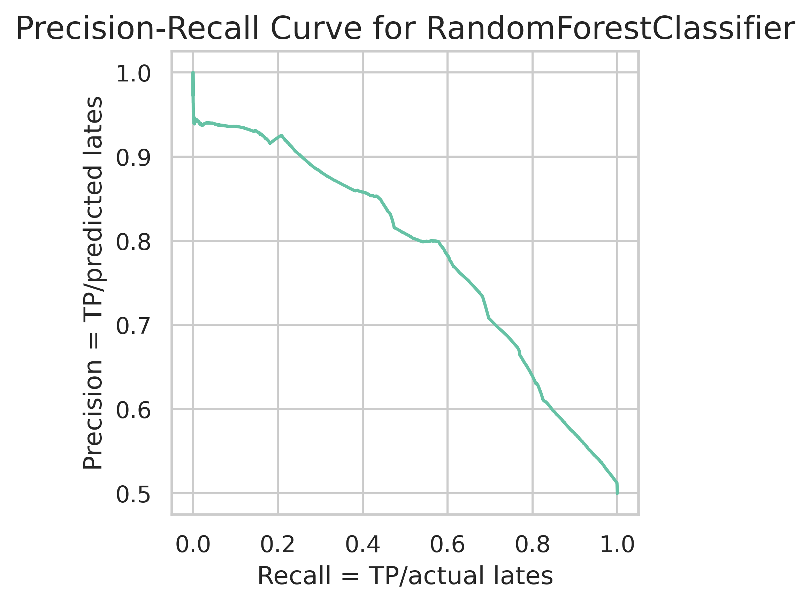

### Feature importance

|feature|importance|
| :---: | :---: |
|entity_figment|0.27393380364950853|
|entity_binance|0.19913373970792222|
|entity_other|0.18399470395575876|
|p66_block_arrival_ms|0.1241209503556042|
|entity_kraken|0.0676150652199295|
|entity_figment_lido|0.06470662062820244|
|entity_blockdaemon|0.03569500383280413|
|entity_solo_stakers|0.013498797038453792|
|entity_kiln|0.012727450459510674|
|entity_senseinode_lido|0.005569659534795366|
|entity_staked.us|0.004975026516644621|
|entity_liquid_collective|0.004598796479880195|
|entity_bridgetower_lido|0.0029297545536468945|
|block_proposer_index|0.0017543640128781421|
|entity_abyss_finance|0.0015608334805696127|
|entity_ether.fi|0.0009208730087850631|
|block_total_bytes_compressed|0.0008643701059537373|
|block_gas_used|0.0004512611841181146|
|block_tx_count|0.00044317482383589654|
|entity_coinbase|0.0001967015696747201|
|block_blob_count|0.00017680172135446876|
|entity_everstake|0.00013224816016893734|


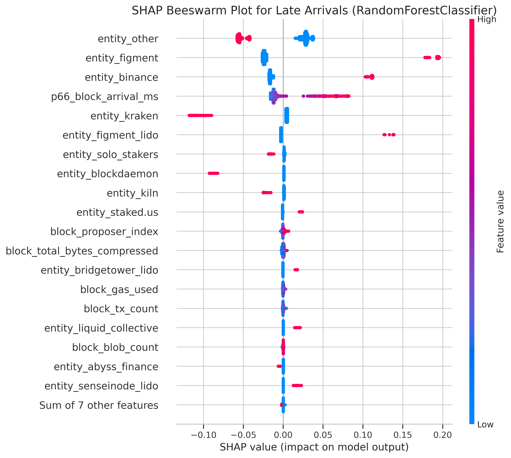


## LGBMClassifier outputs

### Model performance


```python

              precision    recall  f1-score   support

     on-time      0.682     0.843     0.754   1120402
        late      0.794     0.607     0.688   1120402

    accuracy                          0.725   2240804
   macro avg      0.738     0.725     0.721   2240804
weighted avg      0.738     0.725     0.721   2240804

```

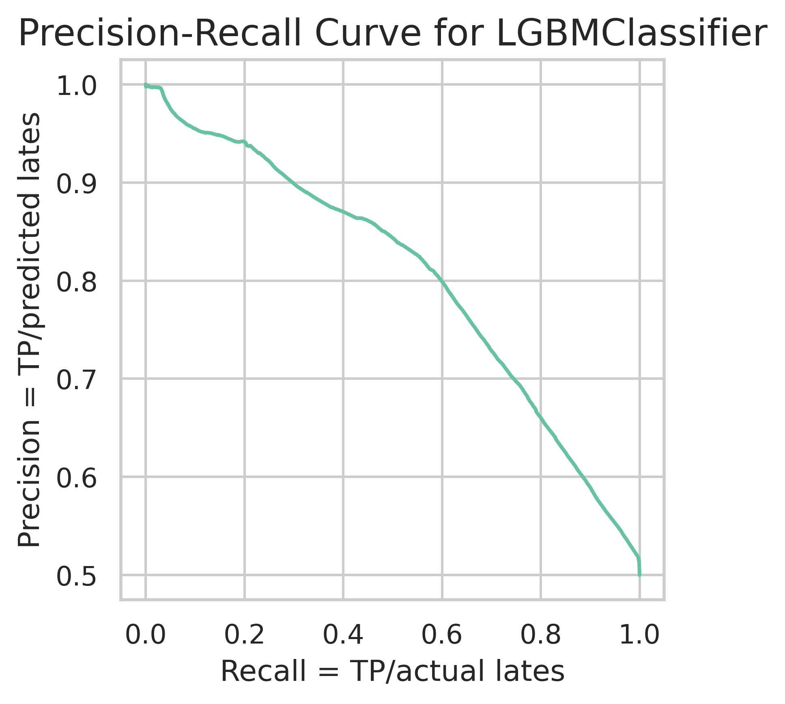

### Feature importance

|feature|importance|
| :---: | :---: |
|p66_block_arrival_ms|312|
|entity_figment_lido|33|
|entity_figment|30|
|entity_kraken|27|
|block_total_bytes_compressed|27|
|block_tx_count|25|
|entity_binance|24|
|entity_blockdaemon|24|
|block_gas_used|21|
|entity_kiln|20|
|entity_senseinode_lido|19|
|entity_other|19|
|entity_bridgetower_lido|17|
|block_proposer_index|17|
|entity_staked.us|14|
|entity_solo_stakers|14|
|block_blob_count|14|
|entity_liquid_collective|12|
|entity_abyss_finance|11|
|entity_stakefish|10|
|entity_everstake|5|
|entity_coinbase|3|
|entity_okex|2|


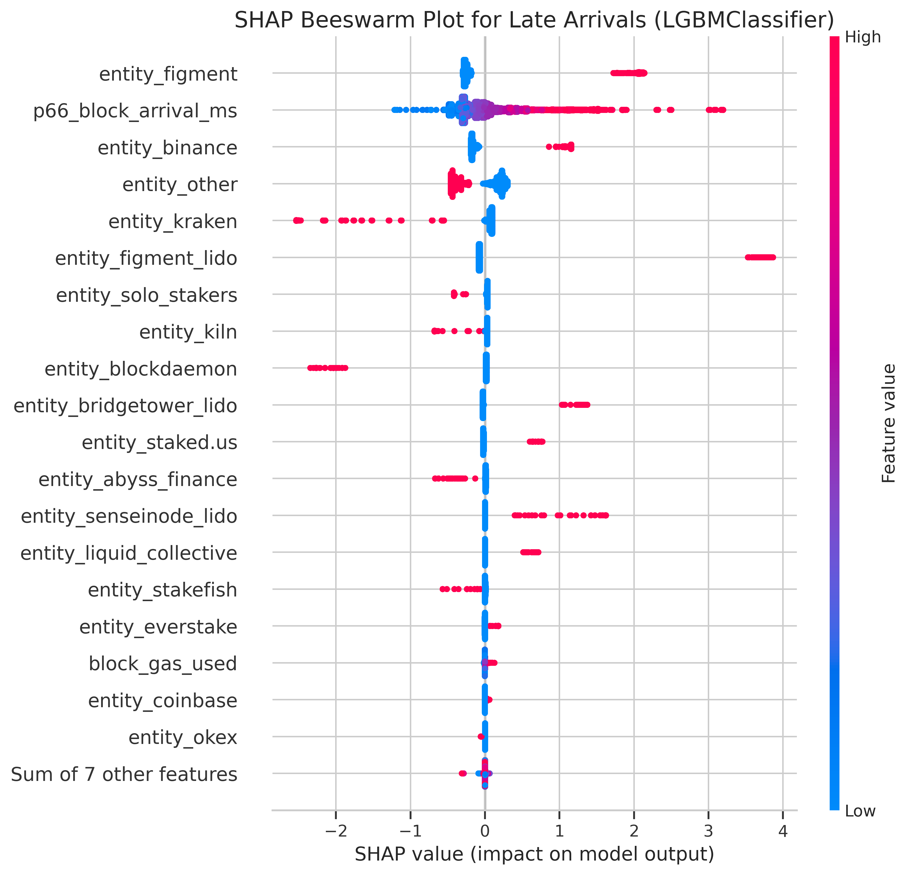


## LogisticRegression outputs

### Model performance


```python

              precision    recall  f1-score   support

     on-time      0.684     0.820     0.746   1120402
        late      0.775     0.621     0.690   1120402

    accuracy                          0.721   2240804
   macro avg      0.730     0.721     0.718   2240804
weighted avg      0.730     0.721     0.718   2240804

```

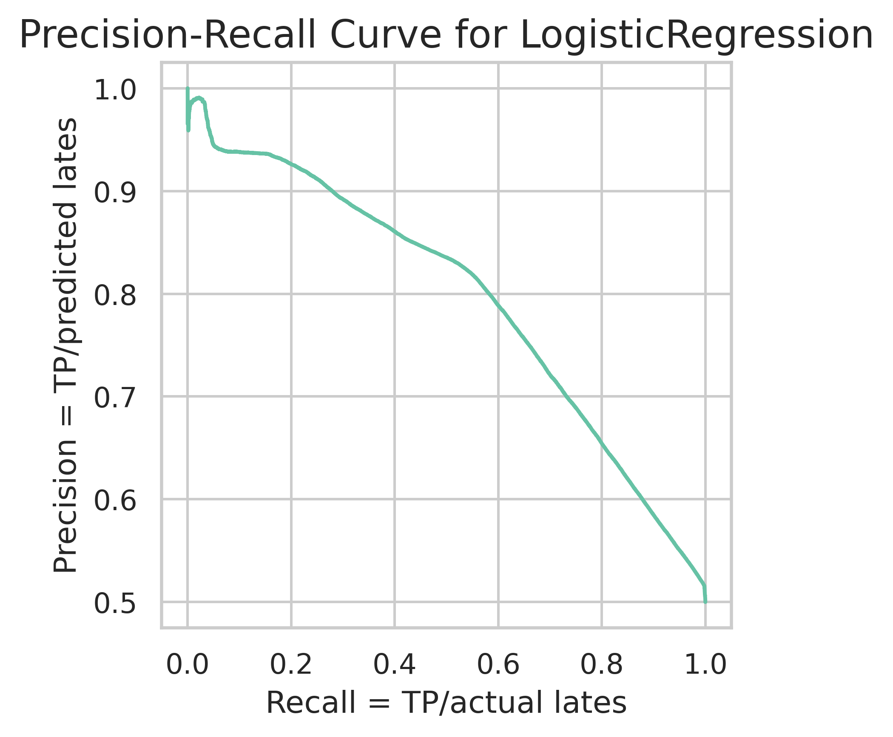

### Feature importance

|feature|importance|
| :---: | :---: |
|entity_figment_lido|5.3091869533149|
|entity_figment|2.3811131163480277|
|entity_bridgetower_lido|1.4433049368778144|
|entity_senseinode_lido|1.4073729654859246|
|entity_binance|1.159174929045688|
|entity_staked.us|0.6063122993243898|
|entity_liquid_collective|0.5696528624003142|
|p66_block_arrival_ms|0.5281556623034755|
|header_from_self_build|0.16569599489306708|
|block_gas_used|0.08012312806878961|
|block_blob_count|0.051611753323323566|
|block_proposer_index|0.0087972782827624|


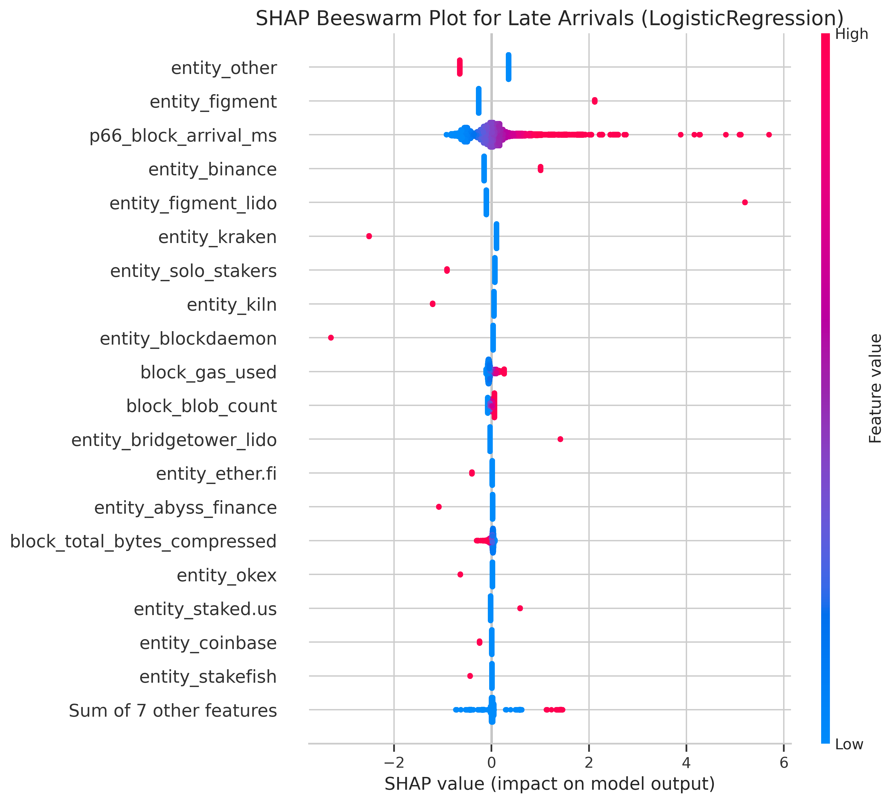


# Relay balanced sample

## Logit regression - statsmodel report


```python
                           Logit Regression Results                           
==============================================================================
Dep. Variable:                      y   No. Observations:               117835
Model:                          Logit   Df Residuals:                   117812
Method:                           MLE   Df Model:                           22
Date:                Wed, 27 Aug 2025   Pseudo R-squ.:                  0.2402
Time:                        17:59:49   Log-Likelihood:                -62058.
converged:                       True   LL-Null:                       -81677.
Covariance Type:            nonrobust   LLR p-value:                     0.000
================================================================================================
                                   coef    std err          z      P>|z|      [0.025      0.975]
------------------------------------------------------------------------------------------------
const                            0.0844        nan        nan        nan         nan         nan
p66_block_arrival_ms            -0.0111      0.007     -1.560      0.119      -0.025       0.003
block_total_bytes_compressed    -0.0013      0.011     -0.116      0.908      -0.024       0.021
block_proposer_index            -0.0207      0.007     -2.963      0.003      -0.034      -0.007
block_gas_used                   0.1305      0.010     12.894      0.000       0.111       0.150
block_blob_count                 0.0589      0.007      8.323      0.000       0.045       0.073
block_tx_count                  -0.0243      0.010     -2.377      0.017      -0.044      -0.004
header_from_flashbots            0.3652        nan        nan        nan         nan         nan
header_from_titan               -0.2384        nan        nan        nan         nan         nan
header_from_ultrasound          -0.0424        nan        nan        nan         nan         nan
entity_abyss_finance             0.3277   2.18e+05    1.5e-06      1.000   -4.27e+05    4.27e+05
entity_binance                   0.4367   2.18e+05      2e-06      1.000   -4.27e+05    4.27e+05
entity_coinbase                 -0.7715   2.18e+05  -3.54e-06      1.000   -4.27e+05    4.27e+05
entity_coinspot                  2.0236   2.18e+05   9.29e-06      1.000   -4.27e+05    4.27e+05
entity_ether.fi                  1.2057   2.18e+05   5.53e-06      1.000   -4.27e+05    4.27e+05
entity_everstake                -2.8620   2.18e+05  -1.31e-05      1.000   -4.27e+05    4.27e+05
entity_figment                   0.6009   2.18e+05   2.76e-06      1.000   -4.27e+05    4.27e+05
entity_kiln                     -1.8662   2.18e+05  -8.56e-06      1.000   -4.27e+05    4.27e+05
entity_kraken                   -2.0339   2.18e+05  -9.33e-06      1.000   -4.27e+05    4.27e+05
entity_liquid_collective         0.0509   2.18e+05   2.33e-07      1.000   -4.27e+05    4.27e+05
entity_other                    -1.2908   2.18e+05  -5.92e-06      1.000   -4.27e+05    4.27e+05
entity_rocketpool                0.0572   2.18e+05   2.62e-07      1.000   -4.27e+05    4.27e+05
entity_solo_stakers             -0.6659   2.18e+05  -3.06e-06      1.000   -4.27e+05    4.27e+05
entity_staked.us                 1.6075   2.18e+05   7.38e-06      1.000   -4.27e+05    4.27e+05
entity_stakewise                 3.2644   2.18e+05    1.5e-05      1.000   -4.27e+05    4.27e+05
================================================================================================
```
## RandomForestClassifier outputs

### Model performance


```python

              precision    recall  f1-score   support

     on-time      0.760     0.735     0.747     58908
        late      0.743     0.768     0.755     58927

    accuracy                          0.751    117835
   macro avg      0.752     0.751     0.751    117835
weighted avg      0.752     0.751     0.751    117835

```

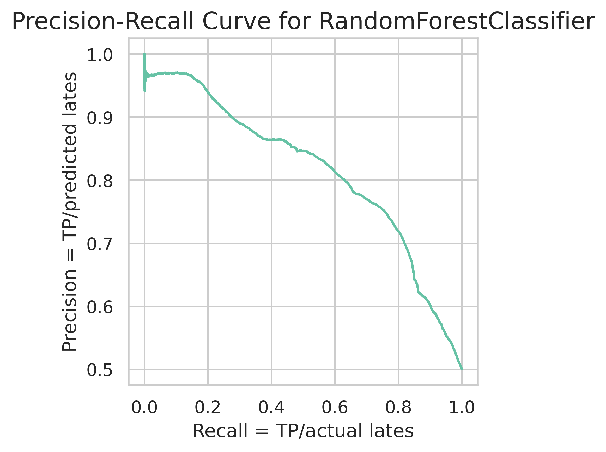

### Feature importance

|feature|importance|
| :---: | :---: |
|entity_other|0.2935612454882834|
|entity_stakewise|0.2731329650526126|
|entity_ether.fi|0.15872748490890087|
|entity_staked.us|0.06490194878168108|
|entity_kiln|0.04837686457535673|
|entity_coinspot|0.03922594079997622|
|p66_block_arrival_ms|0.026562010399682742|
|entity_kraken|0.026101941048973863|
|entity_binance|0.017033306310506716|
|entity_everstake|0.01608804097643451|
|entity_coinbase|0.009132609836371246|
|entity_solo_stakers|0.008705031020153619|
|entity_figment|0.006346506904367333|
|block_gas_used|0.003920963648066603|
|header_from_flashbots|0.003596866607556156|
|block_total_bytes_compressed|0.001504727272797291|
|block_tx_count|0.0014409780024000072|
|block_proposer_index|0.0005587049082961935|
|header_from_ultrasound|0.00035375129885372933|
|entity_abyss_finance|0.0002600852722606489|
|header_from_titan|0.00024805860041470277|
|block_blob_count|0.00021996828605368962|


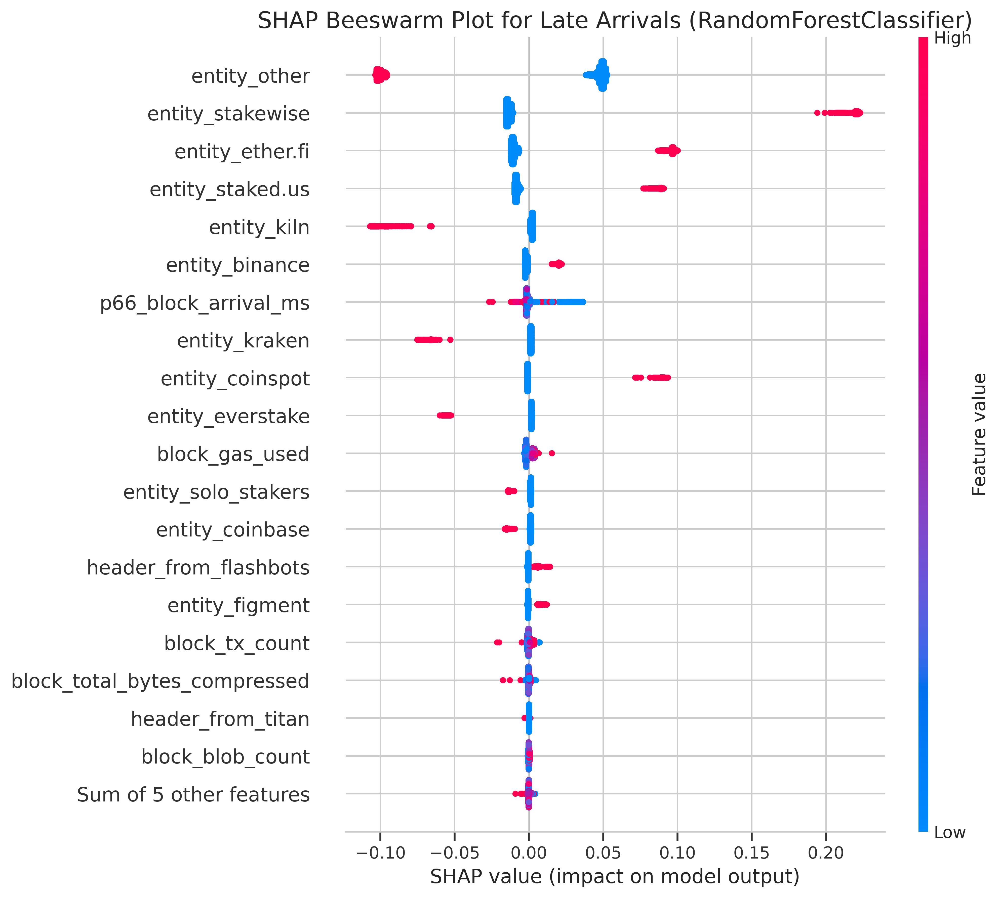


## LGBMClassifier outputs

### Model performance


```python

              precision    recall  f1-score   support

     on-time      0.766     0.745     0.755     58908
        late      0.752     0.772     0.762     58927

    accuracy                          0.759    117835
   macro avg      0.759     0.759     0.759    117835
weighted avg      0.759     0.759     0.759    117835

```

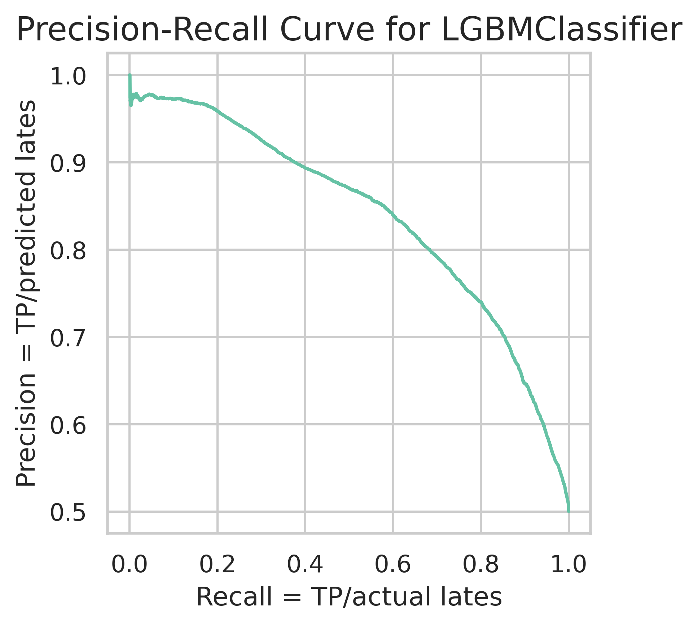

### Feature importance

|feature|importance|
| :---: | :---: |
|p66_block_arrival_ms|266|
|block_total_bytes_compressed|52|
|block_gas_used|39|
|block_tx_count|37|
|entity_stakewise|32|
|block_blob_count|29|
|entity_other|27|
|entity_kiln|22|
|entity_everstake|21|
|entity_kraken|20|
|entity_figment|20|
|entity_coinspot|20|
|entity_ether.fi|19|
|entity_staked.us|18|
|block_proposer_index|17|
|entity_coinbase|16|
|entity_solo_stakers|15|
|entity_abyss_finance|9|
|entity_binance|7|
|header_from_titan|5|
|header_from_ultrasound|4|
|header_from_flashbots|1|
|entity_liquid_collective|1|


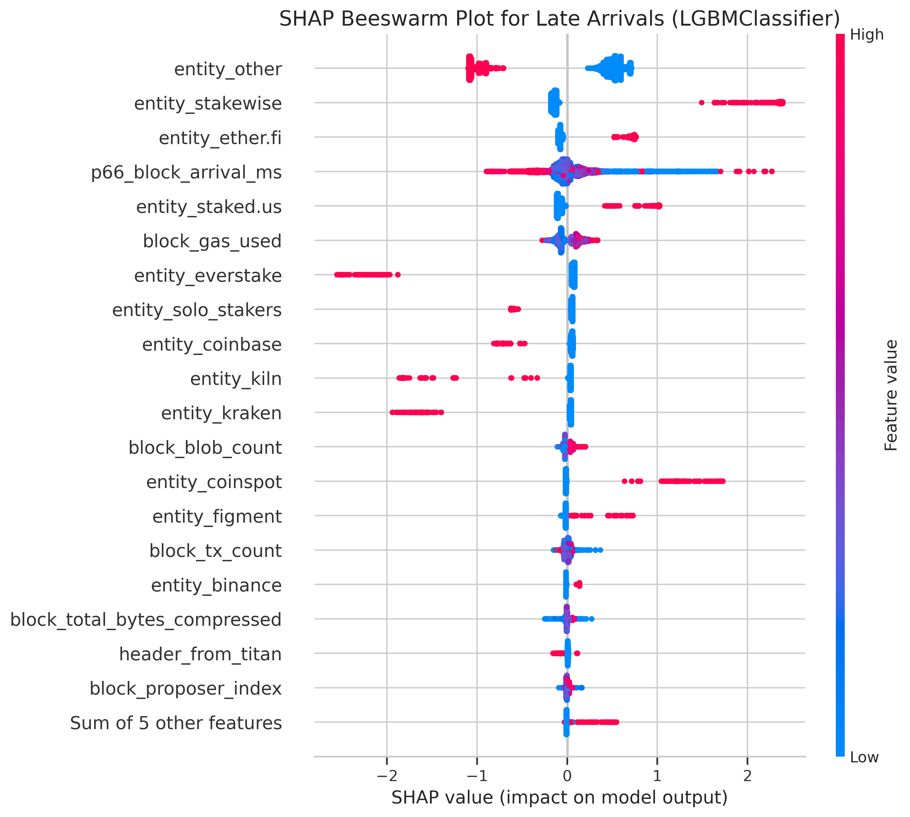


## LogisticRegression outputs

### Model performance


```python

              precision    recall  f1-score   support

     on-time      0.751     0.751     0.751     58908
        late      0.751     0.751     0.751     58927

    accuracy                          0.751    117835
   macro avg      0.751     0.751     0.751    117835
weighted avg      0.751     0.751     0.751    117835

```

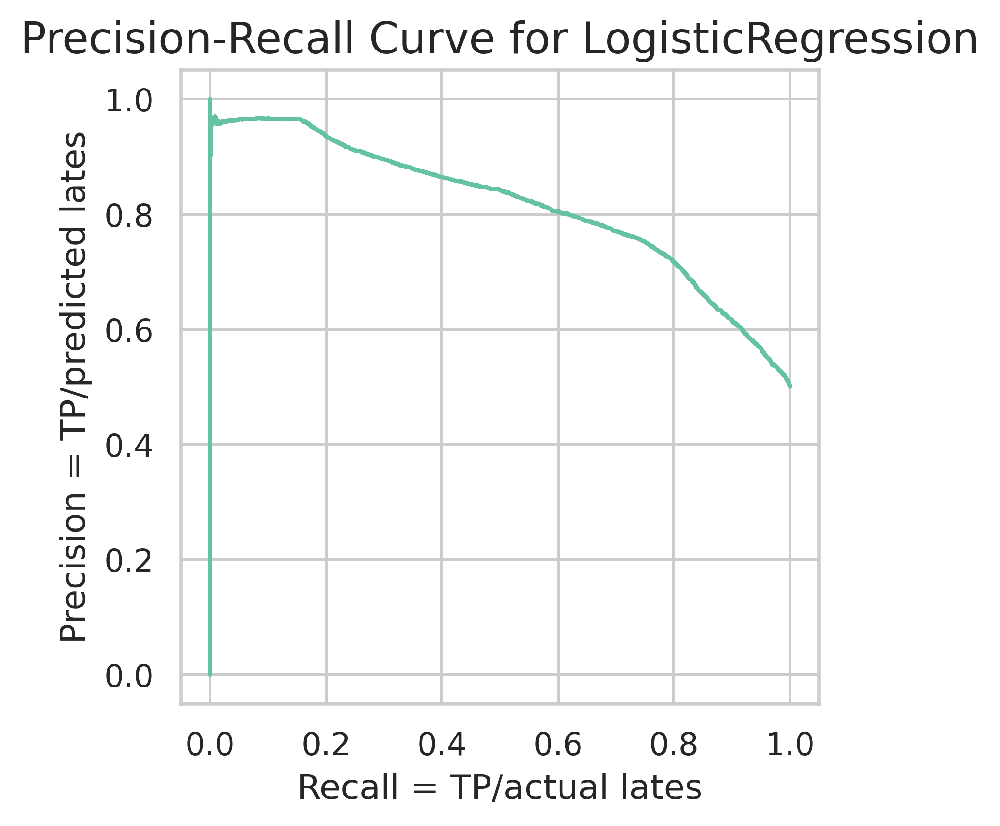

### Feature importance

|feature|importance|
| :---: | :---: |
|entity_stakewise|3.226959563787069|
|entity_coinspot|2.0349312208615418|
|entity_staked.us|1.6012375135880341|
|entity_ether.fi|1.1996347169720396|
|entity_figment|0.5990655693763046|
|entity_binance|0.43009555271284866|
|header_from_flashbots|0.3659704543170287|
|entity_abyss_finance|0.3096765041792874|
|block_gas_used|0.12992071905193128|
|block_blob_count|0.05865702385684471|
|entity_liquid_collective|0.04533170666177669|
|entity_rocketpool|0.037167212283138774|


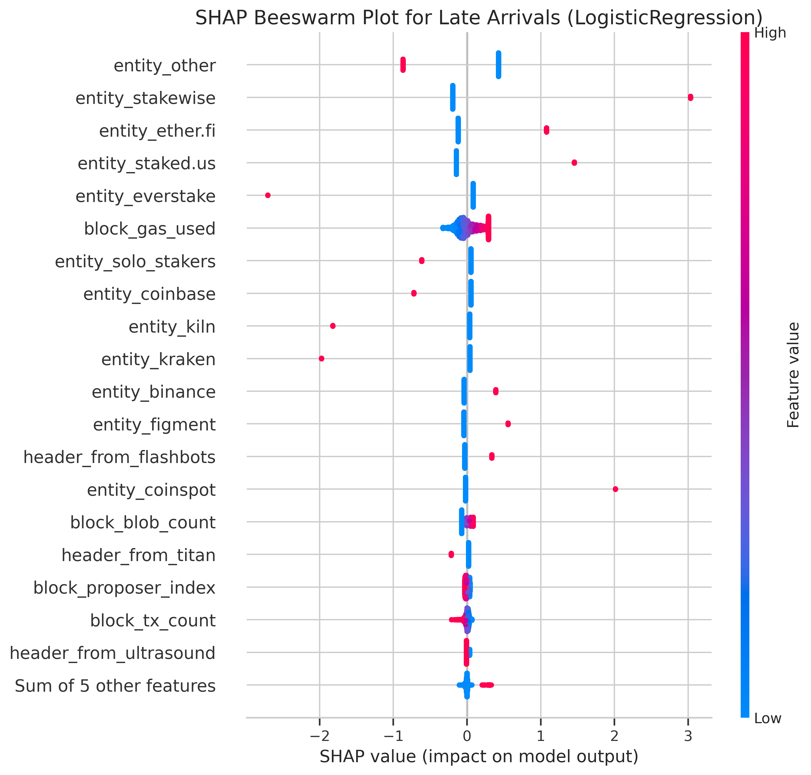


# No entity feature balanced sample

## Logit regression - statsmodel report


```python
                           Logit Regression Results                           
==============================================================================
Dep. Variable:                      y   No. Observations:              2358454
Model:                          Logit   Df Residuals:                  2358444
Method:                           MLE   Df Model:                            9
Date:                Wed, 27 Aug 2025   Pseudo R-squ.:                  0.2558
Time:                        18:01:51   Log-Likelihood:            -1.2165e+06
converged:                       True   LL-Null:                   -1.6348e+06
Covariance Type:            nonrobust   LLR p-value:                     0.000
================================================================================================
                                   coef    std err          z      P>|z|      [0.025      0.975]
------------------------------------------------------------------------------------------------
const                           -1.3596    5.1e+04  -2.67e-05      1.000   -9.99e+04    9.99e+04
p66_block_arrival_ms             0.3094      0.002    165.455      0.000       0.306       0.313
block_total_bytes_compressed    -0.0092      0.004     -2.486      0.013      -0.017      -0.002
block_proposer_index             0.0116      0.002      7.323      0.000       0.009       0.015
block_gas_used                   0.0641      0.003     22.263      0.000       0.058       0.070
block_blob_count                 0.0365      0.002     22.402      0.000       0.033       0.040
block_tx_count                  -0.0195      0.003     -6.492      0.000      -0.025      -0.014
header_from_flashbots           -0.9990    5.1e+04  -1.96e-05      1.000   -9.99e+04    9.99e+04
header_from_self_build           2.1712    5.1e+04   4.26e-05      1.000   -9.99e+04    9.99e+04
header_from_titan               -1.3864    5.1e+04  -2.72e-05      1.000   -9.99e+04    9.99e+04
header_from_ultrasound          -1.1453    5.1e+04  -2.25e-05      1.000   -9.99e+04    9.99e+04
================================================================================================
```
## RandomForestClassifier outputs

### Model performance


```python

              precision    recall  f1-score   support

     on-time      0.917     0.554     0.691   1179125
        late      0.680     0.950     0.793   1179329

    accuracy                          0.752   2358454
   macro avg      0.799     0.752     0.742   2358454
weighted avg      0.799     0.752     0.742   2358454

```

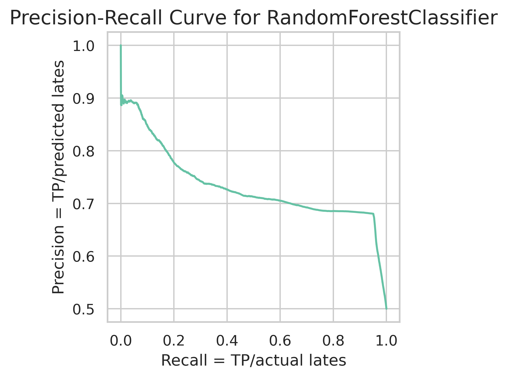

### Feature importance

|feature|importance|
| :---: | :---: |
|header_from_self_build|0.4639056962011482|
|header_from_ultrasound|0.27687329988338577|
|block_total_bytes_compressed|0.0830232827560127|
|block_gas_used|0.07007073146509528|
|block_tx_count|0.04076162108940459|
|header_from_flashbots|0.024317182746428554|
|header_from_titan|0.02266737344151318|
|p66_block_arrival_ms|0.017100365053978932|
|block_proposer_index|0.0008320956053854756|
|block_blob_count|0.0004483517576474524|


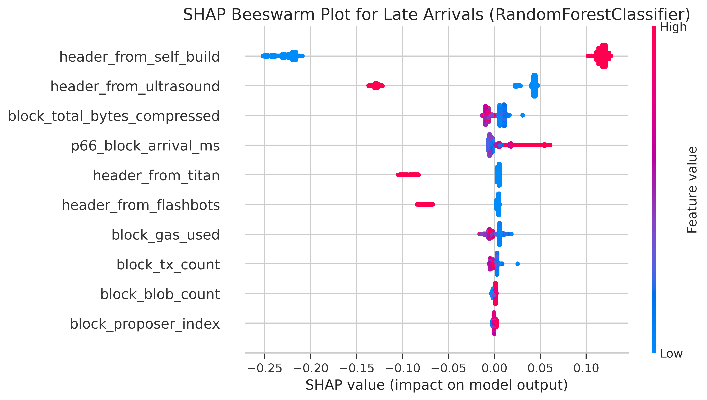


## LGBMClassifier outputs

### Model performance


```python

              precision    recall  f1-score   support

     on-time      0.917     0.554     0.691   1179125
        late      0.680     0.950     0.793   1179329

    accuracy                          0.752   2358454
   macro avg      0.799     0.752     0.742   2358454
weighted avg      0.799     0.752     0.742   2358454

```

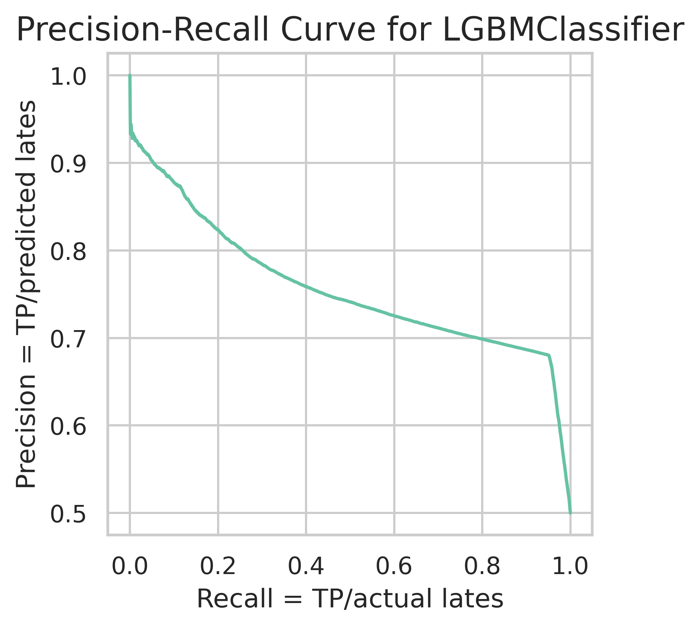

### Feature importance

|feature|importance|
| :---: | :---: |
|p66_block_arrival_ms|299|
|block_gas_used|78|
|block_total_bytes_compressed|68|
|block_proposer_index|62|
|block_tx_count|56|
|header_from_self_build|55|
|block_blob_count|33|
|header_from_flashbots|21|
|header_from_ultrasound|13|
|header_from_titan|12|


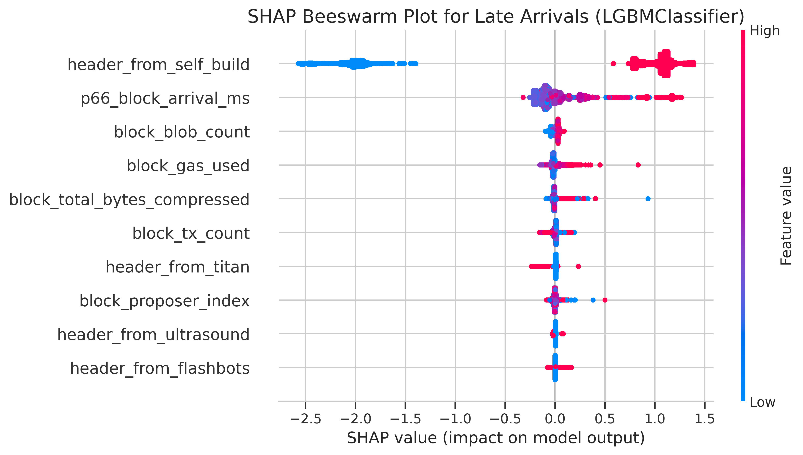


## LogisticRegression outputs

### Model performance


```python

              precision    recall  f1-score   support

     on-time      0.917     0.554     0.691   1179125
        late      0.680     0.950     0.793   1179329

    accuracy                          0.752   2358454
   macro avg      0.799     0.752     0.742   2358454
weighted avg      0.799     0.752     0.742   2358454

```

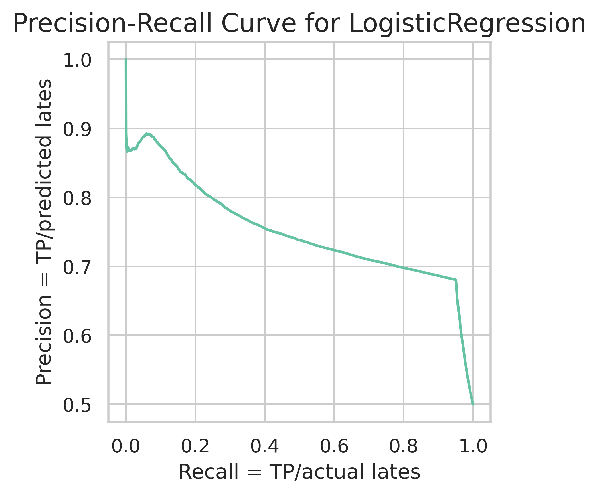

### Feature importance

|feature|importance|
| :---: | :---: |
|header_from_self_build|2.1718646935660137|
|p66_block_arrival_ms|0.30944251692388397|
|block_gas_used|0.06400117768379651|
|block_blob_count|0.036546917224816004|
|block_proposer_index|0.011750099513617444|


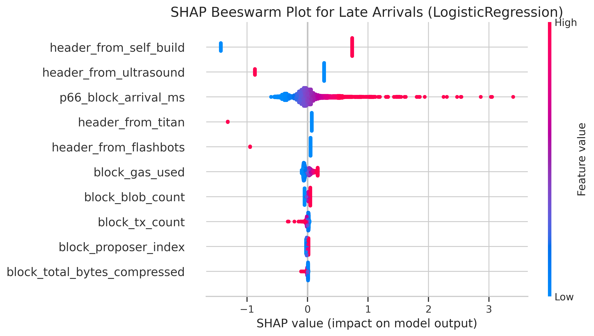


# Timings since slot start balanced predictor

## Logit regression - statsmodel report


```python
                           Logit Regression Results                           
==============================================================================
Dep. Variable:                      y   No. Observations:              4742692
Model:                          Logit   Df Residuals:                  4742664
Method:                           MLE   Df Model:                           27
Date:                Wed, 27 Aug 2025   Pseudo R-squ.:                  0.1948
Time:                        18:19:14   Log-Likelihood:            -2.6469e+06
converged:                       True   LL-Null:                   -3.2874e+06
Covariance Type:            nonrobust   LLR p-value:                     0.000
================================================================================================
                                   coef    std err          z      P>|z|      [0.025      0.975]
------------------------------------------------------------------------------------------------
const                            0.2927   1.69e+04   1.73e-05      1.000   -3.32e+04    3.32e+04
p66_block_arrival_ms             0.5582      0.001    432.477      0.000       0.556       0.561
block_total_bytes_compressed    -0.0388      0.002    -17.288      0.000      -0.043      -0.034
block_proposer_index            -0.0056      0.001     -5.274      0.000      -0.008      -0.004
block_gas_used                   0.0881      0.002     46.742      0.000       0.084       0.092
block_blob_count                 0.0432      0.001     39.539      0.000       0.041       0.045
block_tx_count                  -0.0128      0.002     -6.750      0.000      -0.016      -0.009
header_from_flashbots            0.0534   1.82e+04   2.93e-06      1.000   -3.57e+04    3.57e+04
header_from_self_build           0.1242   1.82e+04   6.81e-06      1.000   -3.57e+04    3.57e+04
header_from_titan                0.0721   1.82e+04   3.95e-06      1.000   -3.57e+04    3.57e+04
header_from_ultrasound           0.0430   1.82e+04   2.36e-06      1.000   -3.57e+04    3.57e+04
entity_abyss_finance            -0.9317   1.88e+04  -4.96e-05      1.000   -3.68e+04    3.68e+04
entity_binance                   1.0603   1.88e+04   5.64e-05      1.000   -3.68e+04    3.68e+04
entity_blockdaemon              -3.1533   1.88e+04     -0.000      1.000   -3.68e+04    3.68e+04
entity_bridgetower_lido          1.3768   1.88e+04   7.33e-05      1.000   -3.68e+04    3.68e+04
entity_coinbase                 -0.3122   1.88e+04  -1.66e-05      1.000   -3.68e+04    3.68e+04
entity_ether.fi                 -0.4629   1.88e+04  -2.46e-05      1.000   -3.68e+04    3.68e+04
entity_everstake                -0.0840   1.88e+04  -4.47e-06      1.000   -3.68e+04    3.68e+04
entity_figment                   2.2793   1.88e+04      0.000      1.000   -3.68e+04    3.68e+04
entity_figment_lido              5.1943   1.88e+04      0.000      1.000   -3.68e+04    3.68e+04
entity_kiln                     -1.3687   1.88e+04  -7.29e-05      1.000   -3.68e+04    3.68e+04
entity_kraken                   -2.5579   1.88e+04     -0.000      1.000   -3.68e+04    3.68e+04
entity_liquid_collective         0.4448   1.88e+04   2.37e-05      1.000   -3.68e+04    3.68e+04
entity_okex                     -0.6859   1.88e+04  -3.65e-05      1.000   -3.68e+04    3.68e+04
entity_other                    -1.0080   1.88e+04  -5.37e-05      1.000   -3.68e+04    3.68e+04
entity_rocketpool               -0.4082   1.88e+04  -2.17e-05      1.000   -3.68e+04    3.68e+04
entity_senseinode_lido           1.6549   1.88e+04   8.81e-05      1.000   -3.68e+04    3.68e+04
entity_solo_stakers             -1.0110   1.88e+04  -5.38e-05      1.000   -3.68e+04    3.68e+04
entity_staked.us                 0.5293   1.88e+04   2.82e-05      1.000   -3.68e+04    3.68e+04
entity_stakefish                -0.2631   1.88e+04   -1.4e-05      1.000   -3.68e+04    3.68e+04
================================================================================================
```
## RandomForestClassifier outputs

### Model performance


```python

              precision    recall  f1-score   support

     on-time      0.648     0.861     0.739   2371346
        late      0.793     0.532     0.636   2371346

    accuracy                          0.696   4742692
   macro avg      0.720     0.696     0.688   4742692
weighted avg      0.720     0.696     0.688   4742692

```

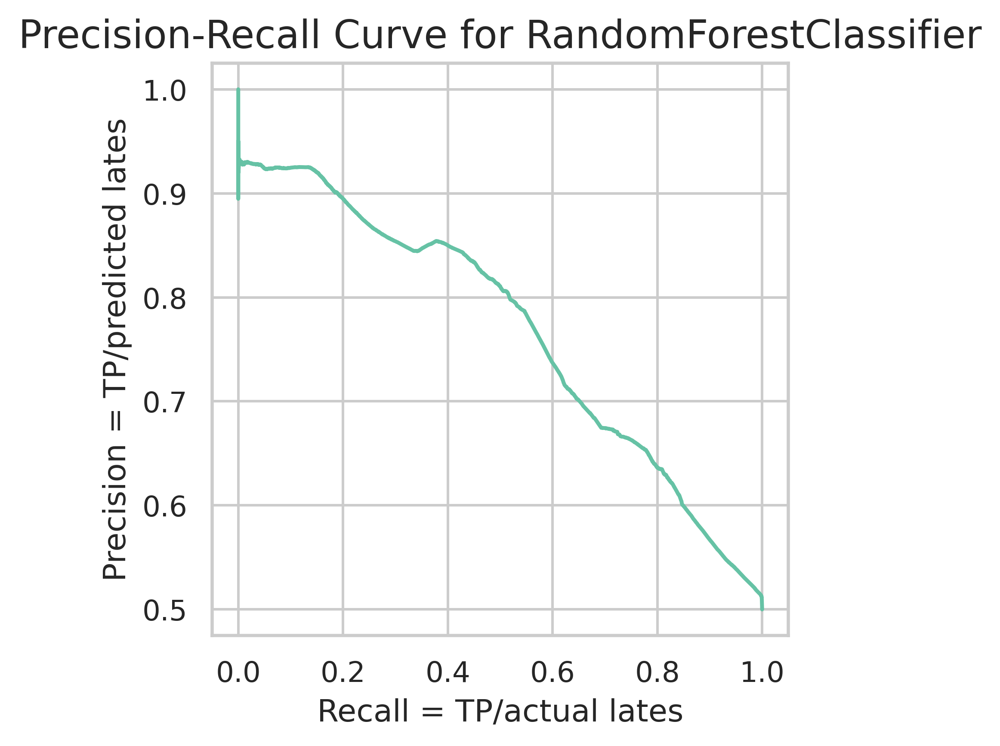

### Feature importance

|feature|importance|
| :---: | :---: |
|entity_figment|0.2472008078349101|
|entity_binance|0.21742879021450365|
|entity_other|0.17203327053287532|
|p66_block_arrival_ms|0.09516399014428818|
|entity_kraken|0.07578419599215681|
|entity_blockdaemon|0.05026556890179723|
|entity_figment_lido|0.04228783121957303|
|entity_senseinode_lido|0.02201087878204826|
|entity_solo_stakers|0.020435197977665576|
|entity_kiln|0.018361848973026954|
|entity_bridgetower_lido|0.016102642295929646|
|block_gas_used|0.006936923276061771|
|block_total_bytes_compressed|0.004964325925876734|
|entity_staked.us|0.003951785280625831|
|block_tx_count|0.0018684270802425686|
|entity_liquid_collective|0.0016820904306467566|
|header_from_self_build|0.0007293080061262374|
|entity_everstake|0.0004893033246362138|
|entity_okex|0.00048565123585266073|
|entity_abyss_finance|0.00045209580933795024|
|block_proposer_index|0.00042835655796221307|
|block_blob_count|0.00036070636762973283|
|entity_coinbase|0.00022996406475131782|
|header_from_ultrasound|0.00019305953257208933|
|header_from_flashbots|7.892966046232077e-05|
|header_from_titan|7.405057844082136e-05|


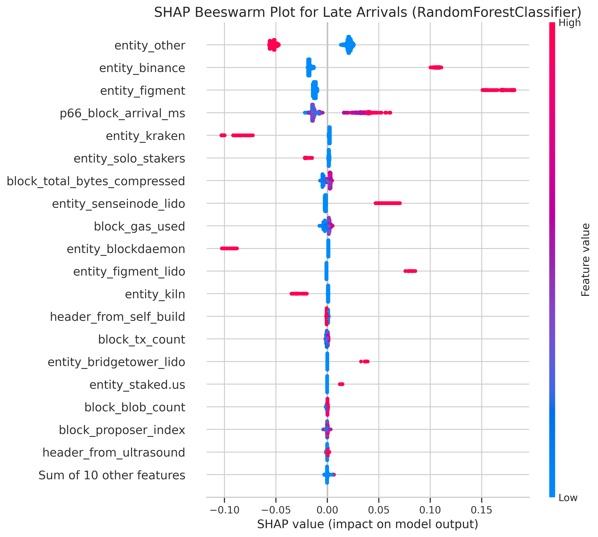


## LGBMClassifier outputs

### Model performance


```python

              precision    recall  f1-score   support

     on-time      0.688     0.811     0.744   2371346
        late      0.769     0.632     0.694   2371346

    accuracy                          0.721   4742692
   macro avg      0.729     0.721     0.719   4742692
weighted avg      0.729     0.721     0.719   4742692

```


### Feature importance

|feature|importance|
| :---: | :---: |
|p66_block_arrival_ms|363|
|entity_figment_lido|33|
|entity_figment|31|
|block_gas_used|30|
|entity_kraken|26|
|entity_blockdaemon|25|
|entity_binance|24|
|entity_senseinode_lido|22|
|block_tx_count|20|
|entity_other|19|
|entity_bridgetower_lido|17|
|entity_kiln|16|
|entity_solo_stakers|14|
|entity_staked.us|13|
|entity_liquid_collective|11|
|entity_abyss_finance|9|
|block_total_bytes_compressed|9|
|entity_stakefish|7|
|entity_everstake|4|
|block_proposer_index|3|
|block_blob_count|2|
|entity_okex|2|


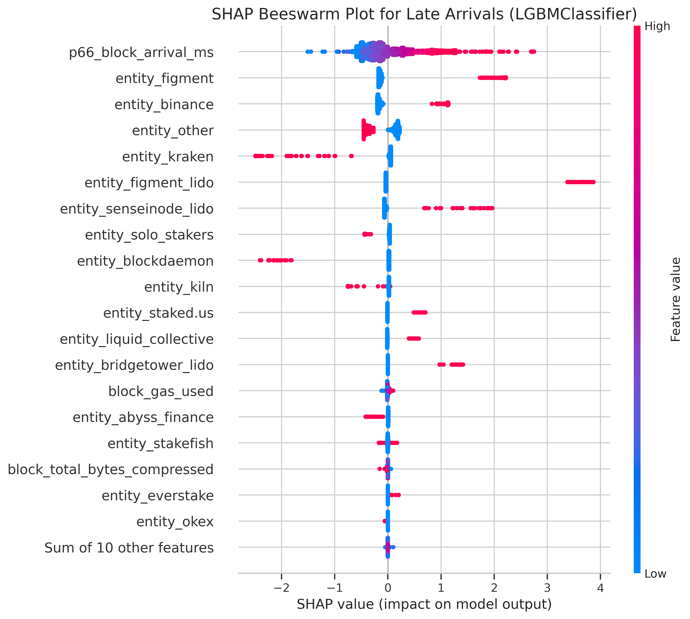


## LogisticRegression outputs

### Model performance


```python

              precision    recall  f1-score   support

     on-time      0.686     0.802     0.740   2371346
        late      0.762     0.633     0.692   2371346

    accuracy                          0.718   4742692
   macro avg      0.724     0.718     0.716   4742692
weighted avg      0.724     0.718     0.716   4742692

```

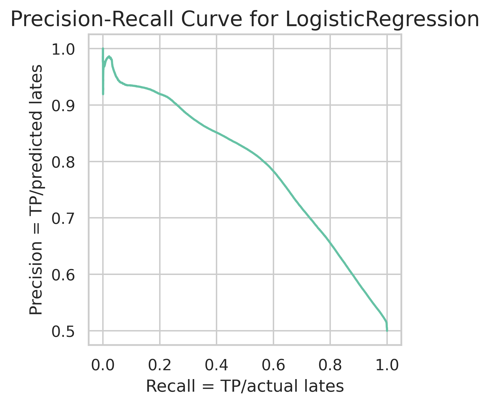

### Feature importance

|feature|importance|
| :---: | :---: |
|entity_figment_lido|5.166462286795126|
|entity_figment|2.276757524289792|
|entity_senseinode_lido|1.6410703974661953|
|entity_bridgetower_lido|1.3940376880481735|
|entity_binance|1.0665474075422345|
|p66_block_arrival_ms|0.5583024109950512|
|entity_staked.us|0.5241593955707764|
|entity_liquid_collective|0.452698663344703|
|header_from_self_build|0.12376586049233486|
|block_gas_used|0.08886485180157708|
|header_from_titan|0.07262824086212159|
|header_from_flashbots|0.05159047273945901|
|block_blob_count|0.04334055357824187|
|header_from_ultrasound|0.04207496325389027|


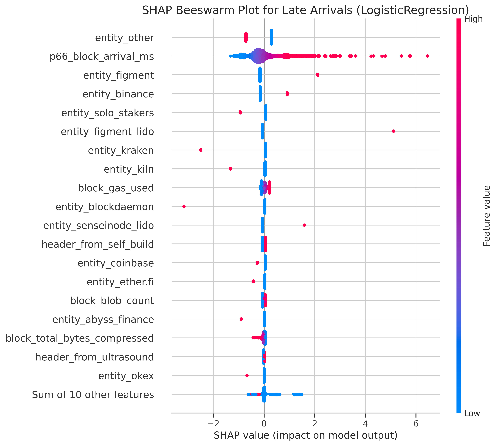

