# An analysis of attestation timings

### Maria Silva, August 2025

## Introduction

This report contains the main results from analyzing block and attestation arrivals collected from Ethereum nodes between slots 12243599 and 12293998, which corresponds to roughly one week of slots during the first week of August 2025.

The goal of this analysis is to gather a first-level understanding of the feasibility of [EIP-7782](https://eips.ethereum.org/EIPS/eip-7782), which proposes to reduce the slot to 6 seconds by moving the attestation deadline to 3 seconds and the aggregation deadline to 4.5 seconds.

Our analysis focuses on three different metrics, which are illustrated in the diagram below.

First, we look into block arrival times. The block arrival time corresponds to the time when the beacon node first saw the block. From this block arrival, we compute two propagation metrics:

- The number of milliseconds between the block arrival time and the time when a relay published the block payload. This block propagation metric is represented in yellow in the diagram and aims to discount timing games. However, since we only collected data from the Ultrasound, Flashbots, and Titan relays, this metric is only reported for a sub-sample of slots.
- The number of milliseconds between the block arrival time and the start time of the slot. As this metric does not require relay data, we can report the full slot sample. However, because of timing games and block-building logic, this metric is an overestimation of the actual propagation time needed.

Second, we analyze the attestations for missed slots. In these slots, the block payload was never made available, and thus, we know that validators waited until the 4-second deadline to attest. This allows us to compute the pure attestation propagation time by taking the attestation arrival time in the beacon node minus 4 seconds. This is the light-blue component in the diagram above.

The third and final metric attempts to estimate the total time required to propagate the block through the P2P layer, including execution, validation, and propagation of attestations. It corresponds to the yellow, pink, and light blue components of the diagram. Similarly to the block propagation metric, we compute the attestation arrival since the block was published by the relay, to account for timing games. We use the same publish times shared by the Ultrasound, Flashbots, and Titan relays as in the block propagation metric.

### Data gathering

- The relay publishing times were kindly provided by the teams at [Flashbots](https://www.flashbots.net/), [Titan](https://www.titanbuilder.xyz/), and [Ultrasound](https://relay.ultrasound.money/). The datasets contain the number of milliseconds since the start of the slot when the relay replies to a `/eth/v1/builder/blinded_blocks` request by sending the block payload to the beacon node.
- The block arrival times were collected from [Xatu's Beacon API Event Stream](https://ethpandaops.io/data/xatu/schema/beacon_api_/) tables. These tables contain the events generated by internal nodes run by the [ethPandaOps team](https://ethpandaops.io/) and community nodes that chose to share their metrics with the ethPandaOps team. On one hand, the inclusion of community data provides a much wider pool of beacon nodes and geographical locations. However, this comes with a drawback - the data is more prone to errors because it cannot be validated. The SQL query for gathering the data can be found in [`beacon_blocks.sql`](../sql/beacon_blocks.sql).
- Attestation arrivals for missed slots were collected from [Xatu's Consensus Layer P2P](https://ethpandaops.io/data/xatu/schema/libp2p_/) tables. We filtered the data to only include the messages generated by a set of nodes managed by the [ethPandaOps team](https://ethpandaops.io/) that are running a fork of the Prysm consensus clients designed to gather P2P-related data. The logic to collect this data can be found in [`atts_missed_runner.py`](../src/atts_missed_runner.py).
- The mapping between the validator ID and the validator entity was collected from [ethseer.io](https://ethseer.io/?network=mainnet). This data can be directly queried from Xatu's ClickHouse instance by using the table `ethseer_validator_entity`. We implemented this query in the function [get_validator_ethseer_info](../src/query.py#get_validator_ethseer_info).

## Block propagation

Out of the 51139 slots in our dataset, 47.6% don't have relay data. These slots were either provided by other relays or were self-built. The remaining 41.3% were published by Ultrasound, 5.8% by Flashbots, and 5.3% by Titan. For each slot, we have block arrivals for 109 community nodes and 29 internal nodes. Nodes have a variety of clients and geographical regions.

Focusing on the subset of slots for which we have relay data, we can see in the following two plots the distributions of the block propagation since the block was published, split by node client and node country. The boxplots show the three quartiles in the colored boxes and the variability outside the upper and lower quartiles in the extending lines. The dots are outliers.

There are some variations by client, with Lodestar and Caplin showing slightly larger propagation times. Countries also vary, with the Netherlands showing a surprisingly skewed distribution. After the Netherlands, Australia, India, and Nigeria show the longer propagation times.

Independent of the observed variations, most nodes still receive the block in under 1 second. The 95th percentile of block propagation since it was published by the relay is 816 ms for Xatu's internal nodes and 804 ms for the community nodes.

The final plot shows the distribution of the block arrival times since the start of the slot by header source. As we previously explained, this is an overestimation of the block propagation time as it also includes the time spent block building and interacting with mev-boost. However, it allows us to understand how the sub-sample of relay slots compares to the remaining slots.

Interestingly, the slots without relay data have slightly shorter propagation times, but they show more outliers and a larger standard deviation. The 95th percentiles are comparable, with the "other" slots taking 3292ms, while the slots with relay data take 3337ms. This indicates that the observed timings with relay data are likely a reasonable estimate.

Additionally, the fact that block arrivals are so close to the attestation deadline while the actual propagation takes less than 1 second suggests that the start of the slot is not being solely used for block propagation. Thus, there is likely some slack in the attestation timings in the current slot structure.

For additional plots and analysis, refer to the notebook [2.3-beacon-block-arrivals-with-relay.ipynb](../notebooks/2.3-beacon-block-arrivals-with-relay.ipynb).

## Attestation times for missed slots

There are 207 missed slots in our sample. For each, we observe the attestations from subnets 0 and 1. We have three nodes listening to the same subnets across four regions - the Netherlands, India, the US, and Australia. The following plot shows the overall distribution of all these attestation propagation times (i.e., the milliseconds of attestation arrival since the 4-second mark in the slot).

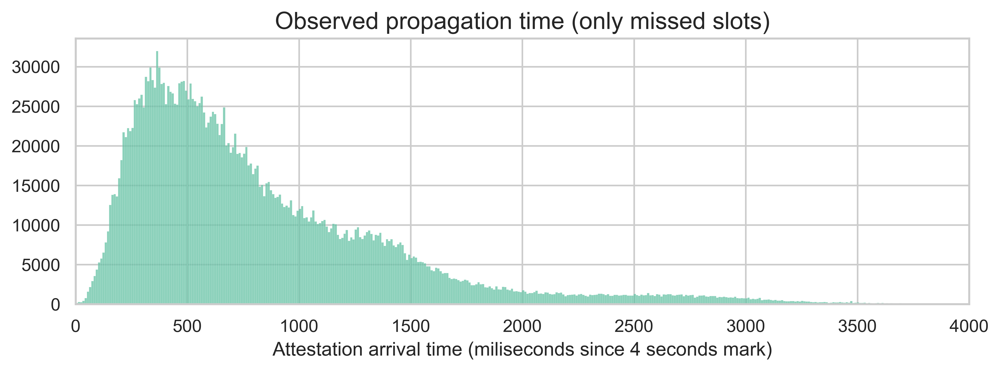

As expected, most attestations take less than 1 second to propagate, with an average of 831ms. However, we do see a large right tail in the distribution, with some attestations arriving later than 1 second. In fact, the overall 95th percentile is 2066ms.

We should note that the timings we are seeing are likely an overestimation. With missed slots, all attesters send their attestations at the same time, which creates a high burst of activity on the P2P layer. Under more normal conditions, attestations would be sent more gradually as validators take slightly different times to receive and validate the block.

Looking at the same distribution by receiver node region (in the boxplots below), we see that even though India and Australia nodes show slightly longer times, the difference is not materially different (around 100ms).

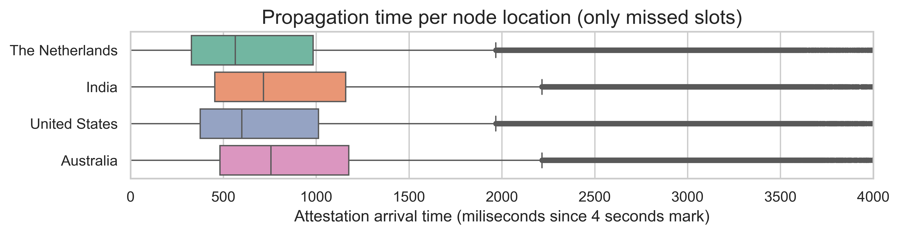

Another important consideration when analyzing attestations is the origin of the attestation, i.e., the attester. Using the mapping from [ethseer.io](https://ethseer.io/?network=mainnet), we extracted the validator entity of the attester. Then, we plotted the propagation time per entity (on the left) and the weight of each entity in the attestations arriving at each 50-ms bucket in the slot (on the right).

| 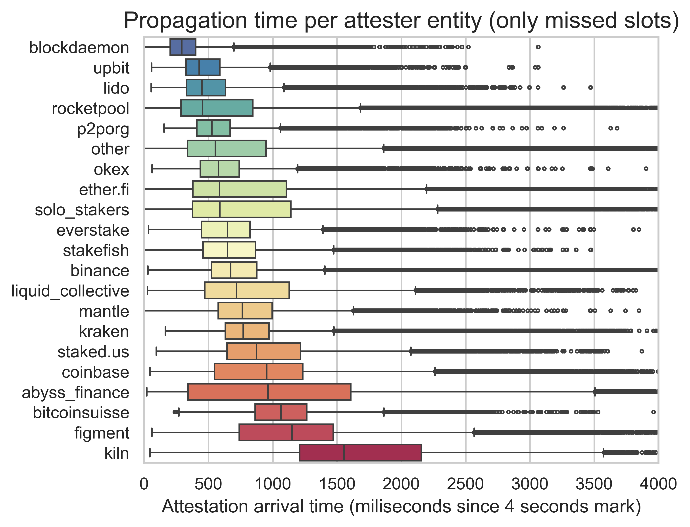 | 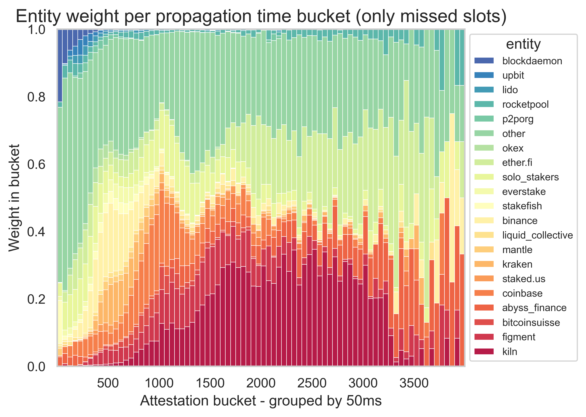|
|:---:|:---:|
|  |  |

We can already see a significant variation among entities. With the information on the client configuration and the geographical locations, it is impossible to pinpoint precisely why some entities are slower attesters than others.

A notable example is Kiln. In our data, they were responsible for a large proportion of attestations arriving between 1500ms and 3250ms, and they had the largest median propagation time. After seeing these results, we contacted them directly, and they uncovered a misconfiguration in their client that significantly improved their times. Looking at a sample of 183 missed slots two weeks after our main sample (i.e., between slots 12344420 and 12394820), **we observe a decrease in the overall 95th percentile from 2066ms to 1782ms**. In addition, we can see in the plot below that the weight of Kiln in the later attestations changed significantly. This points to the importance of investigating more carefully the entities with late attestations to try and solve the root cause of the delays.

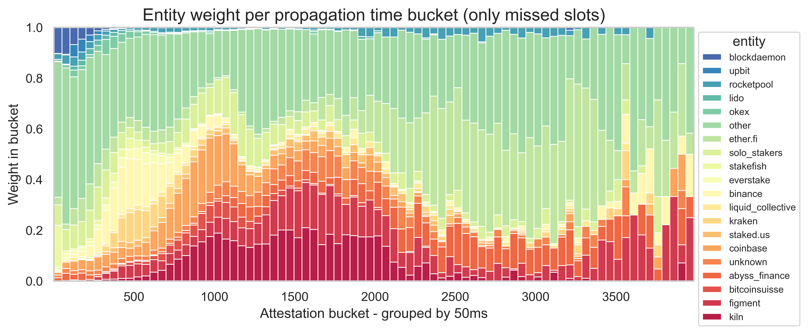

Until now, we were looking at the distribution of the data across all slots and subnets in our sample. However, another relevant metric is the 66th percentile over the subnet. In other words, given a slot and a subnet, when does the subnet observe a supermajority of attestations? The distribution below illustrates this metric over the various slots and subnets in our data. Interestingly, all subnets in all missed slots take less than 830ms to reach supermajority. The mean is 640ms.

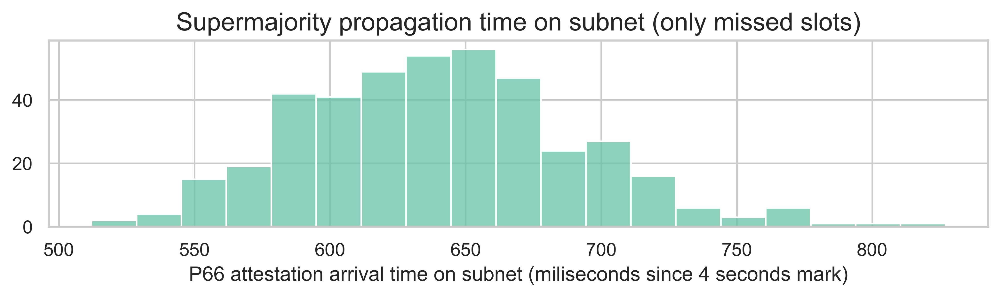

For additional plots and analysis, refer to the notebook [2.4-committee-attestations-missed-slots.ipyn](../notebooks/2.4-committee-attestations-missed-slots.ipynb). The notebook [2.5-committee-attestations-missed-slots-v2.ipynb](../notebooks/2.5-committee-attestations-missed-slots-v2.ipynb) contains the same analysis, but using a sample of missed slots 2 weeks after.

## Attestation arrivals

For this part of the analysis, we took a random sample of 4963 slots from the same slots with relay data used in the block propagation section. From this sample, 80.4% have a header from Ultrasound, 10.9% from Flashbots, and 8.7% from Titan. The next plot shows the distribution of the attestation arrivals (computed as milliseconds since the block was published by the relay) for all slots and all subnets.

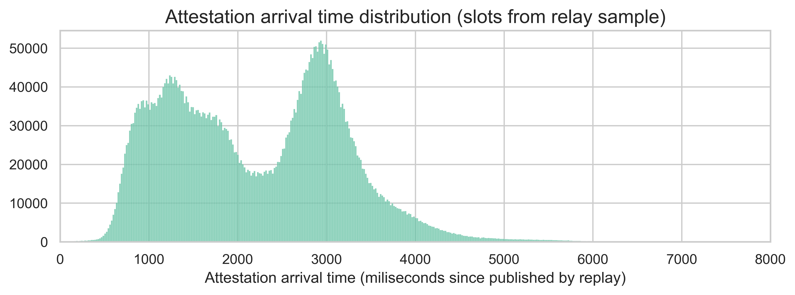

Here, we can see a clear bimodal distribution, with modes around 1.2 seconds and 3 seconds. This means that there are two groups of attestations - fast and slow. The source of the bimodal distribution is neither the header source (as shown in the plot below, the distributions are pretty similar across the various relays) nor specific slots (as evidenced by the same trend at individual slot levels).

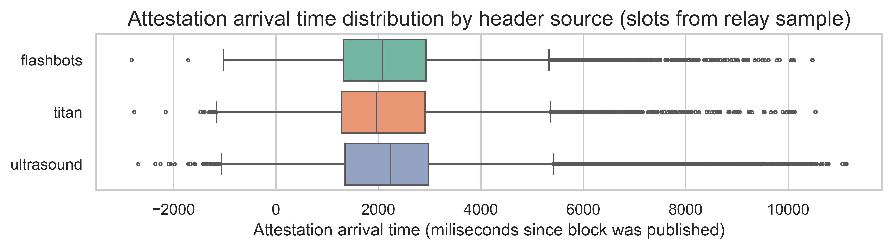

What appears to explain the bimodal shape is the source of the attestations, i.e., the entity making the attestation. This aligns with our observations on the missed slots. Yet, the trend is even more pronounced for the arrival times of attestation.

| 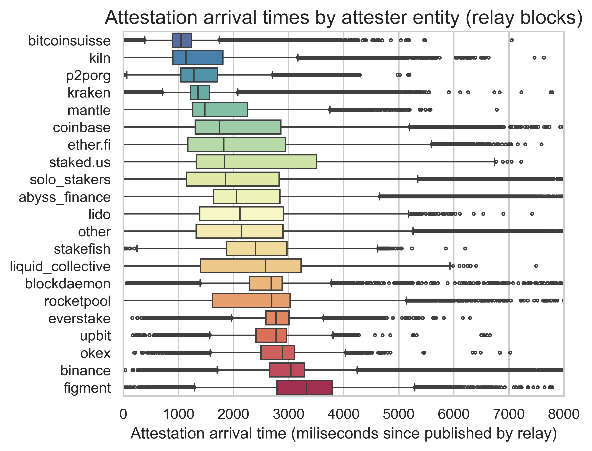 | 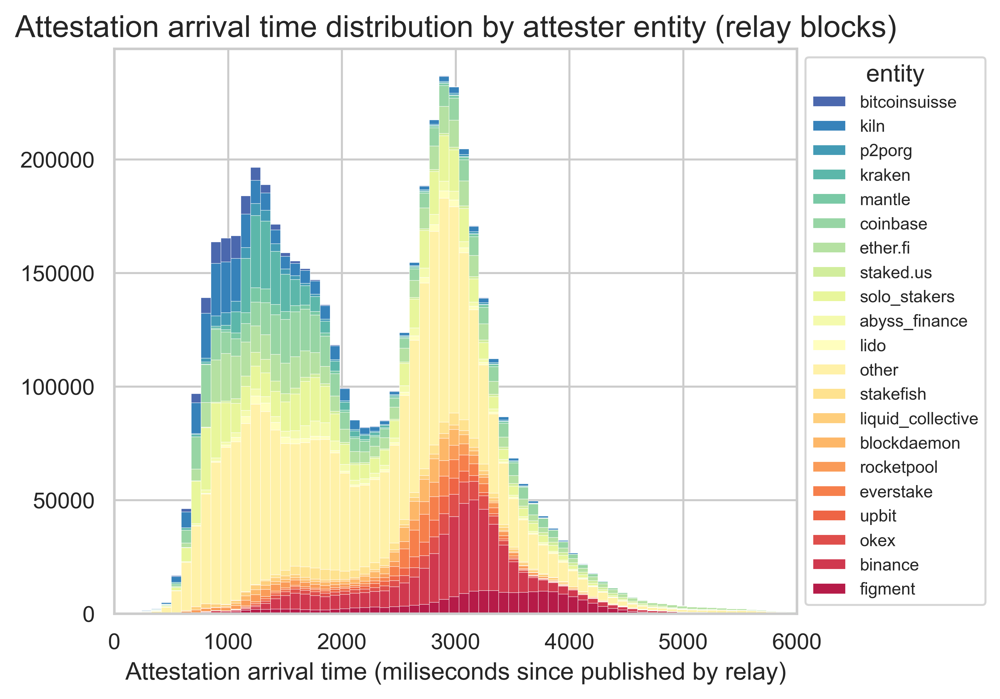|
|:---:|:---:|
|  |  |

Besides the overall distribution, we computed the 95th percentile attestation within each subnet. In other words, this is the time it takes for 95% of the attestations in a given subnet to arrive (counting since the block was published by the relay). The following histogram shows the distribution of this metric for each slot and subnet.

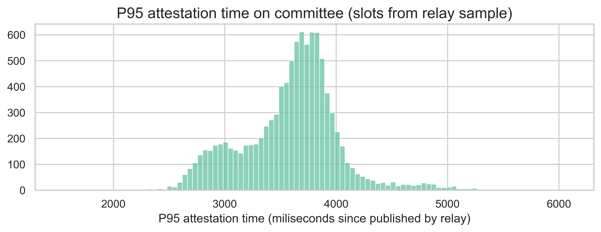

The average P95 is 3590ms, while the 95th percentile of the P95 metric is 4217ms, which is still below the 4.5-second mark required for the 6-second slot proposal.

## Factors impacting late attestations

WIP
