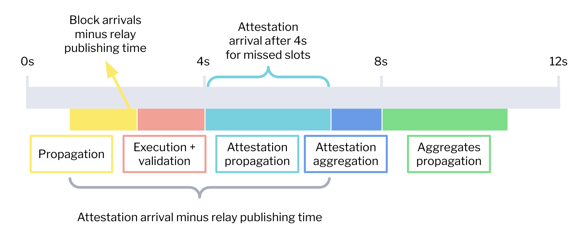
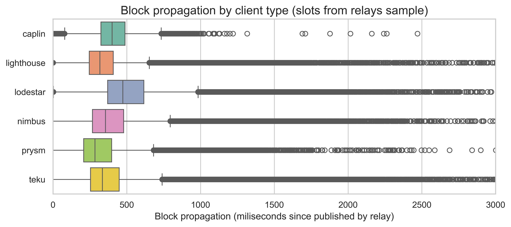
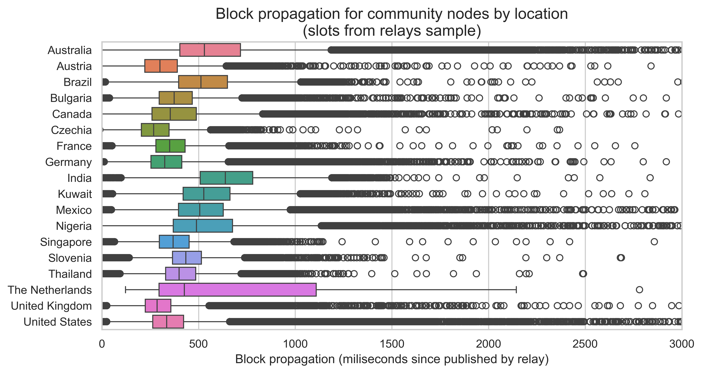
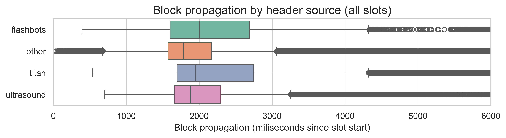

# An analysis of attestation timings

### Maria Silva, August 2025

## Introduction

This report contains the main results from analyzing block and attestation arrivals collected from Ethereum nodes between slots 12243599 and 12293998, which corresponds to roughly one week of slots during the first week of August 2025.

The goal of this analysis is to gather a first-level understanding of the feasibility of [EIP-7782](https://eips.ethereum.org/EIPS/eip-7782), which proposes to reduce the slot to 6 seconds by moving the attestation deadline to 3 seconds and the aggregation deadline to 4.5 seconds.

Our analysis focuses on three different metrics, which are illustrated in the diagram below.

First, we look into block arrival times. The block arrival time corresponds to the time when the beacon node first saw the block. From this block arrival, we compute two propagation metrics:

- The number of milliseconds between the block arrival time and the time when a relay published the block payload. This block propagation metric is represented in yellow in the diagram and aims to discount timing games. However, since we only collected data from the Ultrasound, Flashbots, and Titan relays, this metric is only reported for a sub-sample of slots.
- The number of milliseconds between the block arrival time and the start time of the slot. As this metric does not require relay data, we can report the full slot sample. However, because of timing games and block-building logic, this metric is an overestimation of the actual propagation time needed.

Second, we analyze the attestation arrival time

WIP

### Data gathering

- The relay publishing times were kindly provided by the teams at [Flashbots](https://www.flashbots.net/), [Titan](https://www.titanbuilder.xyz/), and [Ultrasound](https://relay.ultrasound.money/). The datasets contain the number of milliseconds since the start of the slot when the relay replies to a `/eth/v1/builder/blinded_blocks` request by sending the block payload to the beacon node.
- The block arrival times were collected from [Xatu's Beacon API](https://ethpandaops.io/data/xatu/schema/beacon_api_/). These tables contain the events generated by internal nodes run by the [ethPandaOps team](https://ethpandaops.io/) and community nodes that chose to share their metrics with the ethPandaOps team. On one hand, the inclusion of community data provides a much wider pool of beacon nodes and geographical locations. However, this comes with a drawback - the data is more prone to errors because it cannot be validated.

## Block propagation

Out of the 53528 slots in our dataset, 49.9% don't have relay data. These slots were either provided by other relays or were self-built. The remaining 39.4% were published by Ultrasound, 5.6% by Flashbots, and 5.1% by Titan.

Focusing on the subset of slots for which we have relay data, we can see in the following two plots the distributions of the block propagation since the block was published, split by node client and node country. The boxplots show the three quartiles in the colored boxes and the variability outside the upper and lower quartiles in the extending lines. The dots are outliers.

There are some variations by client, with Lodestar and Caplin showing slightly larger propagation times. Countries also vary, with the Netherlands showing a surprisingly skewed distribution. After the Netherlands, Australia, India, and Nigeria show the longer propagation times.

Independent of the observed variations, most nodes still receive the block in under 1 second. The 95th percentile of block propagation since it was published by the relay is 816 ms for Xatu's internal nodes and 804 ms for the community nodes.

The final plot shows the distribution of the block arrival times since the start of the slot by header source. As we previously explained, this is an overestimation of the block propagation time as it also includes the time spent block building and interacting with mev-boost. However, it allows us to understand how the sub-sample of relay slots compares to the remaining slots.

Interestingly, the slots without relay data have slightly shorter propagation times, but they show more outliers and a larger standard deviation. The 95th percentiles are comparable, with the "other" slots taking 3292ms, while the slots with relay data take 3337ms. This indicates that the observed timings with relay data are likely a reasonable estimate.

Additionally, the fact that block arrivals are so close to the attestation deadline while the actual propagation takes less than 1 second suggests that the start of the slot is not being solely used for block propagation. Thus, there is likely some slack in the attestation timings in the current slot structure.

For additional plots and analysis, refer to the notebook [3-beacon-block-arrivals-with-relay.ipynb](../notebooks/2.3-beacon-block-arrivals-with-relay.ipynb).

## Attestation times for missed slots

WIP

## Attestation arrivals

WIP

## Late attestations

WIP
